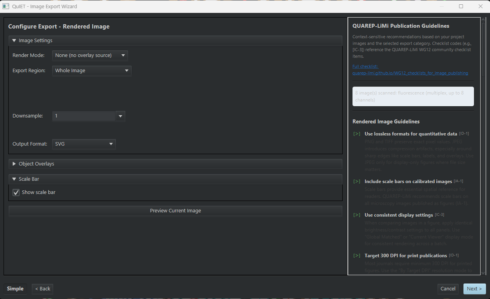

# QuIET — QuPath Image Export Toolkit

> Turn an annotated project into publication-ready figures, collaborator review images, or
> machine-learning training sets, in batch, without writing an export script. With
> QUAREP-LiMi reporting guidance built into the dialog.

| | |
|---|---|
| **Repository** | [uw-loci/qupath-extension-image-export-toolkit](https://github.com/uw-loci/qupath-extension-image-export-toolkit) |
| **Version at workshop** | 1.2.8 |
| **License** | Apache-2.0 |
| **Requires** | QuPath 0.7.0+, Java 21+ |
| **Where to find it** | `Extensions > QuIET > Image Export...` and `Extensions > QuIET > Panel / Montage Export...` |
| **Catalog** | LOCI QuPath Extensions |
| **Session** | Hands-on |

> **Walkthrough video:** %%VIDEO_QUIET_IMAGE_EXPORT%%
> The walkthrough below is self-contained. You can work through it during the workshop, or on your own afterwards.

---

## What it does

Exporting an image out of QuPath is easy. Exporting *the right image, the same way, from
forty slides, with a scale bar, at a stated resolution, with a record of how you did it* is
not. That is normally a Groovy scripting job.

QuIET is a three-step wizard over that job. You pick a category, configure it, pick your
images, and export.

**Five export categories**, all sharing the same 3-step flow:

| Category | Produces | Typical use |
|---|---|---|
| **Rendered** | The image as displayed, with overlays, scale bar, panel labels | Figures and collaborator review |
| **Label / Mask** | Per-class segmentation masks | ML training targets, QC |
| **Raw image data** | Pixel data at any downsample | Handing data to another tool |
| **Tiled export (ML)** | Image + label tile pairs | Deep-learning frameworks |
| **Object crops** | One small image per object | Cell-type classifier training |

A sixth workflow, **Panel / Montage Export**, is a separate menu item with its own wizard:
select several project images, choose a *recipe* (saved settings for how a single image is
exported), and lay them out into one grid figure, with captions, spacing and background color.
QuPath renders every panel identically, so you do not assemble the figure by hand in
another program.

## Two things that make it worth your time

**Every export writes a Groovy script.** Whatever you clicked in the wizard is emitted as a
self-contained script you can save, version-control, re-run next year, or send to a
collaborator who does not have QuIET installed. The wizard is a script *generator*, not a
black box, which is the difference between a convenience and a reproducibility tool.

**QUAREP-LiMi guidance is in the dialog.** [QUAREP-LiMi](https://quarep.org/) is the
community effort to define minimum reporting standards for light microscopy. Step 2 shows a
context-sensitive guidance panel driven by your project's actual images, and Step 3 shows
"Publication Advice" before you export. The point is to catch "what magnification was that,
and is there a scale bar?" *before* the figure goes into a manuscript, not during review.

> **Simple vs Advanced.** The navigation bar has a Simple/Advanced toggle; Simple is the
> default and hides rarely-used controls. If a setting described here seems to be missing,
> flip to Advanced. The choice persists across sessions.

<b>Install</b> — from the LOCI catalog, then restart QuPath

Install from the **LOCI QuPath Extensions** catalog, then restart QuPath. Full steps, including the catalog URL, are in the [setup guide](setup.md).

Both menu items stay greyed out until a project with at least one image is open.

---

## Hands-on exercise (~15 min)

**Data:** `DATA-01_HE_WSI`, the CMU-1 H&E slide in the **`Scripting Demo.zip`** ([Drive folder](https://drive.google.com/drive/folders/1waxGfZt3Ua_EKcC86fOn8Qr89lZXnrIX?usp=sharing), four zips — this is the one that is a QuPath project) (~500 MB; see [setup](setup.md#5-download-the-workshop-data)).

> **Parts A and B need one image. Part C needs at least two**, because it builds a figure out
> of several panels. `Scripting Demo.zip` gives you two; the synthetic set gives you eight.

> **Or use the synthetic multiplex set instead.** If you are on the multiplexed track, or you
> just want something small, the CC0
> [multiplex synthetic dataset](https://github.com/uw-loci/multiplex-synthetic-data/releases/download/v1.2/multiplex-synthetic-data-v1.2.zip)
> (~14 MB) works for every part of this exercise. Its eight-channel images exercise the channel
> handling that a brightfield slide cannot, and because every cell carries a known type, the
> label-mask and tile-pair exports have a ground truth you can check the output against.
> The eight `tme_NN.tif` files are the images; the CSVs and GeoJSON beside them are the
> answer key. Set the image type to **Fluorescence** when QuPath asks.
> You will need to detect cells first — the recipe is in the
> [QP-CAT guide](03-qp-cat-cell-analysis-tools.md#hands-on-exercise-20-min-or-10-for-parts-a-and-b).

### Part A: a figure you could publish

1. Open the project — the folder you unzipped, which QuPath opens with
   `File > Project > Open project`. Confirm at least one **annotation** exists: a region you
   or someone else drew on the image. If there are none, draw a rectangle over part of the
   tissue.
2. `Extensions > QuIET > Image Export...` (see below). The second entry,
   **Panel / Montage Export...**, is Part C.

   
3. **Step 1:** choose **Rendered Image** — the leftmost of the five categories (see below).

   
4. **Step 2:** set **Render Mode**. For this figure choose **Object Overlay**, which draws
   your annotations onto the image; **None (no overlay source)** gives a clean image with no
   annotations, which is what the screenshot below happens to show. Turn on a **scale bar**.
   **Downsample** shrinks the exported image: **1** means full size, **4** means a quarter as
   wide. You only need it when the image is far bigger than the figure you want. The synthetic
   images are 2048 × 2048, so leave it at **1**. CMU-1 is tens of thousands of pixels wide —
   QuPath's **Image** tab shows the width, and dividing that by about 2000 gives you the
   number to enter.

   The panel down the right (see below) is general QUAREP-LiMi guidance for the kind of export
   you picked, plus one line saying how many of your images it scanned and what type they are.
   Read it now; the advice specific to *your* images comes at Step 3.

   
5. **Step 3:** **every image in the project starts ticked.** Click **Deselect All** and tick
   exactly one — Part B needs a second image that has *not* been exported yet. Choose an
   output folder.

   Now click **Publication Advice**. *This* is the part that looks at the images you actually
   selected and tells you what is missing — for example "No scale bar on calibrated images".
   Items are coloured by how much they matter. Read it, then export.
6. Open the result. Check that the scale bar is legible at the size you would print it.

   Your output folder should hold **one** image plus `export_info`, a small text file
   recording the settings used.

   The folder below shows what happens when you *don't* do that — eight exports, because every
   image was still ticked at Step 3. If yours looks like this, delete the folder and redo
   Step 3 with **Deselect All**, because Part B needs an image that has not been exported yet.

   (The names look odd because that run had **Drop source file extension** unticked on Step 3,
   so each file kept its original `.tif` name and gained `.svg` on the end. With the tickbox
   left at its default you get `tme_00.svg`.)

   

### Part B: the reproducibility half

*This is why Part A asked you to export only one image.*

7. Find the **Groovy script** QuIET wrote alongside your export — a text file of QuPath
   commands, which you do not have to write or understand to use.
8. Open QuPath's script editor, `Automate > Script editor` (see below), paste it in, and run
   it against a *different* image in the project.

   
9. Confirm you get the same treatment applied to new data with zero clicks.

### Part C: a multi-panel figure

10. `Extensions > QuIET > Panel / Montage Export...`
11. Select the images you want as panels and apply one **recipe** — one set of rendering
    settings — to all of them, so every panel is treated identically. How many you have
    depends on your data: the synthetic set has eight, so pick four and lay them out 2×2;
    `Scripting Demo.zip` has only two (CMU-1 and LuCa-7color), so lay those out 1×2.
    Add captions.
12. Export and open the montage. The one below was made from four images of the **synthetic
    set**, not the H&E slide — so yours will look different, and will have as many panels as
    you selected. What matters is that every panel got the same recipe and its own scale bar.

    

### What to notice

- The recipe concept is what makes panels *comparable*: every panel got the same rendering,
  downsample, and overlay treatment, which is exactly the claim a figure implicitly makes.
- The QUAREP panel is advisory, not blocking. It is telling you what a reviewer may ask.
- Exporting masks (Step 1 → **Label / Mask**) from the same annotations gives you ML training
  targets with no extra annotation work. Try it if you have time.

---

## Going further

- Object Crops is the fastest route from "I have classified cells" to "I have a labeled
  image dataset for a cell-type classifier."
- Tiled export writes image/label pairs in the layout deep-learning frameworks expect. This
  is the natural handoff to the [DL Pixel Classifier](02-dl-pixel-classifier.md) or to
  training outside QuPath.

**Full documentation:** the
[repository README](https://github.com/uw-loci/qupath-extension-image-export-toolkit#readme).
