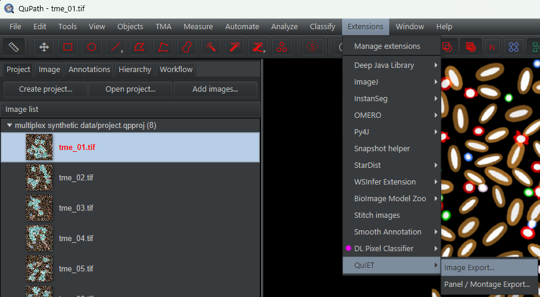
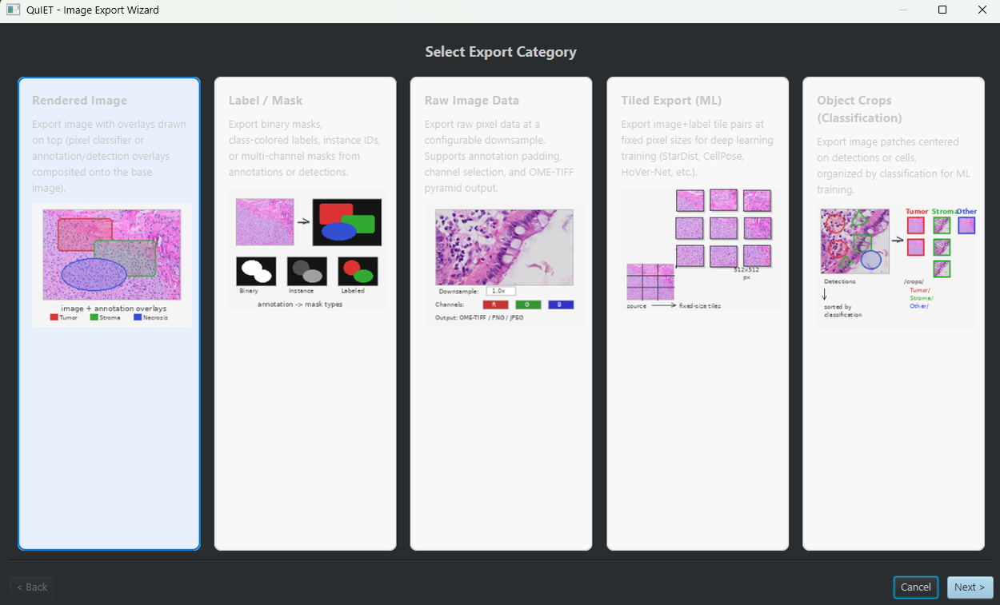
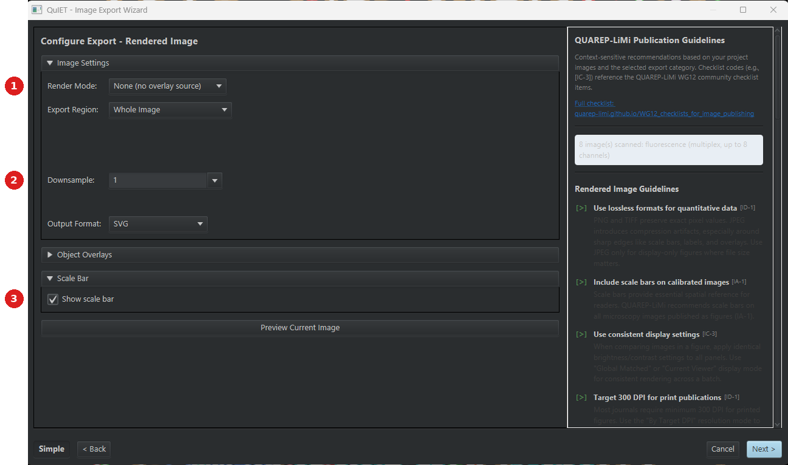
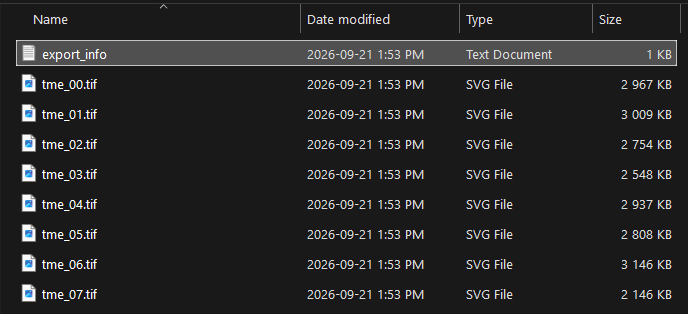
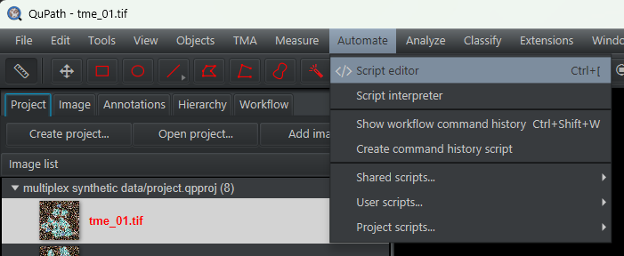
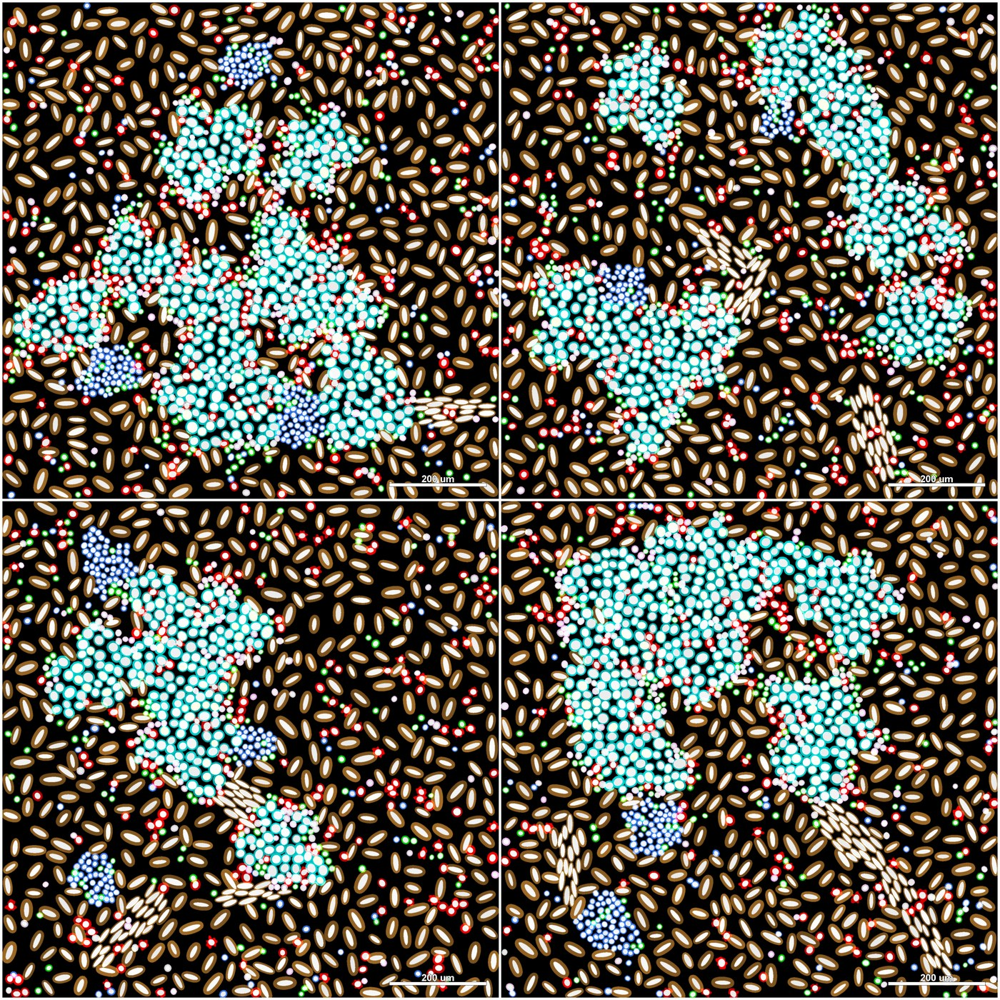

# QuIET — QuPath Image Export Toolkit

> Turn an annotated project into publication-ready figures, collaborator review images, or
> machine-learning training sets, in batch, without writing an export script. With
> QUAREP-LiMi reporting guidance built into the dialog.

| | |
|---|---|
| **Repository** | [uw-loci/qupath-extension-image-export-toolkit](https://github.com/uw-loci/qupath-extension-image-export-toolkit) |
| **Extension version** | 1.2.12 |
| **License** | Apache-2.0 |
| **Requires** | QuPath 0.7.0+, Java 21+ |
| **Where to find it** | `Extensions > QuIET > Image Export...` and `Extensions > QuIET > Panel / Montage Export...` |
| **Catalog** | LOCI QuPath Extensions |
| **Session** | Hands-on |

> **Walkthrough video:** %%VIDEO_QUIET_IMAGE_EXPORT%%
> The walkthrough below is self-contained. You can work through it during the workshop, or on your own afterwards.

> **New to QuPath?** Words like *project*, *annotation*, *detection*, *class* and
> *measurement* are explained in the [glossary](glossary.md). For QuPath itself, the
> [official documentation](https://qupath.readthedocs.io/en/stable/) is the place to go.

---

## What it does

Exporting an image out of QuPath is easy. Exporting *the right image, the same way, from
forty slides, with a scale bar, at a stated resolution, with a record of how you did it* is
not. That is normally a Groovy scripting job.

QuIET is a three-step wizard over that job. You pick a category, configure it, pick your
images, and export.

**Five export categories**, all sharing the same 3-step flow:

| Category | Produces | Typical use |
|---|---|---|
| **Rendered** | The image as displayed, with overlays, scale bar, panel labels | Figures and collaborator review |
| **Label / Mask** | Per-class segmentation masks | ML training targets, QC |
| **Raw image data** | Pixel data at any downsample | Handing data to another tool |
| **Tiled export (ML)** | Image + label tile pairs | Deep-learning frameworks |
| **Object crops** | One small image per object | Cell-type classifier training |

A sixth workflow, **Panel / Montage Export**, is a separate menu item with its own wizard:
select several project images, choose a *recipe* (saved settings for how a single image is
exported), and lay them out into one grid figure, with captions, spacing and background color.
QuPath renders every panel identically, so you do not assemble the figure by hand in
another program.

## Two things that make it worth your time

**Every export records a Groovy script.** Whatever you clicked in the wizard is emitted as a
self-contained script you can save, version-control, re-run next year, or send to a
collaborator who does not have QuIET installed. Save it from **Save Script...** on Step 3, or
find it afterwards in `Automate > Show workflow command history`.

The two exceptions: exports using the **active overlay**, which cannot be reproduced from a
script because the classifier is ephemeral, and the case where you have turned script recording
off in Preferences.

**QUAREP-LiMi guidance is in the dialog.** [QUAREP-LiMi](https://quarep.org/) is the
community effort to define minimum reporting standards for light microscopy. Step 2 shows a
context-sensitive guidance panel driven by your project's actual images, and Step 3 shows
"Publication Advice" before you export. The point is to catch "what magnification was that,
and is there a scale bar?" *before* the figure goes into a manuscript, not during review.

> **Simple vs Advanced.** The navigation bar has a Simple/Advanced toggle; Simple is the
> default and hides rarely-used controls. If a setting described here seems to be missing,
> flip to Advanced. The choice persists across sessions.

<b>Install</b> — from the LOCI catalog, then restart QuPath

Install from the **LOCI QuPath Extensions** catalog, then restart QuPath. Full steps, including the catalog URL, are in the [setup guide](setup.md).

Both menu items stay grayed out until a project with at least one image is open.

---

## Hands-on exercise
**Data:** `multiplex-synthetic-data-demo-project-v1.2.zip` —
**[direct download](https://github.com/uw-loci/multiplex-synthetic-data/releases/download/v1.2/multiplex-synthetic-data-demo-project-v1.2.zip)**
(20 MB; see [setup](setup.md#5-download-the-workshop-data)). It is a ready-made QuPath project
of eight synthetic 8-channel multiplexed images, `tme_00.tif` … `tme_07.tif`, from the CC0
[multiplex synthetic dataset](https://github.com/uw-loci/multiplex-synthetic-data). Cells are
already detected on every image, and every cell carries a classified ground-truth point, so
there are objects to draw in Part A and a known answer to check mask and tile exports against.
The same zip serves the [Classify Object Subset](07-classify-object-subset.md) and
[Class Distribution](10-class-distribution.md) exercises, so one download covers all three.

> **Parts A and B need one image. Part C needs at least two**, because it builds a figure out
> of several panels. This project gives you eight.

> **Already have the 14 MB `multiplex-synthetic-data-v1.2.zip` from Track B?** Those are the
> same eight images as loose files, with the ground truth beside them as CSV and GeoJSON, but
> with no project and no cells detected. It works for this exercise once you have added the
> images to a project and run cell detection — the recipe is in the
> [QP-CAT guide](03-qp-cat-cell-analysis-tools.md#hands-on-exercise). The demo project above
> skips both steps.

### Part A: a figure you could publish

1. **Drag the unzipped folder — or the `project.qpproj` inside it — onto an open QuPath
   window** to open it as a project. The images will show as **missing**: the project cannot
   know where you unzipped it. In the **Update URIs** dialog click **Search...**, choose the
   folder you unzipped, then **Apply changes**. Double-click `tme_00.tif` to open it. You
   should see cell outlines (the detections) and a colored dot on each cell (the
   ground-truth points). Those are the objects Part A draws onto the figure, so there is
   nothing to annotate by hand.
2. `Extensions > QuIET > Image Export...` (see below). The second entry,
   **Panel / Montage Export...**, is Part C.

   
3. **Step 1:** choose **Rendered Image** — the leftmost of the five categories (see below).

   
4. **Step 2:** set the export up like this. The numbers match the badges in the picture below.

   | # | Field | Set to |
   |---|---|---|
   | 1 | **Render Mode** | **Object Overlay**. The dropdown starts on **None (no overlay source)**, with a blue ring around it to draw your eye; that gives a clean image with no objects, which is what the picture below happens to show |
   | 2 | **Downsample** | **1** |
   | 3 | **Show scale bar** | Ticked |

   

   **Object Overlay** draws the detected cells and their ground-truth points onto the image.
   **Downsample** shrinks the exported image: **1** means full size, **4** means a quarter as
   wide. You only need it when the image is far bigger than the figure you want, and these
   images are 2048 × 2048. (On a whole-slide image tens of thousands of pixels wide you would
   check the width in QuPath's **Image** tab — the wizard does not block the main window, so
   you can do that with it open — and divide by roughly 2000 to get the number to enter.)

   The panel down the right is general QUAREP-LiMi guidance for the kind of export you picked,
   plus one line saying how many of your images it scanned and what type they are. Read it
   now; the advice specific to *your* images comes at Step 3.

5. **Step 3:** **every image in the project starts ticked.** Click **Deselect All** and tick
   exactly one — Part B needs a second image that has *not* been exported yet. Choose an
   output folder.

   Now click **Publication Advice**. *This* is the part that looks at the images you actually
   selected and tells you what is missing — for example "No scale bar on calibrated images".
   Items are colored by how much they matter. Read it, then export.
6. Open the result. Check that the scale bar is legible at the size you would print it.

   Your output folder should hold **one** image plus `export_info`, a small text file
   recording the settings used.

   The folder below shows what happens when you *don't* do that — eight exports, because every
   image was still ticked at Step 3. If yours looks like this, delete the folder and redo
   Step 3 with **Deselect All**, because Part B needs an image that has not been exported yet.

   (The names look odd because that run had **Drop source file extension** unticked on Step 3,
   so each file kept its original `.tif` name and gained `.svg` on the end. With the tickbox
   left at its default you get `tme_00.svg`.)

   

### Part B: the reproducibility half

*This is why Part A asked you to export only one image.*

1. Get the **Groovy script** for that export. QuIET does not write one into the output
   folder — on Step 3, click **Save Script...** and save it somewhere you can find. (It is also
   recorded in `Automate > Show workflow command history` on the exported image.)
2. Open QuPath's script editor, `Automate > Script editor` (see below), paste it in, and run
   it against a *different* image in the project.

   
3. Confirm you get the same treatment applied to new data with zero clicks.

### Part C: a multi-panel figure

1. `Extensions > QuIET > Panel / Montage Export...`
2. Select the images you want as panels and apply one **recipe** — one set of rendering
    settings — to all of them, so every panel is treated identically. The project has eight
    images; pick four and lay them out 2×2. `tme_06` (immune-rich) and `tme_07` (immune-poor)
    are the two most different, so include those. Add captions — the caption is the full
    image name, `tme_06.tif`, extension included, so you can tell versions of an image apart.
3. Export and open the montage. The one below was made from four of these images, so yours
    should look similar, with as many panels as you selected. What matters is that every panel
    got the same recipe and its own scale bar.

    

### What to notice

- The recipe concept is what makes panels *comparable*: every panel got the same rendering,
  downsample, and overlay treatment, which is exactly the claim a figure implicitly makes.
- The QUAREP panel is advisory, not blocking. It is telling you what a reviewer may ask.
- Exporting masks (Step 1 → **Label / Mask**) from the same annotations gives you ML training
  targets with no extra annotation work. Try it if you have time.

---

## Going further

- Object Crops is the fastest route from "I have classified cells" to "I have a labeled
  image dataset for a cell-type classifier."
- Tiled export writes image/label pairs in the layout deep-learning frameworks expect. This
  is the natural handoff to the [DL Pixel Classifier](02-dl-pixel-classifier.md) or to
  training outside QuPath.

**Full documentation:** the
[repository README](https://github.com/uw-loci/qupath-extension-image-export-toolkit#readme).
