# Deep Learning Pixel Classifier

> Train a deep-learning pixel classifier from sparse brush annotations, inside QuPath, with
> an embedded Python environment. Retrain, adapt to a new scanner or stain, and run inference
> without leaving the application.

| | |
|---|---|
| **Repository** | [uw-loci/qupath-extension-dl-pixel-classifier](https://github.com/uw-loci/qupath-extension-dl-pixel-classifier) |
| **Extension version** | 0.9.5 |
| **License** | Apache-2.0 |
| **Requires** | QuPath 0.7.0+, Java 21+. **A CUDA GPU to train**; inference also runs on Apple Silicon and on CPU. **Intel Macs are not supported.** ~2–4 GB download for the Python environment on first use |
| **Where to find it** | `Extensions > DL Pixel Classifier` |
| **Catalog** | LOCI QuPath Extensions |
| **Session** | Hands-on (training and inference); the large encoders are demonstrated rather than run |

> **Research use only.** Not a diagnostic device, not cleared for clinical use, not validated
> for patient care. Models trained or loaded here must not drive clinical decisions.

> **Walkthrough video:** %%VIDEO_DL_PIXEL_CLASSIFIER%%
> The walkthrough below is self-contained. You can work through it during the workshop, or on your own afterwards.

> **New to QuPath?** Words like *project*, *annotation*, *detection*, *class* and
> *measurement* are explained in the [glossary](glossary.md). For QuPath itself, the
> [official documentation](https://qupath.readthedocs.io/en/stable/) is the place to go.

---

## What it does

QuPath's built-in pixel classifier is a shallow model over hand-chosen features. It is fast,
interpretable, and often, enough. When it is not (subtle textures, tissue classes that differ
by architecture rather than color, images where stain normalization keeps failing), this
extension keeps the way you work — you still draw a few sparse annotations per class — and
puts a deep segmentation network behind it.

### Train

- The extension samples training tiles from the regions you mark, so a few brush strokes per
  class are enough. You do not annotate exhaustively.
- Train across **multiple project images** in one run for representative sampling.
- Works on **brightfield RGB and multi-channel fluorescence/spectral** images, with
  per-channel normalization.
- Normalization statistics can be computed over the **whole image** rather than per tile.
  Per-tile statistics make neighboring tiles scale their pixel values differently, which
  shows up as a visible grid of seams in the output.
- Choose your encoder: ResNet / EfficientNet / MobileNet (U-Net), **MuViT** (a multi-scale
  vision transformer with multi-resolution feature fusion), or bring your own ONNX model.
- Start from **histology-pretrained weights** (TCGA, Lunit, Kather100K) instead of ImageNet.
- Or from **pathology foundation-model encoders** (h-optimus-0, virchow, hibou-l/b,
  midnight, dinov2-large), downloaded on demand. Each carries its own license — check the
  model card before you publish results built on one.

### Adapt

- **MAE pretraining**: masked-autoencoder self-supervised pretraining on your own unlabeled
  tiles.
- **AdaBN / "Calibrate model to current image"**: recompute BatchNorm statistics on a new
  acquisition in seconds, with *zero retraining*. This is the cheap first thing to try when a
  model that worked last month stops working on this month's scanner.

### Run

- Output as per-pixel measurements, detection objects, or a classification overlay.
- Full per-pixel **probability maps**, not just argmax labels.
- Fast embedded Python inference via Appose with zero-copy tile transfer, with no conda
  environment to manage, no external server.
- An **out-of-distribution check** warns before inference when a channel's mean, 1st or 99th
  percentile sits more than 3 standard deviations from the training statistics, or its
  contrast differs by more than 2x. Both thresholds are preferences. This catches stain,
  exposure and sensor shifts that would otherwise degrade predictions silently.

## Hardware reality check

> What you can train is decided by which encoder you pick, and they span five orders of
> magnitude. Tiny U-Net trains from scratch at 10k–300k parameters. The ImageNet- and
> histopathology-pretrained backbones (ResNet, EfficientNet) sit in the middle. The pathology
> foundation models are another matter: Virchow is 632M parameters, H-optimus-0 and Midnight
> are 1.1B each. Those were trained on GPU clusters and are demanding even to fine-tune.
>
> - **Without a dedicated NVIDIA GPU (CUDA), training is impractical.** Apple Silicon (MPS)
>   can take 1–2+ hours *per epoch* on larger models. CPU is slower still, and is realistic only
>   for very small models on very few tiles.
> - Larger model + larger tiles + larger batch = more VRAM. Exceeding it can hang or crash
>   QuPath, occasionally requiring a force-quit.
> - **Start small:** Tiny U-Net if you have enough annotation to train from scratch, ResNet-18
>   or ResNet-34 if you want pretrained weights. 256 px tiles, and a batch size your card can
>   hold — 2–4 is a safe start on a small GPU, and the screenshots further down use 20 on a
>   24 GB card. Scale up only if your hardware is comfortable.

This is why the large encoders are a demonstration rather than a hands-on step: a workshop
laptop will not fine-tune a 1.1B-parameter model in the time available. A **small pretrained
encoder is a different matter** — ResNet-18 on a two-class problem trains in well under a
minute on a workstation GPU, which is what the
[hands-on training exercise](#train-your-own-in-about-a-minute) uses.

<b>Install</b> — from the LOCI catalog, then restart QuPath

Install from the **LOCI QuPath Extensions** catalog, then restart QuPath. Full steps, including the catalog URL, are in the [setup guide](setup.md).

---

## Exercise

**Training and inference have different hardware floors**, so "can I follow along?" has two
answers:

| Your machine | Training | Inference |
|---|---|---|
| Windows or Linux with an **NVIDIA (CUDA) GPU** | Fast — the exercise below runs in about a minute | Fast |
| **Apple Silicon** Mac (M1–M4) | Too slow for a workshop slot — watch this part | Usable |
| Windows or Linux with **no GPU** | Too slow — watch this part | Slow, but it works |
| **Intel Mac** | Not supported — the Python environment cannot be built at all |

So most people in the room can run the inference half on their own laptop, and only the CUDA
machines can train inside the session. Everything here also works afterwards on your own data,
which is the other reason to have it installed.

> ⚠️ **Install it before you travel** — unless you are on an Intel Mac, where it will not
> install at all. The first run fetches a **2–4 GB** Python environment, and a room full of
> people fetching it at once is not a good use of the hour. Open the extension once at home so
> the download happens there.

The inference steps additionally need a pre-trained model we have not published yet, so those
are a demonstration for everyone until it is released. Training your own is the way to get a
model to run them against today.

**Data:** the CMU-1 H&E slide in
[`Scripting Demo.zip`](https://drive.google.com/uc?export=download&id=1bWZtjZEtgqZnJOVBc91_Wk_HPgw8dmNY)
(229 MB; see [setup](setup.md#5-download-the-workshop-data)), plus
[`CMU-1_NanoTissueTrainingData.geojson`](../data/dl-pixel-classifier/CMU-1_NanoTissueTrainingData.geojson)
(110 KB) and the matching settings profile
[`ResNet18_fast_tissue.json`](../data/dl-pixel-classifier/ResNet18_fast_tissue.json) (2 KB) if
you want to train your own.

**Before you start.** Unzip `Scripting Demo.zip`, then **drag the unzipped folder onto an open QuPath window** — it is already a project, and dropping it opens it. (The menu route is `File > Project > Open project`, if you prefer.) Then double-click the **CMU-1 H&E** slide in the project list to open it.

The extension is at `Extensions > DL Pixel Classifier`.

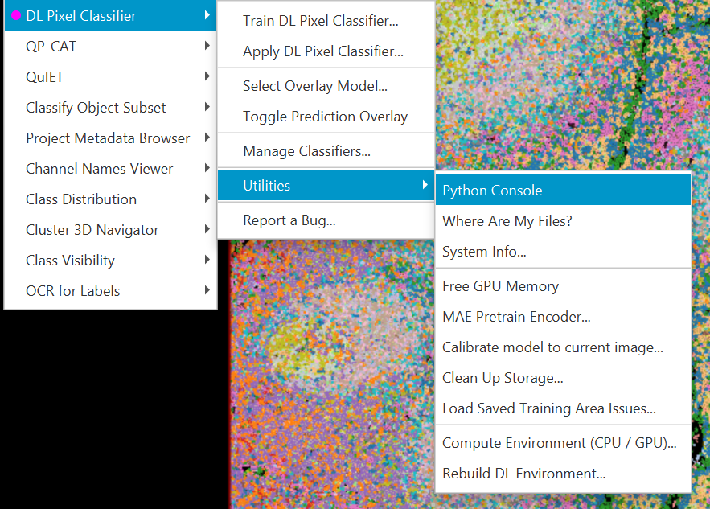

Note the **Utilities** submenu — pretraining, AdaBN calibration and the environment controls
live there, not on the top level.

1. `Extensions > DL Pixel Classifier`. Open it once and check that the Python environment
   reports as ready.
2. **Load a trained model.** In the workshop this is demonstrated with a model we have not
   published yet. To follow along on your own, train one first with
   [Train your own, in about a minute](#train-your-own-in-about-a-minute), then come back.
3. Draw a rectangle over a small area of tissue, then choose
   `Extensions > DL Pixel Classifier > Apply DL Pixel Classifier...`. Set the output to
   **overlay** so the prediction is drawn on the slide.
4. Look at the **probability map**, not just the class assignment. Find a region where the
   model is genuinely uncertain. Uncertainty is usually highest at class boundaries; that is
   expected, and a model that looks confident everywhere is the one to distrust.
5. Run it again with **detection objects** as the output, so the result becomes QuPath objects
   you can measure and classify downstream.
6. Open a slide with a visibly different stain and run inference again, watching for the
   **out-of-distribution warning**. The workshop project does not contain a second H&E slide,
   so use one of your own if you have one — otherwise this step is a demonstration.
7. On that second slide, try
   `Extensions > DL Pixel Classifier > Utilities > Calibrate model to current image...`
   (AdaBN), run inference again, and compare.

### Train your own, in about a minute

This part you *can* run today. It trains tissue-vs-background on CMU-1 and finishes in seconds
on a workstation GPU.

**1. Load the annotations.** Download
[`CMU-1_NanoTissueTrainingData.geojson`](../data/dl-pixel-classifier/CMU-1_NanoTissueTrainingData.geojson),
open the CMU-1 slide, then **drag the `.geojson` file onto the open slide** — QuPath imports the
objects directly. (The menu route is `File > Import objects from file...`.) You get
**17 annotations**: 10 `Tissue` and 7 `Ignore*`.

That is the whole training set. Here it is on the slide, and again with the slide hidden:

**That is all the labeling this took** — a dozen short strokes and a few blobs, not a traced
outline of every fragment.

<b>Why the class is called <code>Ignore*</code></b> — the trailing asterisk changes how QuPath treats the class

The `Ignore*` strokes sit on empty slide. In QuPath, a class name ending in `*` marks it as an
*ignored* class, and the extension honors that: those regions train the model (it still has to
learn what background looks like) but are left out when you generate objects from a prediction.
Without it you would get a detection object covering every piece of empty slide.

**2. Open `Extensions > DL Pixel Classifier > Train DL Pixel Classifier...`**, tick the CMU-1
slide, and press **Load Classes from Selected Images**. Nothing downstream fills in until you do.

**3. Load the settings.** Click **Load profile...** and choose
`ResNet18_fast_tissue.json`. That sets the architecture, the encoder, the tile geometry and
everything else in one step. A profile carries *settings only* — your classes still come from
the annotations you just imported, so it does not matter that the profile was saved against a
different set.

**4. Name it and press Start Training.**

<b>Settings details — set it up yourself</b> — every panel, with the value the profile uses

If you would rather set it by hand, or just want to see what the profile did, this is the whole
dialog in the order you meet it.

**Click "Show All Settings" first.** The dialog opens in a basic view that hides four of these
panels — Learning Rate & Optimizer, Loss Function, Performance and Data Augmentation. The button
is at the top right, and it reads **Show Basic View** once the full set is showing.

Every field is documented with its default and range in the
[Parameter Reference](https://github.com/uw-loci/qupath-extension-dl-pixel-classifier/blob/main/docs/PARAMETERS.md).
**Channel Configuration** and **Annotation Classes** stay empty until you press **Load Classes
from Selected Images**, so they have no screenshot here.

Screenshots are from a run of this recipe, so a number or two may differ from the profile.
The **value to set** is given in each step.

**1. Training Data Source** — tick `CMU-1.svs`, then press **Load Classes from Selected Images**.

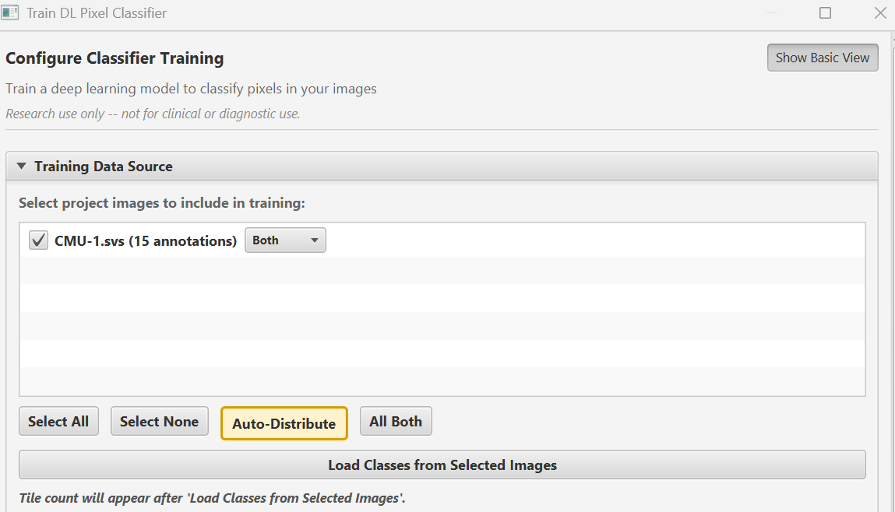

**2. Model Architecture** — `unet`, encoder **ResNet-18**. This is what makes the run fast.

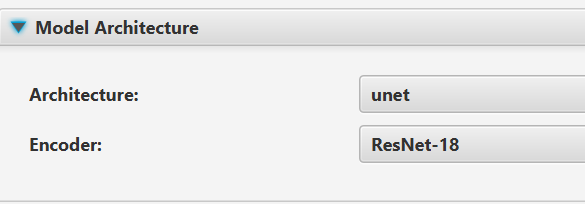

**3. Weight Initialization** — **Use pretrained backbone weights**. The profile freezes
`encoder.layer1` and `encoder.layer2`. Pretrained features mean the model starts knowing what an
edge is, which is why it converges in a handful of epochs instead of eighty.

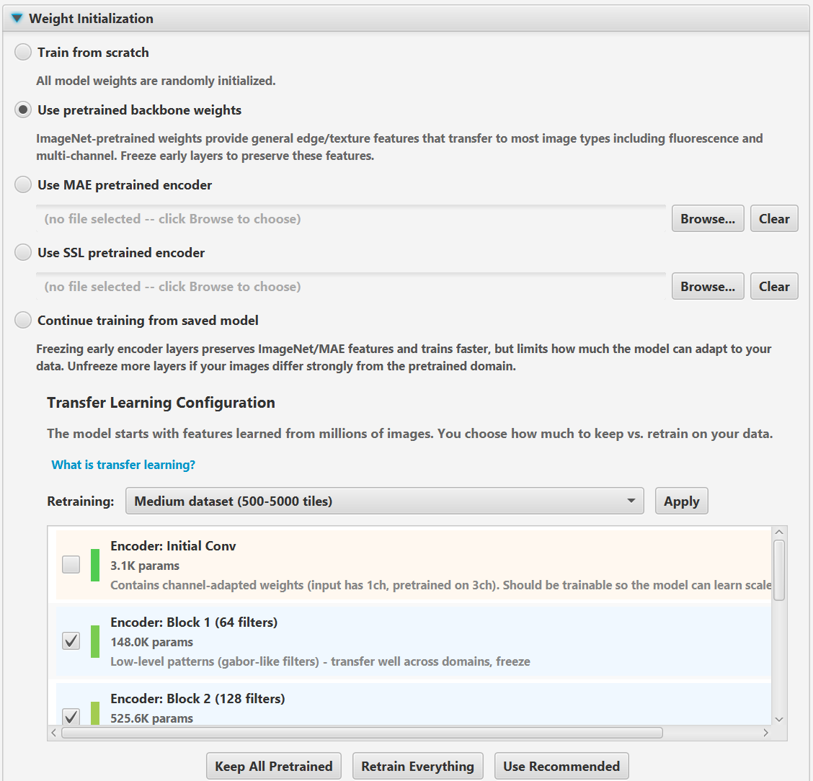

**4. Tiles & Resolution** — tile size **256**, resolution **4x**. The gray line underneath
reports the effective pixel size the model will train at; that is the number that matters, not
the slide's native one.

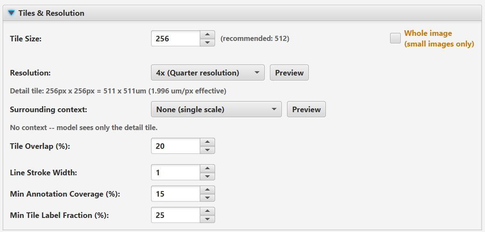

**5. Duration & Stopping** — **100 epochs**, validation split **20%**. The profile leaves early
stopping on with patience 10; see the warning below the walkthrough before you trust it.

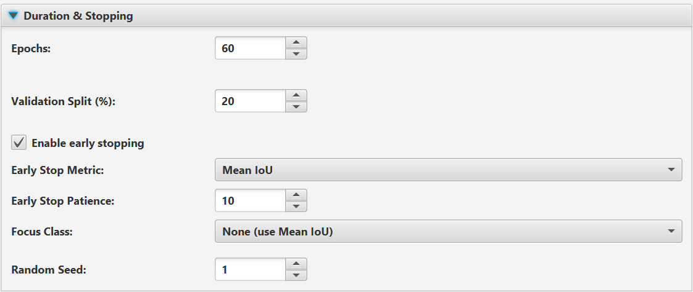

**6. Batch Size & Memory** — batch **20**, accumulation **1**.

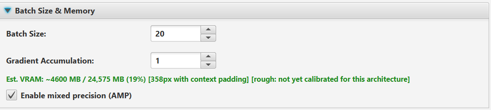

> **The green line will not match yours, and that is expected.** The first number is what this
> configuration is predicted to need; **the second is your own GPU's memory**, so the percentage
> is specific to your machine. On a smaller card the same settings might read 60%, or refuse to
> fit. If it says it will not fit, lower the batch size first.
>
> - **`[358px with context padding]`** — the tiles handed to the model are larger than the tile
>   size you set, because real image data is added around each one so training geometry matches
>   inference. Memory scales with *that* number, not with the 256 you typed.
> - **`[rough: not yet calibrated for this architecture]`** — the estimate is a formula rather
>   than a measurement for this architecture. Treat it as a guide and leave headroom.

**7. Learning Rate & Optimizer** — learning rate **0.001**, encoder LR factor **0.10**, weight
decay **0.01**, scheduler **Reduce on Plateau**. The gray text spells out the resulting
per-group rates.

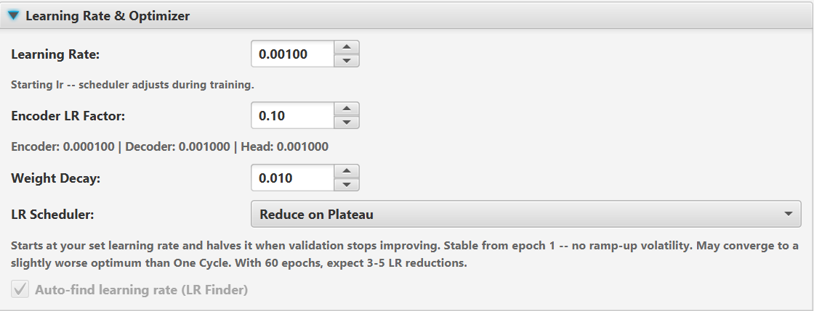

**8. Loss Function** — **Cross Entropy + Dice**, hard-pixel mining annealing from 100% to
**30%**, adaptive per-class floor on.

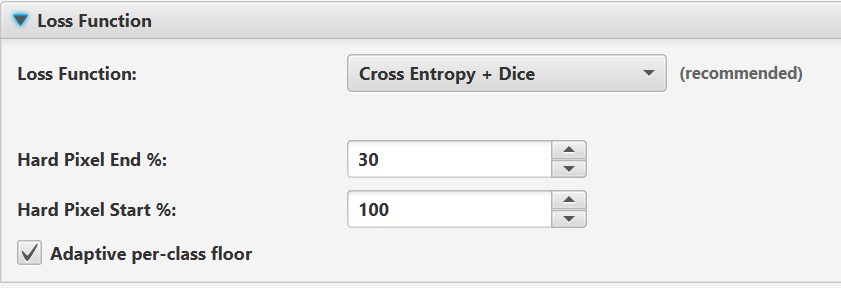

**9. Performance** — leave as-is. **DataLoader workers 0** unless you know otherwise.

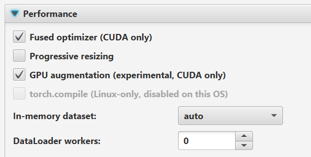

**Channel Configuration** and **Annotation Classes** appear once you press **Load Classes**.
Channels are RGB with **percentile_99** normalization; the classes are whatever your annotations
contain, with per-class weights.

**10. Data Augmentation** — flips, 90-degree rotation, brightfield color jitter, elastic
deformation.

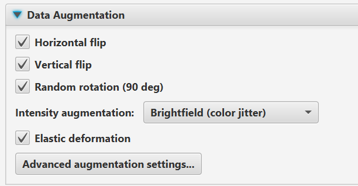

**11. Name Your Classifier** — name it and press **Start Training**. `Copy as Groovy Script`
on the same row reproduces the whole run as a script.

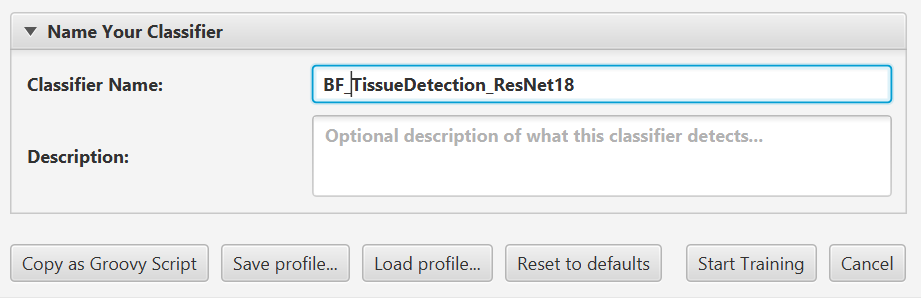

**5. Watch the training log.** On a recent GPU this reaches a usable model within the first
handful of epochs.

<b>Will everyone get the same result?</b> — what is repeatable and what is not

**The train/validation split is repeatable.** It is not drawn at random per run: patches are
assigned by a deterministic rule with a fixed shuffle seed, so the same annotations at the same
tile size, downsample and overlap give the same split on every machine. Two people following
this recipe get the same split.

**Change the annotations and the split changes** — necessarily, because the patches themselves
change. Add one stroke and the whole assignment can shift. The same is true if you change the
downsample, the tile size or the overlap, since those change how many patches exist.

**The Random Seed field does not control the split.** It seeds the Python side: weight
initialization, augmentation and batch order. Set it to anything other than 0 and those become
repeatable too; leave it at 0 and they are not. Even with a seed fixed, results can differ
slightly between GPUs and driver versions.

So: identical setup, identical split, and with a non-zero seed a near-identical model. Different
annotations, all bets off — which is the honest answer for anyone comparing their run against
the numbers here.

<b>Two lines near the top of the log</b> — the step budget, and the validation size

- the **step budget** — how many optimizer steps each epoch actually buys. If your batch size
  is at or above the number of training patches, an epoch buys a single step and the epoch
  count stops meaning anything. The extension asks before starting in that case.
- the **validation size** — with a small validation set, one patch is a large fraction of the
  reported score, so the best-epoch number is optimistic. With a handful of patches from a
  single slide it is optimistic for a second reason too: the validation tiles are near
  neighbors of the training tiles, so a high score partly measures memorization of one slide.

**6. Apply it, and expect the edges to be wrong.** A model trained on 17 sparse annotations
learns the places you showed it. Run it over the whole slide and look for where it fails —
usually the tissue boundary and anything you never annotated. Those failing regions are what you
annotate next, and *Review Training Areas* (below) is how you find them systematically.

### What to notice

- Where you put a stroke decides which tiles the model trains on, so covering the *variety* in
  your slide matters more than the total area you label.
- The OOD warning and the probability map are the two things that tell you when *not* to
  trust the output.
- AdaBN often recovers most of the loss from a domain shift in seconds. Try it before you
  consider retraining.

---

## The training loop (demo)

Training is a demonstration today rather than a hands-on step — see the hardware note above.
These are the four stages worth watching. What is *specific to this extension* is
described here; the method behind it is linked rather than explained.

### 1. Create a classifier

`Extensions > DL Pixel Classifier > Train DL Pixel Classifier...`

Draw sparse brush annotations for each class, load the classes into the dialog, pick an
architecture, and train. The dialog opens in a simplified Basic view; **Show All Settings**
exposes everything else.

Two things here differ from QuPath's built-in pixel classifier: tiles are drawn from the
regions you mark, so you label a few representative areas rather than everything; and one run
can train across **several project images** at once.

→ [Training Guide](https://github.com/uw-loci/qupath-extension-dl-pixel-classifier/blob/main/docs/TRAINING_GUIDE.md)

### 2. Review the training data the model disagrees with

**Review Training Areas...**, in the training progress dialog when a run finishes.

Your first annotations will be wrong somewhere, and this is how you find out where. The model
is run back over every training tile and the tiles are ranked by loss, highest first.

The **Confusion Matrix** tab aggregates labelled pixels across the tiles, so you can see which
class is being mistaken for which instead of guessing from individual tiles. Click any
off-diagonal cell and the Tiles tab filters to exactly those confusions.

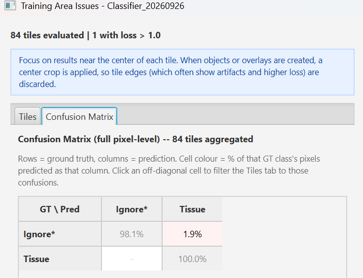

Then fix what it found. Expand **Annotation Adjustment**:

1. Set the confidence threshold — click or drag the colour ramp, or use the slider. Only pixels
   the model is at least that confident about are eligible to change.
2. Click **Preview annotation adjustment areas**. Nothing is edited yet; the pixels that would
   change are drawn in green.
3. Uncheck any class-to-class transition you disagree with, so you apply only the corrections
   you want.
4. Click **Apply previewed adjustment** and confirm.

Annotations outside the current tile are never touched.

> **Do it before you close the dialog.** Training tiles are deleted when the progress dialog
> closes. Save the session first if you want to reopen it later via
> `Extensions > DL Pixel Classifier > Utilities > Load Saved Training Area Issues...`.

Correcting annotations here typically improves results more than moving to a larger model.

→ [Training Guide, Step 9](https://github.com/uw-loci/qupath-extension-dl-pixel-classifier/blob/main/docs/TRAINING_GUIDE.md#step-9-review-training-areas-optional)

### 3. Pretrain on your own images

`Extensions > DL Pixel Classifier > Utilities > MAE Pretrain Encoder...`

If you have far more unlabeled tissue than annotation time — which is most people — the
encoder can learn your imagery before it ever sees a label, by reconstructing masked patches
of your own tiles. You then train the classifier on top of that encoder.

Extension-specific: it runs on your project images, in the embedded environment, with no data
leaving QuPath. Masked autoencoders themselves are a published method and the guide below
links onward.

→ [Domain Adaptation Guide](https://github.com/uw-loci/qupath-extension-dl-pixel-classifier/blob/main/docs/DOMAIN_ADAPTATION_GUIDE.md)

### 4. Adapt a model to a domain shift

*Described only — we have no second-batch data to demonstrate this on today.*

A classifier that worked last month can fail on this month's slides: new scanner, new stain
lot, different exposure. The extension offers three responses, cheapest first:

- **Calibrate model to current image (AdaBN)** — recomputes BatchNorm statistics on the new
  image in seconds, no retraining. Try this first; it often recovers most of the loss.
- **Domain-adaptive MAE** — continue MAE pretraining from the existing encoder on the new
  images, then fine-tune. For when the shift is too large for AdaBN.
- **Retrain** — when the new data is genuinely a different problem, not a shifted version of
  the old one.

The **out-of-distribution check** is what tells you a shift has happened at all, before you
have trusted a bad result.

→ [Domain Adaptation Guide](https://github.com/uw-loci/qupath-extension-dl-pixel-classifier/blob/main/docs/DOMAIN_ADAPTATION_GUIDE.md)

---

## Sharing and moving a model

`Extensions > DL Pixel Classifier > Manage Classifiers...`

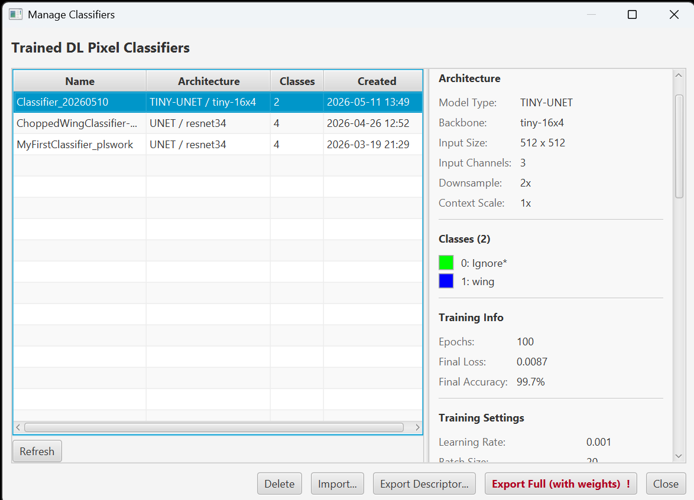

*The screenshot is from a different project — yours will list only what you have trained.*

Every classifier you train lands here, with the architecture, classes and settings it was
trained with. Two export buttons, for two different purposes:

- **Export Descriptor...** writes the model's `metadata.json` alone: architecture, classes,
  normalization, training settings. A few kilobytes, readable as text, and **not runnable**.
  This is what you attach to a methods section or send someone who asks how you configured a
  model.
- **Export Full (with weights)** writes the whole thing, weights included. This is the one to
  use when you want the model to run somewhere else. **Import...** takes that zip; it cannot
  take a descriptor. Size follows the encoder — a few megabytes for a Tiny U-Net, several
  hundred for a ResNet. The zip holds every file in the classifier folder, including the
  training checkpoints, which are usually the largest part of it.
- **Running an exported model outside QuPath?** The preprocessing recorded in `metadata.json`
  has to be reproduced exactly, including the pixel size the model trained at, which is
  `training_pixel_size_um` multiplied by the downsample. A mismatch does not error; it can
  drop a class silently. See [Normalization round-trip](https://github.com/uw-loci/qupath-extension-dl-pixel-classifier/blob/main/docs/NORMALIZATION_ROUNDTRIP.md).

---

## Going further

- [Domain Adaptation Guide](https://github.com/uw-loci/qupath-extension-dl-pixel-classifier/blob/main/docs/DOMAIN_ADAPTATION_GUIDE.md)
  covers when to use AdaBN, when to use domain-adaptive MAE, and when you really do need to retrain.
- **You do not need to pre-tile anything.** The extension exports its own training patches
  from your annotations when a run starts, so there is no separate export step to prepare.
- **Accuracy numbers** for the pixel output come from this extension's own confusion matrix,
  in *Review Training Areas* above — it is pixel-level, aggregated over the training tiles.
  The separate [Confusion Matrix](presented/confusion-matrix.md) extension is a different
  tool for a different job: it evaluates **cell** classifiers by matching detected cells
  against ground-truth points or regions. Reach for it once you have turned predictions into
  classified objects, not for the pixel classification itself.

- **Every dialog field**, with its type, default and range:
  [Parameter Reference](https://github.com/uw-loci/qupath-extension-dl-pixel-classifier/blob/main/docs/PARAMETERS.md).
- **Batch runs from Groovy**: [Scripting Guide](https://github.com/uw-loci/qupath-extension-dl-pixel-classifier/blob/main/docs/SCRIPTING.md).

**Full documentation:** the
[repository README](https://github.com/uw-loci/qupath-extension-dl-pixel-classifier#readme)
and `QUICKSTART.md`.
