# QP-CAT — Cell Analysis Tools

> Python-powered clustering, phenotyping, and spatial statistics for highly multiplexed
> imaging, with the full scientific Python stack embedded inside QuPath. No conda, no
> servers, no command line.

| | |
|---|---|
| **Repository** | [uw-loci/qupath-extension-cell-analysis-tools](https://github.com/uw-loci/qupath-extension-cell-analysis-tools) |
| **Extension version** | 0.12.0 |
| **License** | Apache-2.0 |
| **Requires** | QuPath 0.7.0+. ~1.5–2.5 GB download, ~2.5 GB on disk for the Python environment |
| **Where to find it** | `Extensions > QP-CAT` |
| **Catalog** | LOCI QuPath Extensions |
| **Session** | Hands-on |

> **Maturity warning, from the author.** This is a continuation of earlier work integrating
> other people's software into QuPath (CytoMAP, QuBaLab). Many features are **lightly tested or
> entirely untested**. Treat results as a starting point for investigation, not as findings.

> **Walkthrough video:** %%VIDEO_QP_CAT_CELL_ANALYSIS_TOOLS%%
> The walkthrough below is self-contained. You can work through it during the workshop, or on
> your own afterwards.

> **New to QuPath?** Words like *project*, *annotation*, *detection*, *class* and
> *measurement* are explained in the [glossary](glossary.md). For QuPath itself, the
> [official documentation](https://qupath.readthedocs.io/en/stable/) is the place to go.

---

## What it does

The standard multiplex workflow is: segment cells in QuPath, export a measurement table, open
Python, cluster, produce a UMAP, and then lose the connection back to the tissue. QP-CAT
collapses that loop by embedding the Python environment (via
[Appose](https://github.com/apposed/appose)) inside QuPath, so **cluster space and slide space
stay linked** — every result stays clickable back to the cell it came from.

You do not need the rest of this section to start the exercise.

<b>The capabilities</b> — what QP-CAT adds beyond QuPath's own classification

QuPath already classifies objects (train on measurements, or threshold one). These are the
other routes to a class on a cell, for when you have thirty markers and no training set worth
the name.

### Find cell types

<b>Unsupervised clustering</b>

Leiden or KMeans to start, HDBSCAN for rare populations, BANKSY when tissue architecture
matters, plus several others. <a href="https://github.com/uw-loci/qupath-extension-cell-analysis-tools/blob/main/documentation/clustering.md">Choosing one</a>.

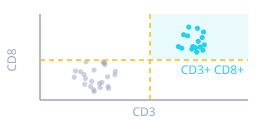
<b>Rule-based phenotyping</b>

Flow-cytometry-style marker gating, with a threshold <em>suggested</em> per marker.
<code>anypos</code> / <code>anyneg</code> express "Macrophage = CD68 <b>or</b> CD163 <b>or</b>
CD206" as one rule. <a href="https://github.com/uw-loci/qupath-extension-cell-analysis-tools/blob/main/documentation/phenotyping.md">Details</a>.

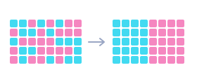
<b>Spatial feature smoothing</b>

Blend each cell with its neighbours before clustering, so niches come out as coherent
regions instead of salt-and-pepper.

<b>Autoencoder cell classifier</b>

Label a small subset by hand and have the rest of the project labelled for you. Original to
QP-CAT and unpublished. <a href="https://github.com/uw-loci/qupath-extension-cell-analysis-tools/blob/main/documentation/autoencoder.md">Details</a>.

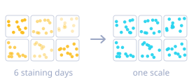
<b>Batch correction</b>

So clusters reflect biology rather than staining day. Runs
<a href="https://portals.broadinstitute.org/harmony/">Harmony</a> over images, or over
independent areas within one image.

### Ask where things sit

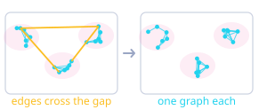
<b>Independent areas</b>

Cells in physically separate tissue — different TMA cores, sections, images — must never
share a spatial graph. A neighbour relationship across two cores is an artifact of how the
slide was laid out, not biology. QP-CAT resolves areas by geometry and guarantees no edge
joins two of them. Left unconfigured, the graph is global.

<b>Spatial statistics</b>

Neighborhood enrichment, Ripley's L, Geary's C, Moran's I and co-occurrence over kNN,
radius or Delaunay graphs — via <a href="https://squidpy.readthedocs.io/">squidpy</a>. Do two
phenotypes co-localize or avoid each other, and at what distance?
<a href="https://github.com/uw-loci/qupath-extension-cell-analysis-tools/blob/main/documentation/spatial-statistics.md">Details</a>.

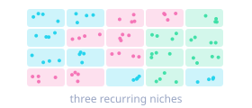
<b>Cellular neighborhoods</b>

Recurring tissue niches derived from the cell-type composition around each cell.
<a href="https://github.com/uw-loci/qupath-extension-cell-analysis-tools/blob/main/documentation/spatial-neighborhoods.md">Details</a>.

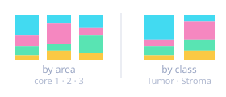
<b>Composition tables</b>

<b>By area</b>: one row per independent area — how does cluster makeup vary core to core?
<b>By class</b>: clusters grouped by annotation class (Tumor, Stroma), pooled across images.

<em>Areas decide which cells may share a graph; class decides how results are compared.</em>

### Look at results

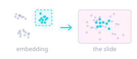
<b>Linked embedding</b>

Interactive UMAP / PCA / t-SNE plus a 3D view. Brush a region and those cells highlight on
the slide; double-click to jump to one.

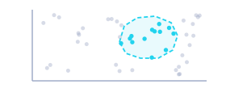
<b>Lasso gating</b>

Draw a polygon on any biaxial marker plot and the objects inside it are selected in QuPath,
in the current image.

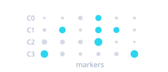
<b>Cluster-defining markers</b>

Wilcoxon ranking, plotted as dotplot, matrix plot, violin or PAGA, without leaving QuPath.
<a href="https://github.com/uw-loci/qupath-extension-cell-analysis-tools/blob/main/documentation/results.md">Reading the tabs</a>.

<b>Install</b> — from the LOCI catalog, then restart QuPath

Install from the **LOCI QuPath Extensions** catalog, then restart QuPath. Full steps, including the catalog URL, are in the [setup guide](setup.md).

Then run `Extensions > QP-CAT > Setup & help > Set up analysis environment (first run)...`. One click configures the full Python environment.

> **Do this before the workshop.** It is a 1.5–2.5 GB download, and conference wifi will be slow with several people fetching it at once.

---

## The data: a synthetic tumor microenvironment

<b>Coming: a real multiplexed Orion dataset</b> — seven images, shown in the walkthrough video; not downloadable yet

A second dataset is being prepared for QP-CAT specifically — a QuPath project
(`multiplexTesting`) of **seven Orion images**, six numbered `Orion1`–`Orion6` plus
`Orion_Tonsil_10follicles`. Real tissue, real markers, and **several GB**, which is why it is
not the hands-on exercise. **You will see it in the walkthrough video**, showing what this
workflow looks like on real data, and the download is there for exploring afterwards on a
machine with room for it.

The tonsil image is the one to start from: ten follicles in a single field, each with a
distinct core and a surrounding zone, so clustering and neighborhood analysis have real
structure to recover rather than a schematic one.

**It does not replace the synthetic set below, and is not meant to.** The synthetic data
stays the one you learn the workflow on: it is small, it is quick to look at, and it has
ground truth, so you can tell whether you got the right answer. Come here once you trust the
workflow and want it on real tissue.

**Not downloadable yet.** The link will appear here and in the [setup guide](setup.md).

This exercise uses the
**[multiplex synthetic dataset](https://github.com/uw-loci/multiplex-synthetic-data)**, a
small, fully ground-truthed synthetic tumor microenvironment. It is **CC0**: public domain,
no attribution required, yours to reuse in your own teaching.

The hands-on exercise below hands you a **ready-made QuPath project** built from it — the
eight images with cells already detected — so you do not need to run any detection yourself.
It also carries the ground truth as classified **point annotations**, one per cell, so you can
check an answer without leaving QuPath. Get the source zip (**~14 MB**, the
[latest release](https://github.com/uw-loci/multiplex-synthetic-data/releases/download/v1.2/multiplex-synthetic-data-v1.2.zip))
when you want that same truth as **CSVs** to open in a spreadsheet, the per-image generation
parameters, or the raw images to build the project yourself.

Why synthetic, for a workshop:

- **You can check the answer.** Real multiplexed tissue has no ground truth, so you never
  actually know which cell is which type, or whether two populations really co-localize.
  Here every cell has a known type, known marker positivity, and a known place in the tissue.
- **It is fast.** ~1,430 cells per image; 11,421 across all eight. Clustering one image is
  seconds, not coffee.
- **Everything has something to recover.** Six cell types, tissue niches, a proliferation
  gradient, and deliberate per-image intensity offsets.

> **None of the biology is real.** Treat it as you would fake news: the biological accuracy
> has not been checked by a biologist. Or even by me. It is built so the analysis has
> structure to find, not so the tissue is right.

**What is in it**

| | |
|---|---|
| 8 images | 8 channels (DAPI, PanCK, Ki67, aSMA, CD3, CD8, CD20, CD68), 2D, 0.5 µm/pixel |
| 6 cell types | tumor, fibroblast, CD8 T, helper T, B cell, macrophage |
| Tissue niches | tumor nests, an immune-infiltrated nest boundary, B-cell follicles, stroma |
| Ground truth | per-cell CSV: type, region, position, morphology, per-marker positivity |

**What you get when you unzip the source zip**

Thirty-four files, and QuPath only wants eight of them:

| Files | How many | What to do with them |
|---|---|---|
| `tme_00.tif` ... `tme_07.tif` | 8 | **These are the images.** Drag them into a QuPath project. Everything else is reference material |
| `tme_NN_groundtruth.csv` | 8 | The answer key: one row per cell, with its true type, region and per-marker positivity. Open in a spreadsheet when you want to check a result |
| `all_groundtruth.csv` | 1 | The same thing for all eight images in one file |
| `tme_NN_points.geojson` | 8 | The same cells as QuPath point annotations. `File > Import objects from file...` if you want the truth drawn on the image |
| `tme_NN_params.json` | 8 | How each image was generated: cell counts per type, niche layout, batch offset |
| `INSTRUCTIONS.md` | 1 | The dataset's own guide, with the full channel and region tables |

> **Set the image type to Fluorescence.** QuPath asks the first time you open one, and the
> answer is **Fluorescence**. The brightfield options are RGB-only and are not offered for
> an eight-channel image, so this is a quick confirmation rather than something to get
> wrong.

---

## Hands-on exercise

**Download:** `multiplex-synthetic-data-demo-project-clustered.zip` —
**[direct download](https://github.com/uw-loci/multiplex-synthetic-data/releases/download/v1.2/multiplex-synthetic-data-demo-project-clustered.zip)** (23 MB). All eight synthetic images with cells already detected, plus
a saved KMeans k = 6 clustering of all 11,421 of them. Unzip it and drag `project.qpproj` onto
an open QuPath window; if the images come up red in an **Update URIs** dialog, click
**Search...**, point it at the unzipped folder, and **Apply changes**.

That saved result means **you can read every number in Part A without running anything** — useful
if the environment build is slow, or if you would rather spend the hour on Parts B and C.

> **The embedding columns in the download are named `3DUMAP1`, `3DUMAP2` and `3DUMAP3`** — the
> dialog's **Name** field was `3D UMAP`, and the space is dropped when the columns are written. A
> run you do with a newer QP-CAT build may write `QPCAT 3D UMAP1` instead. Nothing is broken
> either way — the saved result knows which columns it wrote — but if you go on to the
> [Cluster 3D Navigator](04-cluster-3d-navigator.md) exercise, those are the three names to pick.

<b>Building it yourself instead</b> — detection settings, if you want to start from the images

You need **one** image to start, `tme_00.tif`; Parts C and D add `tme_06.tif` and
`tme_07.tif`, and only batch correction wants all eight.

Create a QuPath project and add `tme_00.tif`. Set the image type to **Fluorescence** if
prompted. Add a rectangle covering the whole image, then run `Analyze > Cell detection` on the
**DAPI** channel.

> **One parameter matters more than the rest: background radius = 0.**
> DAPI in this data has no background. Any nonzero radius smaller than the largest nucleus
> hollows out the biggest round nuclei and **silently drops about 20% of the tumor cells**,
> and a tumor compartment that is quietly 20% short still looks entirely plausible. This is
> worth internalizing beyond this dataset: segmentation defaults chosen for one image type
> fail *silently* on another, and the failure shows up as biology.

Other settings that work: requested pixel size 0.5 µm, sigma 1.5 µm, minimum area 8 µm²,
maximum 1000 µm², threshold 50, cell expansion 5 µm, include nuclei and measurements. You
should detect close to 1,530 cells on `tme_00`.

### Part A: recover the cell types
*Concept: cell identity from marker combinations, and what "resolution" costs you.*

1. **Check the environment first.** Open `Extensions > QP-CAT`. Until the Python environment
   is installed, every group except **Setup & help** is hidden, so a fresh install shows a menu
   with one item on it — that is expected, not a broken install. Build it from
   `Setup & help > Set up analysis environment (first run)...`. Once it is ready the menu fills
   out:

   

2. **`Extensions > QP-CAT > Find cell populations (clustering)...`**, and set it up like this:

   | Section | Setting |
   |---|---|
   | Scope | **All project images (8)** — 11,421 cells |
   | Measurements | **`Select 'Mean' only`**, then also tick the six **`Nucleus:`** shape measurements (Area, Perimeter, Circularity, Max caliper, Min caliper, Eccentricity). **30 in total** |
   | Normalization | **Z-score (standard)**, the default |
   | Dimensionality Reduction | **UMAP**, **Dimensions: 3D** |
   | Clustering Algorithm | **KMeans**, **k = 6** |

   Leave the random seed at 42. KMeans runs ten initializations and keeps the best, so the run
   is repeatable. The dialog reopens with whatever you last ran, so the second and third runs in
   this exercise start from the first rather than from defaults. While a run is going, the
   progress checklist shows how long each step has taken — useful for deciding which spatial
   statistics are worth their time on your own data. Tick **`Neighborhood enrichment + Moran's I`** and, under Spatial statistics,
   **`Ripley L`** as well — Parts B and C need them, and computing them now saves a second
   run.

   > **Short on time, or something went wrong?** Everything below is already computed in the
   > **clustered project** download. Open it, then
   > `Results & populations > View Past Results...` and pick `auto_20260924_135415_kmeans`.
   > The run's settings are also saved as `K-Means-6.json`, loadable from the Run Clustering
   > dialog's **`Load Config from file...`**, if you would rather reproduce it than read it.

   > **Why keep the shape measurements?** Marker intensities are the usual starting point, and
   > it would be reasonable to stop there. This dataset is built so that shape carries real
   > information — fibroblasts have elongated spindle nuclei, tumor nuclei are large and round —
   > and you will see those features earn their place in the next step.
   >
   > `Explore & spatial > Quick clustering presets > Quick KMeans (k=10)` is **k = 10**, not 6.
   > It is not a shortcut for this step.

3. **Read the Marker Fingerprints tab.** One card per cluster, showing each measurement's
   enrichment as log2 fold-change against every other cell. This is where you name the clusters:

   

   | Cluster | Cells | Led by | Read it as |
   |---|---|---|---|
   | 0 | 3,306 | aSMA, **plus eccentric, long nuclei** | fibroblast |
   | 1 | 1,914 | PanCK | tumor |
   | 2 | 2,752 | CD3 **and** CD8 | T cells |
   | 3 | 1,093 | CD20 | B cell |
   | 4 | 1,566 | CD68 | macrophage |
   | 5 | 790 | Ki67 **and** PanCK | proliferating tumor |

   Cluster 0 is the shape argument made concrete: `Nucleus: Eccentricity` and `Nucleus: Max
   caliper` sit alongside aSMA, because a fibroblast is both aSMA-positive *and* spindle-shaped.

4. **Now compare that against the ground truth, and notice it does not line up the way you
   would expect.** Every cluster matches a real population to within about one percent —
   but they are not the six types the dataset was built from:

   | Cluster | % of cells | Ground-truth population | % |
   |---|---|---|---|
   | 0 fibroblast | 28.9 | `fibroblast` | 28.9 |
   | 1 tumor | 16.8 | `tumor`, Ki67-negative | 16.4 |
   | 5 proliferating tumor | 6.9 | `tumor`, Ki67-positive | 7.2 |
   | 2 T cells | 24.1 | `cd8_t` **+** `helper_t` | 24.3 |
   | 3 B cell | 9.6 | `b_cell` | 9.5 |
   | 4 macrophage | 13.7 | `macrophage` | 13.6 |

   **KMeans spent one of its six clusters splitting the tumor by proliferation, and paid for it
   by merging the two T-cell lineages.** Ki67 is a *state* — a cell cycling or not — while CD8
   marks a *lineage*. Nothing in the algorithm knows the difference; both are just columns that
   separate cells.

   The cost is not cosmetic. "T cells are present" and "*cytotoxic* T cells are present" are
   different claims about a tumor, and only the second speaks to whether the immune response has
   effector potential. You got the right *number* of clusters and the wrong *partition*, and the
   only reason you can tell is that this dataset ships a ground truth. On real data you could not.

5. **So what would you change?** Two honest routes, both worth trying:
   - **k = 7**, which gives the algorithm room to keep the tumor split *and* separate the T cells.
   - **Drop Ki67 from the measurements** and re-run at k = 6. If proliferation cannot define a
     cluster, the spare cluster goes somewhere else.

   Neither is more correct in the abstract. Which you want depends on whether proliferation or
   cytotoxic identity is the question you came with — and that is a decision about biology, not
   about clustering.

6. **A third route: cluster the UMAP, and let the data pick the number.** Both routes above
   still make you choose *k*. There is a way not to — and you already have what it needs,
   because step 2 computed a 3D UMAP and wrote it onto every cell.

   In QP-CAT this is a **second run**, not a setting: clustering normally fits in full marker
   space and the embedding is computed only so you have something to look at. Open **Find cell
   populations (clustering)...** again and change four things:

   | Section | Setting |
   |---|---|
   | Measurements | **`Select none`**, then tick only **`QPCAT 3D UMAP1`**, **`2`** and **`3`** — three in total. (In the pre-built clustered project these are named `3DUMAP1/2/3`.) |
   | Normalization | **None** |
   | Dimensionality Reduction | **Method: None** |
   | Batch correction (Harmony) | **Off** |
   | Clustering Algorithm | **[HDBSCAN](https://scikit-learn.org/stable/modules/generated/sklearn.cluster.HDBSCAN.html)**, **Cluster selection: Leaf**, **min_samples: 0**, `min_cluster_size` **200** |

   **The three settings in bold are the exercise.** Left on their defaults, this configuration
   returned a single cluster holding **97.0%** of 107,282 cells on a different, real dataset —
   from a space whose groups were plainly separated in the 3D view. What each setting does:
   [scikit-learn's `cluster_selection_method` and `min_samples`](https://scikit-learn.org/stable/modules/generated/sklearn.cluster.HDBSCAN.html).
   What it looks like when it goes wrong, and how to tell:
   [QP-CAT troubleshooting](https://github.com/uw-loci/qupath-extension-cell-analysis-tools/blob/main/documentation/troubleshooting.md#5-hdbscan-returns-one-giant-cluster-and-almost-no-noise).

   **`min_cluster_size` is the one you will actually tune, and 200 is a starting point rather
   than a tuned value.** It is the smallest group HDBSCAN is allowed to call a cluster, so it
   has to be read against this dataset: 11,421 cells, and the smallest population you are trying
   to recover is proliferating tumor at 790. The default of 15 is 0.1% of the cohort — fine for
   finding something rare, but with **Leaf** selection, which deliberately cuts at the finest
   level of the tree, a floor that low is an invitation to shatter each population into
   fragments. 200 sits well under 790 so a real group can still clear it, and well above 15.

   **Changing it changes two things at once.** With `min_samples` on **0**, scikit-learn ties
   the density estimate to `min_cluster_size`, so raising the floor also widens the neighbourhood
   the density is measured over. That is usually what you want — it is why 0 is the default —
   but it means a sweep of `min_cluster_size` is not a one-variable sweep.

   **Leave batch correction off, even though the dialog offers it.** Eight images are in scope,
   so Harmony is selectable, but there is nothing here for it to correct: the input is three
   UMAP columns, and correcting those adjusts the *picture* rather than the measurements that
   produced it. Batch correction belongs in the run that computes the embedding. Note the
   consequence for this dataset — the step 2 UMAP was computed without it, over eight images
   three of which (`tme_02`, `tme_04`, `tme_05`) carry deliberate intensity offsets, so whatever
   batch structure that introduced is already baked into the coordinates you are about to
   cluster. If you want it gone, correct it in step 2 and recompute the UMAP; the
   [batch-effects exercise](#optional-and-slower-batch-effects) below is that run.

   > **One deliberate exception to a rule stated later.** The batch-effects exercise tells you to
   > press **`Deselect QPCAT`** before a second run, because QP-CAT's own output columns are
   > answers, not inputs. This step is the case where clustering on them is the point — which is
   > why you tick exactly three of them by hand rather than leaving the rest of the previous
   > run's output selected alongside.

   **The tell is the noise fraction**, and QP-CAT names it for you in the banner above the
   results. HDBSCAN has two failure modes that look identical in the viewer and are opposites
   underneath: a lot of noise spread evenly means change the *algorithm*; almost no noise beside
   one dominant cluster means change the *cluster selection*.

   **What it looks like when it works** — click any panel for full size:

<figure>
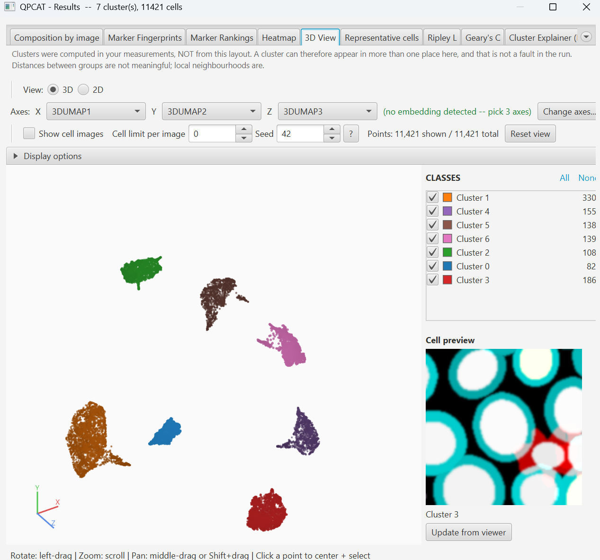
<figcaption><b>Seven separated lobes, no noise.</b> HDBSCAN found the count itself. This is
what Leaf selection buys you: the lobes, rather than their common parent.</figcaption>
</figure>
<figure>
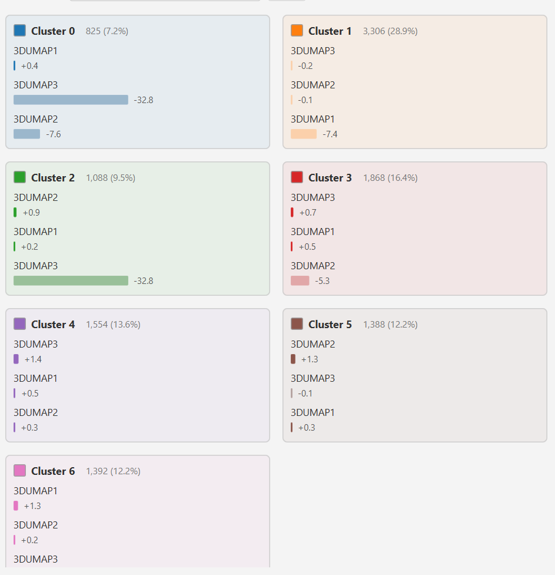
<figcaption><b>And the bill for it.</b> Every card is described by <code>3DUMAP1/2/3</code>,
because those are the only three columns the run saw. No marker names, so no phenotype.</figcaption>
</figure>
<figure>
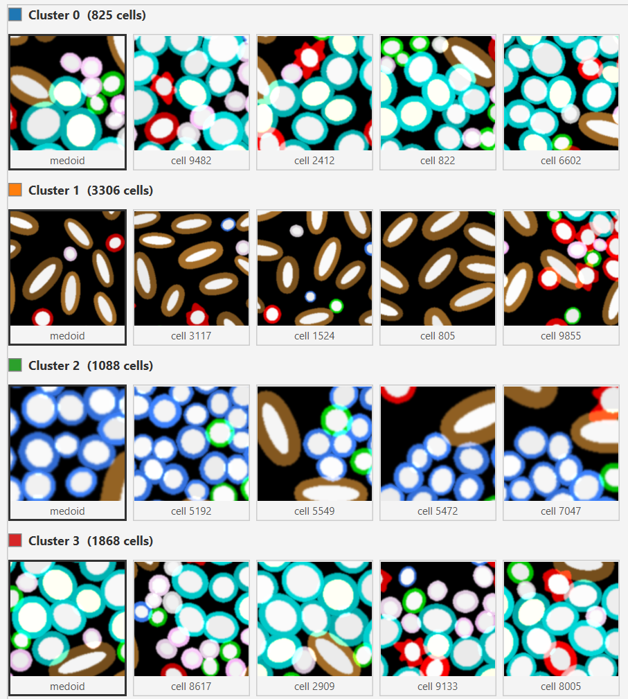
<figcaption><b>The clusters are real anyway.</b> Cluster 1 is unmistakably spindle-shaped,
cluster 2 blue-ringed. Read the clusters by eye here, or re-run over markers to name them.</figcaption>
</figure>

   **What to look for, rather than what to expect.** Your run may split or merge differently.
   Read Marker Fingerprints and compare against the ground truth as you did before, then ask
   the question this route exists for: *did letting the data choose recover the CD8 / helper
   split that KMeans spent its spare cluster elsewhere?*

   **The middle panel is the honest cost of this route, and it is not a bug.** Clustering on
   three embedding columns means the marker rankings can only rank those three columns. If you
   need phenotypes, name the clusters from **Representative cells**, or cross-check against the
   marker-space run from step 2. Note also that with **Method: None** the results window has no
   2D embedding tab — nothing new was computed to plot. The **3D View** tab still works,
   because it reads the UMAP columns off the cells.

   > **Worth reading before you rely on this:**
   > [Using UMAP for Clustering](https://umap-learn.readthedocs.io/en/latest/clustering.html).
   > Cross-check against a full-marker-space run — which, conveniently, is the run you did in
   > step 2.

7. Check your own numbers against `all_groundtruth.csv` in the dataset download; every cell's
   true type is in the `cell_type` column.

### Part B: is the tumor infiltrated?
*Concept: immune infiltration at the invasive margin.*

Cell types alone do not tell you much. **Where** they sit does. In this image, T cells are
concentrated in a band just outside each tumor nest, the computational version of a
pathologist's read on whether an immune response has reached the tumor.

1. Run **neighborhood enrichment** on your classified cells. It is a tick-box —
   `Neighborhood enrichment + Moran's I` — in the Run Clustering dialog, so the easiest route is
   to turn it on before you cluster. After the fact, use
   `Explore & spatial > Spatial statistics on existing clusters...` instead.
2. Read the matrix for four specific pairs, and predict each before you look:

   | Pair | Expect | Because |
   |---|---|---|
   | tumor ↔ tumor | strongly positive | tumor grows in nests, not as single cells |
   | B ↔ B | strongly positive | follicles: dense aggregates, not scattered cells |
   | tumor ↔ fibroblast | strongly **negative** | they occupy different compartments |
   | tumor ↔ CD8 T | positive | cytotoxic T cells sit at the nest boundary |

3. **Now the control that makes it a result.** Check tumor ↔ *helper* T. It should be
   markedly weaker than tumor ↔ CD8 T. The enrichment is specific to the cytotoxic subset,
   which is exactly why Part A's k = 5 merge would have destroyed this finding: the two
   T-cell populations would have been averaged into one indifferent number.
4. Run **Ripley L** per type: tumor and B cells clustered, fibroblasts dispersed. It is one of
   four tick-boxes under **Spatial statistics**, in the same two places as step 1 of this part. Read the
   curve against the dashed diagonal: above it means clustered at that radius, below means
   dispersed.
5. Go and look. Click a boundary CD8 T cell in the viewer and confirm it really is where the
    statistic says.

    > **Taking the numbers with you.** The Geary's C, Ripley and co-occurrence tabs each have
    > `Copy`, `Copy CSV` and `Save CSV...`. The CSV is written one row per observation, so a
    > pairwise co-occurrence row names both clusters — easier to work with than the on-screen
    > table, which is one column per ordered pair and scrolls off the right on a run with many
    > clusters.

### Part C: inflamed versus desert
*Concept: immune phenotypes of the tumor microenvironment, and comparing separate tissue.*

Add **`tme_06`** (immune-rich) and **`tme_07`** (immune-poor) to the project, detect cells in
both, and cluster all three images **jointly**, about 4,200 cells, still fast.

1. Open the new **Composition by area** tab. Each image is an independent area, so you get
    one row per image.
2. The contrast is stark, and it is the point:

    | | `tme_00` | `tme_06` | `tme_07` |
    |---|---|---|---|
    | Cells | 1,530 | 1,722 | 945 |
    | Lymphoid fraction | 33% | **50%** | **6%** |
    | B-cell follicles | present | more | **none at all** |

    Those are the two ends of a distinction that matters clinically: an **immune-inflamed**
    tumor, with lymphocytes throughout and organized B-cell aggregates, versus an **immune
    desert**, where the tumor sits in fibroblast-rich stroma with almost no lymphoid presence.
    It is the same axis used to stratify patients for immunotherapy: inflamed tumors tend to
    respond; deserts tend not to.
3. Note what `tme_07` is *missing*. Zero B cells, no follicles. An absent population is easy
    to overlook in a UMAP, where it simply is not drawn, and obvious in a composition table.
4. **Why "independent areas" is not a technical detail.** These are three separate images. If
    a spatial graph were allowed to join them, cells at the edge of one image would acquire
    "neighbors" from another, a neighborhood relationship that exists only because of how
    files were laid out. QP-CAT guarantees no graph edge crosses an area boundary. The same
    applies to TMA cores on one slide, which is the case you are far more likely to meet.
5. If your project has annotation classes (Tumor, Stroma, …), the **Composition by class** tab
    pools clusters by class across every image and area, the way to compare compartments that
    share a spatial graph.

### Optional, and slower: batch effects

Best done at home; clustering all eight images is ~11,400 cells.

1. `tme_02`, `tme_04` and `tme_05` carry deliberate intensity offsets (×0.8, ×1.2, ×0.85),
    a synthetic staining-day effect.
2. Cluster all eight jointly, **without** correction. Cells of one type from the offset images
    split off into their own clusters: you have discovered your slide scanner, not biology.
3. Re-run **with Harmony**. The same cell type should now cluster together across all eight
    images.

    > **Before any second run, click `Deselect QPCAT` in the Measurements list.** The first run
    > wrote its own columns onto the cells — embedding coordinates, spatial and component
    > measurements — all named with a leading `QPCAT`. They are output, not input: clustering on
    > them clusters on the previous run's answer. One button clears every one of them and leaves
    > your own measurements ticked.

### Saved results: reopen a run instead of repeating it

Clustering is the slow part of this exercise, and you do not have to do it twice. **Every
successful run auto-saves** to `<project>/qpcat/cluster_results/` under a timestamped name like
`auto_20260617_193235_leiden`. Nothing to click.

- **`Results & populations > View Past Results...`** reopens the whole results window — heatmap,
  marker rankings, embedding, every tab — with no Python run and no re-clustering. This is the
  one to use if you want to go back to Part A's plots while working on Part B, or to look again
  after the session.
- **`Apply saved result to detections...`** is the different one: it writes a saved run's labels
  back onto the cells. Reach for it when the labels are right in the saved result but are not on
  the image — most often after closing and reopening the project. It matches cells by source
  image id and centroid rather than by count, and shows a predicted match count before you
  commit, so cells it cannot match are reported rather than mislabeled.
- **`Manage Saved Results...`** lists everything saved with its size, for deleting the runs you
  no longer want. Auto-saves are never removed for you.

> Applied labels are namespaced by the result name — `<result>: Cluster N` — so results from
> different runs can coexist on the same detections without colliding. Handy, with one
> consequence worth knowing: any embedding measurements come back prefixed too
> (`<result>: QPCAT 3D UMAP1`). QP-CAT's own **3D View** tab is unaffected, because the result
> tells the view which columns it wrote; the standalone Cluster 3D Navigator reads the columns
> generically and may still need the three axes picked by hand.

### What to notice

- Every result stays clickable back to the tissue. The value here is the round trip.
- Changing the *measurement selection* usually changes the answer more than changing the
  algorithm. Try it.
- A statistical test that says two populations co-localize, over a slide where they visibly do
  not, means the test answered a different question than you asked. Look at both.
- **A single cluster is a result about your settings, not about the tissue.** Read the noise
  fraction before you conclude anything: *a lot* of noise means the algorithm found no density
  gap — try KMeans or Leiden on the same measurements; *almost none* means it found no
  boundary at all — that is Part A step 6.
- Ground truth is a luxury you will not have again. Use this dataset to learn what a *correct*
  result looks like, so you can recognize a wrong one on data where nobody can tell you.

---

## Going further

- **[Documentation index](https://github.com/uw-loci/qupath-extension-cell-analysis-tools/blob/main/documentation/README.md)**: one page per topic; the place to start.
- **[Clustering](https://github.com/uw-loci/qupath-extension-cell-analysis-tools/blob/main/documentation/clustering.md)**: measurement selection, normalization and algorithm choice.
- **[Scripting (Groovy)](https://github.com/uw-loci/qupath-extension-cell-analysis-tools/blob/main/documentation/scripting.md)** and the **[YAML headless-batch runner](https://github.com/uw-loci/qupath-extension-cell-analysis-tools/blob/main/documentation/yaml-reference.md)**: for running this across a whole cohort, including `area_levels` for TMA cores.
- **[References](https://github.com/uw-loci/qupath-extension-cell-analysis-tools/blob/main/documentation/references.md)**: papers and DOIs for every algorithm used.
- **[Dataset instructions](https://github.com/uw-loci/multiplex-synthetic-data/blob/master/INSTRUCTIONS.md)**: channel tables, the full detection recipe, what every analysis should recover, and the ground-truth CSV reference.
- Once you have clusters, [Cluster 3D Navigator](04-cluster-3d-navigator.md) gives you a
  rotatable 3D point cloud with click-to-navigate.

**Full documentation:** the
[repository README](https://github.com/uw-loci/qupath-extension-cell-analysis-tools#readme).

<b>The analysis libraries underneath</b> — where to read what a parameter actually does

QP-CAT is a QuPath front end for established Python tools: it moves your measurements out, runs
these, and brings the answers back onto the cells. Nothing in this guide re-teaches them, so when
you want to know what a parameter actually does, or how a method behaves, go to its own
documentation.

| Library | What QP-CAT uses it for |
|---|---|
| [scanpy](https://scanpy.readthedocs.io/) | Leiden clustering, marker ranking, PAGA, the dotplot / matrixplot / stacked-violin figures |
| [squidpy](https://squidpy.readthedocs.io/) | Neighborhood enrichment, Ripley's L, Geary's C, Moran's I, co-occurrence |
| [umap-learn](https://umap-learn.readthedocs.io/) | UMAP embeddings, 2D and 3D |
| [scikit-learn](https://scikit-learn.org/stable/) | KMeans, agglomerative clustering, HDBSCAN, PCA, t-SNE |
| [leidenalg](https://leidenalg.readthedocs.io/) + [python-igraph](https://python.igraph.org/) | The graph partitioning behind Leiden |
| [harmonypy](https://github.com/slowkow/harmonypy) | Harmony batch correction |
| [pybanksy](https://pypi.org/project/pybanksy/) | BANKSY spatially aware clustering |
| [anndata](https://anndata.readthedocs.io/) | The data structure the analysis is assembled in |

Versions are pinned per release; the exact set is in the extension's
[`pixi.toml`](https://github.com/uw-loci/qupath-extension-cell-analysis-tools/blob/main/src/main/resources/qupath/ext/qpcat/pixi.toml).

