# QP-CAT — Cell Analysis Tools

> Python-powered clustering, phenotyping, and spatial statistics for highly multiplexed
> imaging, with the full scientific Python stack embedded inside QuPath. No conda, no
> servers, no command line.

| | |
|---|---|
| **Repository** | [uw-loci/qupath-extension-cell-analysis-tools](https://github.com/uw-loci/qupath-extension-cell-analysis-tools) |
| **Extension version** | 0.14.8 |
| **License** | Apache-2.0 |
| **Requires** | QuPath 0.7.0+. ~1.5–2.5 GB download, ~2.5 GB on disk for the Python environment |
| **Where to find it** | `Extensions > QP-CAT` |
| **Catalog** | LOCI QuPath Extensions |
| **Session** | Hands-on |

> **Maturity warning, from the author.** This is a continuation of earlier work integrating
> other people's software into QuPath (CytoMAP, QuBaLab). Many features are **lightly tested or
> entirely untested**. Treat results as a starting point for investigation, not as findings.

> **Walkthrough video:** %Video not ready yet%
> The walkthrough below is self-contained. You can work through it during the workshop, or on
> your own afterwards.

> **New to QuPath?** Words like *project*, *annotation*, *detection*, *class* and
> *measurement* are explained in the [glossary](glossary.md). For QuPath itself, the
> [official documentation](https://qupath.readthedocs.io/en/stable/) is the place to go.

**Steps:** [1. Get the data](#1-get-the-data) · [2. Load it into QuPath](#2-load-it-into-qupath) · [3. Find the cell types](#3-find-the-cell-types) · [4. Cluster on the UMAP instead of the markers](#4-cluster-on-the-umap-instead-of-the-markers) · [5. Is the tumor infiltrated?](#5-is-the-tumor-infiltrated) · [6. Inflamed versus desert](#6-inflamed-versus-desert) · [7. Optional, and slower](#7-optional-and-slower-batch-effects) · [8. Saved results](#8-saved-results-reopen-a-run-instead-of-repeating-it)
{: .toc}

---

## What it does

The standard multiplex workflow is: segment cells in QuPath, export a measurement table, open
Python, cluster, produce a UMAP, and then lose the connection back to the tissue. QP-CAT
collapses that loop by embedding the Python environment (via
[Appose](https://github.com/apposed/appose)) inside QuPath, so **cluster space and slide space
stay linked** — every result stays clickable back to the cell it came from.

You do not need the rest of this section to start the exercise.

<b>The capabilities</b> — what QP-CAT adds beyond QuPath's own classification

QuPath already classifies objects (train on measurements, or threshold one). These are the
other routes to a class on a cell, for when you have thirty markers and no training set worth
the name.

### Find cell types

<b>Unsupervised clustering</b>

Leiden or KMeans to start, HDBSCAN for rare populations, BANKSY when tissue architecture
matters, plus several others. <a href="https://github.com/uw-loci/qupath-extension-cell-analysis-tools/blob/main/documentation/clustering.md">Choosing one</a>.

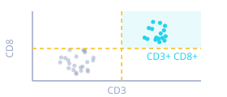
<b>Rule-based phenotyping</b>

Flow-cytometry-style marker gating, with a threshold <em>suggested</em> per marker.
<code>anypos</code> / <code>anyneg</code> express "Macrophage = CD68 <b>or</b> CD163 <b>or</b>
CD206" as one rule. <a href="https://github.com/uw-loci/qupath-extension-cell-analysis-tools/blob/main/documentation/phenotyping.md">Details</a>.

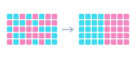
<b>Spatial feature smoothing</b>

Blend each cell with its neighbors before clustering, so niches come out as coherent
regions instead of salt-and-pepper.

<b>Autoencoder cell classifier</b>

Label a small subset by hand and have the rest of the project labeled for you. Original to
QP-CAT and unpublished. <a href="https://github.com/uw-loci/qupath-extension-cell-analysis-tools/blob/main/documentation/autoencoder.md">Details</a>.

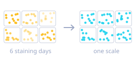
<b>Batch correction</b>

So clusters reflect biology rather than staining day. Runs
<a href="https://portals.broadinstitute.org/harmony/">Harmony</a> over images, or over
independent areas within one image.

### Ask where things sit

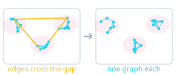
<b>Independent areas</b>

Cells in physically separate tissue — different TMA cores, sections, images — must never
share a spatial graph. A neighbor relationship across two cores is an artifact of how the
slide was laid out, not biology. QP-CAT resolves areas by geometry and guarantees no edge
joins two of them. Left unconfigured, the graph is global.

<b>Spatial statistics</b>

Neighborhood enrichment, Ripley's L, Geary's C, Moran's I and co-occurrence over kNN,
radius or Delaunay graphs — via <a href="https://squidpy.readthedocs.io/">squidpy</a>. Do two
phenotypes co-localize or avoid each other, and at what distance?
<a href="https://github.com/uw-loci/qupath-extension-cell-analysis-tools/blob/main/documentation/spatial-statistics.md">Details</a>.

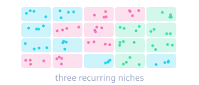
<b>Cellular neighborhoods</b>

Recurring tissue niches derived from the cell-type composition around each cell.
<a href="https://github.com/uw-loci/qupath-extension-cell-analysis-tools/blob/main/documentation/spatial-neighborhoods.md">Details</a>.

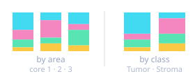
<b>Composition tables</b>

<b>By area</b>: one row per independent area — how does cluster makeup vary core to core?
<b>By class</b>: clusters grouped by annotation class (Tumor, Stroma), pooled across images.

<em>Areas decide which cells may share a graph; class decides how results are compared.</em>

### Look at results

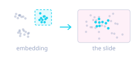
<b>Linked embedding</b>

Interactive UMAP / PCA / t-SNE plus a 3D view. Brush a region and those cells highlight on
the slide; double-click to jump to one.

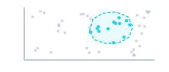
<b>Lasso gating</b>

Draw a polygon on any biaxial marker plot and the objects inside it are selected in QuPath,
in the current image.

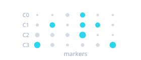
<b>Cluster-defining markers</b>

Wilcoxon ranking, plotted as dotplot, matrix plot, violin or PAGA, without leaving QuPath.
<a href="https://github.com/uw-loci/qupath-extension-cell-analysis-tools/blob/main/documentation/results.md">Reading the tabs</a>.

<b>Install</b> — from the LOCI catalog, then restart QuPath

Install from the **LOCI QuPath Extensions** catalog, then restart QuPath. Full steps, including the catalog URL, are in the [setup guide](setup.md).

Then run `Extensions > QP-CAT > Setup & help > Set up analysis environment (first run)...`. One click configures the full Python environment.

> **Set up QP-CAT's Python environment before the workshop.** QP-CAT needs a Python environment
> in addition to the extension itself. Once the extension is installed, run
> `Extensions > QP-CAT > Setup & help > Set up analysis environment (first run)...`. The
> environment is a 1.5–2.5 GB download, and conference wifi will be slow with several people
> fetching it at once.

---

## The data: a synthetic tumor microenvironment

This exercise uses the
**[multiplex synthetic dataset](https://github.com/uw-loci/multiplex-synthetic-data)**, a
small, fully ground-truthed synthetic tumor microenvironment. It is **CC0**: public domain,
no attribution required, yours to reuse in your own teaching.

You do not build anything from it. **[Get the data](#1-get-the-data) hands you a ready-made
QuPath project** — eight images, cells already detected, and the ground truth as classified
point annotations so you can check an answer without leaving QuPath. The
[dataset repository](https://github.com/uw-loci/multiplex-synthetic-data) has the raw images,
per-cell ground-truth CSVs and generation parameters if you want to do something else with the
data afterwards.

Why synthetic, for a workshop:

- **You can check the answer.** Real multiplexed tissue has no ground truth, so you never
  actually know which cell is which type, or whether two populations really co-localize.
  Here every cell has a known type, known marker positivity, and a known place in the tissue.
- **The dataset is fast to work with.** ~1,430 cells per image; 11,421 across all eight. Clustering one image is
  seconds, not coffee.
- **Everything has something to recover.** Six cell types, tissue niches, a proliferation
  gradient, and deliberate per-image intensity offsets.

> **None of the biology is real.** The dataset is built so the analysis has structure to
> find, and no biologist has checked that the tissue is plausible. Notably, the aSMA
> distribution is not meaningful: do not read anything into where that marker appears.

---

## Hands-on exercise

### 1. Get the data

**Download:** one of the two projects below. Both hold the same eight images, with cells
already detected and the same ground truth.

| # | Download | Size | Choose it if |
|---|---|---|---|
| 1 | **[`multiplex-synthetic-data-demo-project-v1.2.zip`](https://github.com/uw-loci/multiplex-synthetic-data/releases/download/v1.2/multiplex-synthetic-data-demo-project-v1.2.zip)** | 20 MB | you will run the clustering yourself. The run needs QP-CAT's Python environment |
| 2 | **[`multiplex-synthetic-data-demo-project-clustered.zip`](https://github.com/uw-loci/multiplex-synthetic-data/releases/download/v1.2/multiplex-synthetic-data-demo-project-clustered.zip)** | 23 MB | you are short on time, or the Python environment is not built. The clustering is already saved in the project |

Whichever you take, work through the steps below in order. With the clustered project,
"Find the cell types" opens the saved clustering instead of running one.

**You will also need:** QuPath **0.7.0 or later**, and this extension installed from the LOCI
catalog (see the **Install** box above, or the [setup guide](setup.md)).

### 2. Load it into QuPath

1. **Unzip the download** somewhere you can find again.
2. **Drag `project.qpproj` onto an open QuPath window.** (Menu route:
   `File > Project > Open project...`.)
3. If QuPath opens an **Update URIs** dialog with the images listed in red, show it the folder
   once:
   - **Click Search...** (bottom-right) and choose the folder you unzipped.
   - **Click Apply changes.**
4. **Double-click `tme_00.tif`** in the project list to open it.

<b>If the images still show as missing</b>

The project ships a script that points every image at the folder beside `project.qpproj`.

1. **Open `Automate > Project scripts > fix_image_paths`.**
2. **Click Run.**

### 3. Find the cell types
*Concept: cell identity from marker combinations, and what "resolution" costs you.*

The eight channels you are about to cluster on are **DAPI** (used for detection), **PanCK**,
**Ki67**, **aSMA**, **CD3**, **CD8**, **CD20** and **CD68**, at 0.5 um/pixel. They were built
from **six cell types** — tumor, fibroblast, CD8 T, helper T, B cell, macrophage. Recovering
those six from the markers alone is the exercise;
[3.4](#34-compare-against-the-ground-truth) checks what you got against them.

#### 3.1 Check the Python environment

1. **Open the `Extensions > QP-CAT` menu.** Until the Python environment is installed, every
   group except **Setup & help** is hidden, so a fresh install shows a menu with one item on it.
2. **If the menu shows only Setup & help, open
   `Extensions > QP-CAT > Setup & help > Set up analysis environment (first run)...`** and let it
   finish. Once the environment is ready the menu fills out:

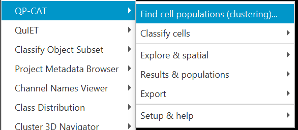

#### 3.2 Set up the clustering run

**Open `Extensions > QP-CAT > Find cell populations (clustering)...`** and set it up like this:

| Section | Setting |
|---|---|
| Scope | **All project images (8)** — 11,421 cells |
| Measurements | **`Select 'Mean' only`**, then **`Deselect QPCAT`**, then tick the six **`Nucleus:`** shape measurements (Area, Perimeter, Circularity, Max caliper, Min caliper, Eccentricity). **30 in total** |
| Normalization | **Z-score (standard)**, the default |
| Dimensionality Reduction | **UMAP**, **Dimensions: 3D** |
| Clustering Algorithm | **KMeans**, **`n_clusters` = 6** |

The dialog spells that parameter `n_clusters`. The rest of this page calls it *k*, which is
the usual name for it.

**Why `Deselect QPCAT`, and why in that order.** On an untouched project it does nothing. But
a QP-CAT run writes its own measurements back onto the cells, and several of them have *Mean*
in the name — `QPCAT spatial: Mean distance`, `QPCAT spatial: Mean triangle area`, and a
`QPCAT component: mean: <X>` for every numeric measurement already there. So `Select 'Mean'
only` **picks those up too**, and clustering on them is clustering on a previous run's answer.
It has to be the second click, not the first: `Select 'Mean' only` sets the whole visible list,
so it would undo a `Deselect QPCAT` done before it. **The count is the check** — if the total
is not 30, something came along that should not have.

These settings are deterministic: run them twice and you get the same clusters. The dialog
also reopens with whatever you last ran, so the second and third runs in this exercise start
from the first rather than from defaults. While a run is going, the progress checklist
shows how long each step has taken — useful for deciding which spatial statistics are worth
their time on your own data.

**Click Run Clustering.**

> **Using the clustered project, or did the run fail?** The clustered project already holds
> this run, so open the saved result instead of running:
>
> 1. **Open `Extensions > QP-CAT > Results & populations > View Past Results...`.**
> 2. **Pick `auto_20260924_135415_kmeans`.**
>
> The run's settings are also saved as `K-Means-6.json`, loadable from the Run Clustering
> dialog's **`Load Config from file...`**, if you would rather reproduce it than read it.

> **Why keep the shape measurements?** Marker intensities are the usual starting point, and
> it would be reasonable to stop there. This dataset is built so that shape carries real
> information — fibroblasts have elongated spindle nuclei, tumor nuclei are large and round —
> and you will see those features earn their place in the next step.
>
> `Extensions > QP-CAT > Explore & spatial > Quick clustering presets > Quick KMeans (k=10)` is **k = 10**, not 6.
> It is not a shortcut for this step.

#### 3.3 Read the Marker Fingerprints tab

**Read the Marker Fingerprints tab.** One card per cluster, showing each measurement's
enrichment as log2 fold-change against every other cell. The Marker Fingerprints tab is where you name the clusters:

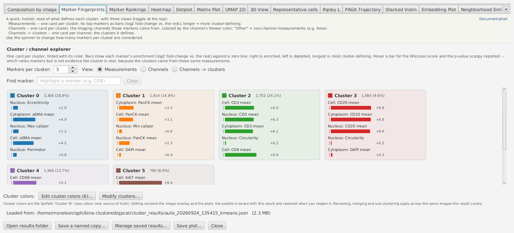

| Cluster | Cells | Led by | Read it as |
|---|---|---|---|
| 0 | 3,306 | aSMA, **plus eccentric, long nuclei** | fibroblast |
| 1 | 1,914 | PanCK | tumor |
| 2 | 2,752 | CD3 **and** CD8 | T cells |
| 3 | 1,093 | CD20 | B cell |
| 4 | 1,566 | CD68 | macrophage |
| 5 | 790 | Ki67 **and** PanCK | proliferating tumor |

Cluster 0 is the shape argument made concrete: `Nucleus: Eccentricity` and `Nucleus: Max
caliper` sit alongside aSMA, because a fibroblast is both aSMA-positive *and* spindle-shaped.

#### 3.4 Compare against the ground truth

**Now compare that against the ground truth, and notice it does not line up the way you
would expect.** Every cluster matches a real population to within about one percent —
but they are not the six types the dataset was built from:

| Cluster | % of cells | Ground-truth population | % |
|---|---|---|---|
| 0 fibroblast | 28.9 | `fibroblast` | 28.9 |
| 1 tumor | 16.8 | `tumor`, Ki67-negative | 16.4 |
| 5 proliferating tumor | 6.9 | `tumor`, Ki67-positive | 7.2 |
| 2 T cells | 24.1 | `cd8_t` **+** `helper_t` | 24.3 |
| 3 B cell | 9.6 | `b_cell` | 9.5 |
| 4 macrophage | 13.7 | `macrophage` | 13.6 |

**KMeans spent one of its six clusters splitting the tumor by proliferation, and paid for it
by merging the two T-cell lineages.** Ki67 is a *state* — a cell cycling or not — while CD8
marks a *lineage*. Nothing in the algorithm knows the difference; both are just columns that
separate cells.

The cost is not cosmetic. "T cells are present" and "*cytotoxic* T cells are present" are
different claims about a tumor, and only the second speaks to whether the immune response has
effector potential. You got the right *number* of clusters and the wrong *partition*, and the
only reason you can tell is that this dataset ships a ground truth. On real data you could not.

#### 3.5 Decide what to change

> **Read this, but do not run it if you are carrying on with the walkthrough.** Both routes
> below mean re-running step 3 with different settings, and that overwrites the clusters and
> the 3D UMAP you just made — which are what step 4 clusters *on*, and what the cluster table
> in step 5 refers to. Come back to this at the end, or on your own data.

<b>So what would you change?</b> — two honest routes, for when you are not continuing

- **k = 7**, which gives the algorithm room to keep the tumor split *and* separate the T cells.
- **Drop Ki67 from the measurements** and re-run at k = 6. If proliferation cannot define a
  cluster, the spare cluster goes somewhere else.

Neither is more correct in the abstract. Which you want depends on whether proliferation or
cytotoxic identity is the question you came with — and that is a decision about biology, not
about clustering.

If you do run one and then want to carry on after all, your step 3 run is still saved:
**View Past Results...** reopens its window, and
`Results & populations > Apply saved result to detections...` puts its labels back on the
cells. One catch worth knowing before you rely on it — an applied result's embedding columns
come back **prefixed**, as `<result name>: QPCAT 3D UMAP1`, so those are the three to tick in
step 4 rather than the unprefixed ones, which by then belong to whichever run you did last.

#### 3.6 Check your numbers

Check your own numbers against `all_groundtruth.csv` in the dataset download; every cell's
true type is in the `cell_type` column.

### 4. Cluster on the UMAP instead of the markers
*Concept: letting the data choose the number of clusters, and what that costs you.*

This step needs the 3D UMAP that the clustering in "Find the cell types" wrote onto every
cell. The clustered project already has it.

Step 3 made you choose *k*. You do not have to, and you already have what that takes: a 3D
UMAP on every cell.

In QP-CAT this is a **second run**, not a setting. Clustering normally fits in full marker
space and the embedding is computed only so you have something to look at, so to cluster *on*
the embedding you run again over those columns.

#### 4.1 Set up the second run

**Open `Extensions > QP-CAT > Find cell populations (clustering)...`** again and change these
settings:

| # | Setting | Set to |
|---|---|---|
| 1 | Measurements | **`Select none`**, then tick only **`QPCAT 3D UMAP1`**, **`2`** and **`3`** — three in total. (In the pre-built clustered project these are named `3DUMAP1/2/3`.) |
| 2 | Normalization | **None** |
| 3 | Dimensionality Reduction: **Method** | **None** |
| 4 | Clustering Algorithm: **Algorithm** | **[HDBSCAN](https://scikit-learn.org/stable/modules/generated/sklearn.cluster.HDBSCAN.html)** |
| 5 | Clustering Algorithm: **min_cluster_size** | **500** |
| 6 | Clustering Algorithm: **min_samples** | **0** |
| 7 | Clustering Algorithm: **Cluster selection** | **Leaf (finest clusters)** |
| 8 | Batch correction (Harmony) | **Off** |

<b>Why the UMAP columns have two possible names</b>

**The embedding columns in the download are named `3DUMAP1`, `3DUMAP2` and `3DUMAP3`** — the
dialog's **Name** field was `3D UMAP`, and the space is dropped when the columns are written. A
run you do with a newer QP-CAT build may write `QPCAT 3D UMAP1` instead. Nothing is broken
either way — the saved result knows which columns it wrote — but if you go on to the
[Cluster 3D Navigator](04-cluster-3d-navigator.md) exercise, those are the three names to pick.

<figure style="max-width:642px">
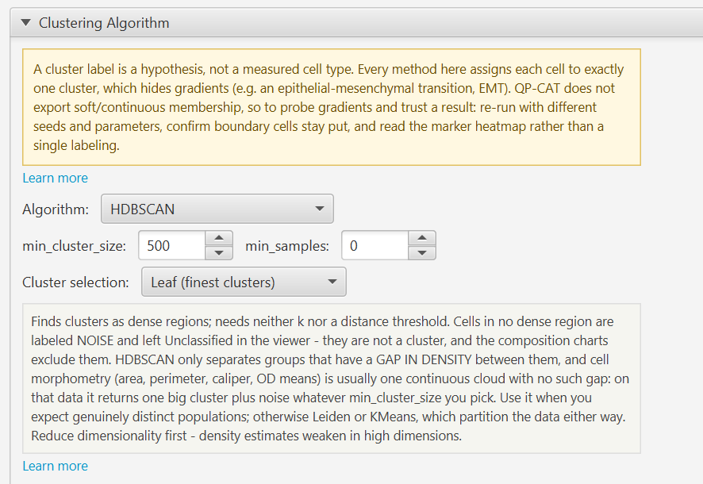
<figcaption><b>The Clustering Algorithm section, set up as in rows 4 to 7 of the table.</b> <b>Cluster selection</b> is new in
0.14.0 &mdash; if you do not see it, update first. The settings shown here produced every
result below.</figcaption>
</figure>

**Change `min_cluster_size`, `min_samples` and Cluster selection (rows 5 to 7) from their
defaults.** Left on the defaults, HDBSCAN returned a single cluster holding **97.0%** of 107,282 cells on a different, real dataset —
from a space whose groups were plainly separated in the 3D view. What each setting does:
[scikit-learn's `cluster_selection_method` and `min_samples`](https://scikit-learn.org/stable/modules/generated/sklearn.cluster.HDBSCAN.html).
What it looks like when it goes wrong, and how to tell:
[QP-CAT troubleshooting](https://github.com/uw-loci/qupath-extension-cell-analysis-tools/blob/main/documentation/troubleshooting.md#5-hdbscan-returns-one-giant-cluster-and-almost-no-noise).

**Click Run Clustering.**

<b>Why these values</b> — 500, <code>min_samples</code> 0, and batch correction off

**Tune `min_cluster_size` first. 500 produced the result below.** It is the smallest group HDBSCAN is allowed to call a cluster, so read it
against this dataset: 11,421 cells, and the smallest population you are trying to recover is
proliferating tumor at 790. The default of 15 is 0.1% of the cohort — fine for finding
something rare, but with **Leaf** selection, which deliberately cuts at the finest level of
the tree, a floor that low is an invitation to shatter each population into fragments. 500
sits under 790, so a real group still clears it, and far above 15. The seven clusters it
returned ran from 825 to 3,306 cells.

**Changing `min_cluster_size` changes two things at once.** With `min_samples` on **0**, scikit-learn ties
the density estimate to `min_cluster_size`, so raising the floor also widens the neighborhood
the density is measured over. That is usually what you want — it is why 0 is the default —
but it means a sweep of `min_cluster_size` is not a one-variable sweep.

**Leave batch correction off, even though the dialog offers it.** Eight images are in scope,
so Harmony is selectable, but there is nothing here for it to correct: the input is three
UMAP columns, and correcting those adjusts the *picture* rather than the measurements that
produced it. Batch correction belongs in the run that computes the embedding. Note the
consequence for this dataset — the step 3 UMAP was computed without it, over eight images
three of which (`tme_02`, `tme_04`, `tme_05`) carry deliberate intensity offsets, so whatever
batch structure that introduced is already baked into the coordinates you are about to
cluster. If you want it gone, correct it in step 3 and recompute the UMAP; the
[batch-effects exercise](#7-optional-and-slower-batch-effects) below is that run.

> **One deliberate exception to a rule stated later.** The batch-effects exercise tells you to
> press **`Deselect QPCAT`** before a second run, because QP-CAT's own output columns are
> answers, not inputs. Here you are clustering on them deliberately, which is why you
> tick exactly three by hand rather than leaving the rest of the previous run's output
> selected alongside.

#### 4.2 Check the result

**Read the noise fraction first.** QP-CAT reports it in the banner above the
results. HDBSCAN has two failure modes that look identical in the viewer and are opposites
underneath: a lot of noise spread evenly means change the *algorithm*; almost no noise beside
one dominant cluster means change the *cluster selection*.

**What it looks like when it works** — click any panel for full size:

<figure>
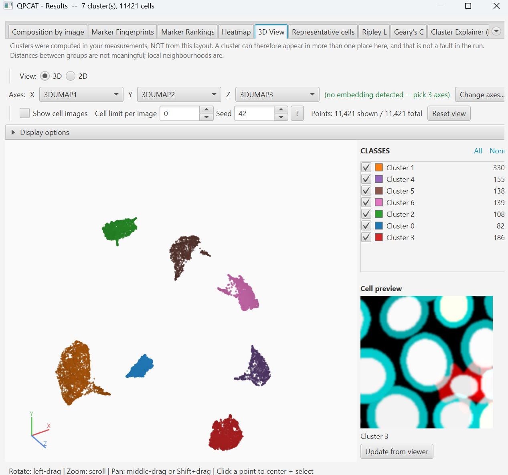
<figcaption><b>Seven separated lobes, no noise.</b> HDBSCAN found the count itself.
Leaf selection is what cut at the lobes instead of returning their common parent.</figcaption>
</figure>
<figure>
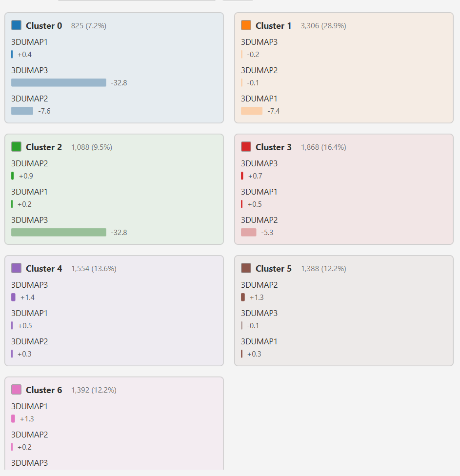
<figcaption><b>No marker names.</b> Every card is described by <code>3DUMAP1/2/3</code>,
because those are the only three columns the run saw. No marker names, so no phenotype.</figcaption>
</figure>
<figure>
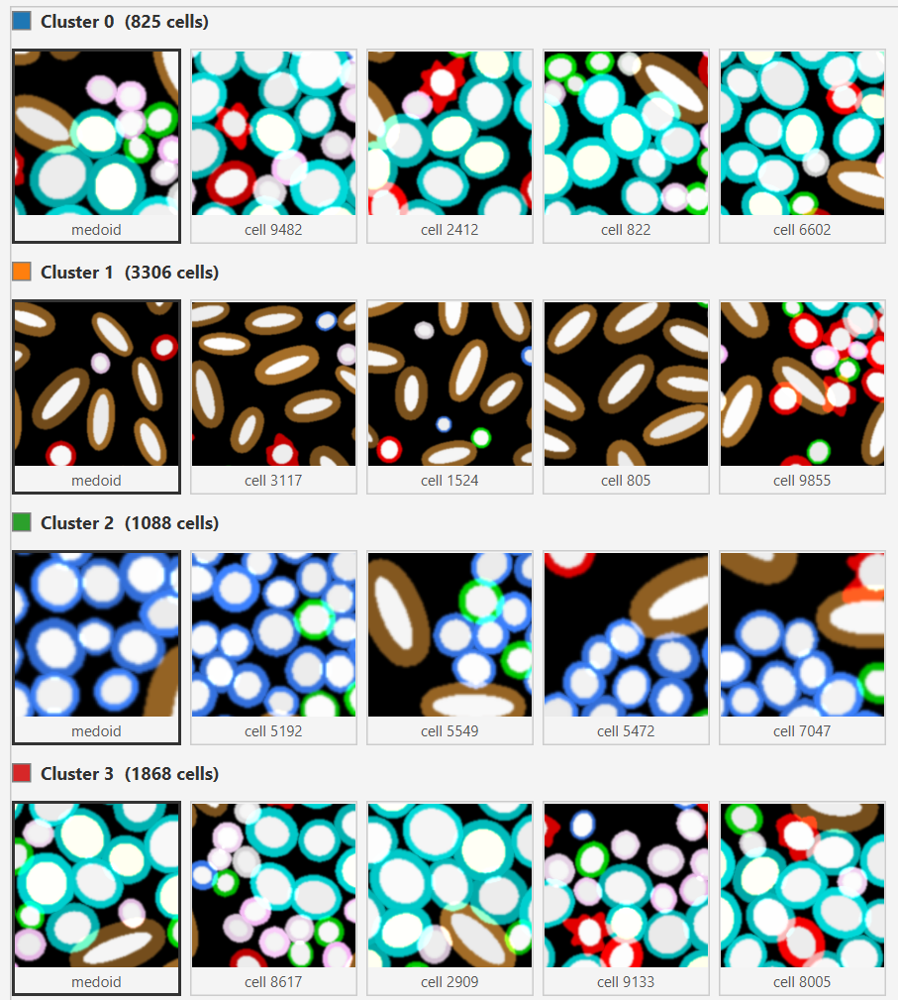
<figcaption><b>The clusters are real anyway.</b> Cluster 1 is unmistakably spindle-shaped,
cluster 2 blue-ringed. Read the clusters by eye here, or re-run over markers to name them.</figcaption>
</figure>

**What to look for.** Seven clusters, and the question this route exists for: *did letting
the data choose recover the CD8 / helper split — the one KMeans missed, having spent its spare
cluster on proliferation instead?* You cannot answer it from these three panels, because
nothing here has read a marker.

**The middle panel ranks only the three embedding columns**, because those are all this run
clustered on. A cluster that
is high in `3DUMAP2` is not a phenotype.

#### 4.3 Describe the clusters by their markers

That run read three columns and nothing else. Every marker
measurement — PanCK, CD3, CD20, all of them — is still on the cells, unused.

**Open `Extensions > QP-CAT > Results & populations > Analyze current cell classifications...`.**

The dialog takes the
classes the cells now carry, computes each cluster's marker statistics, and opens the usual
results window: **Heatmap**, **Marker Rankings**, **Marker Fingerprints** and the
**Composition** tabs. It writes nothing back: no classification is added, changed or
removed.

<b>Heatmap colors may not match the screenshots here</b>

The Heatmap tab has a **Scale**
control, and a matching preference, that changes how values become colors. White is always
zero when the run was Z-scored; what Scale chooses is whether the color reaches to each
marker's own strongest value (**Per marker**, the default) or to one value shared across the
whole map (**Shared across markers**). With **Normalization** set to None the values have no
meaningful zero, so the map switches to a sequential viridis scale and says so in its legend.
The reading does not change, only the colors.

Check these five settings before you run. The dialog reopens on whatever you last ran in
this project, so check them even if you have been here before:

| Section | Set it to | Why |
|---|---|---|
| Measurements | `Select 'Mean' only`, **then `Deselect QPCAT`** | What this run is for: markers, not the UMAP columns you clustered on. `Select 'Mean' only` also ticks QP-CAT's own `QPCAT component: mean:` columns, which are output from an earlier run, not measurements of the cell |
| Dimensionality Reduction | **Method: None** | The UMAP you want is already on the cells. Left on UMAP this computes a *second*, different one |
| Classifications to analyze | **every class ticked** | Each class is described by contrast with all the others, so unticking one silently changes what "the others" means for every class left |
| Independent areas | **blank** | It only shapes the spatial graph, and this run builds none |
| Spatial statistics | all **unticked** | Nothing here is a spatial question, and step 3 already computed them |

<figure>

<figcaption><b>Top half, set up.</b> Scope, Measurements and Normalization behave exactly as in
a clustering run; the banner says what is different. <b>Method</b> is on <b>None</b> here,
which is what this run wants &mdash; it opens on UMAP, and left there it would compute a second
embedding instead of using the one already on the cells.</figcaption>
</figure>
<figure>

<figcaption><b>Lower half: the class list.</b> One row per class with its count, all ticked,
and the class total underneath. <b>Spatial feature smoothing is grayed out</b> in this mode on
purpose: it rewrites the measurements each class is then described by, so a class would report
markers its <i>neighbors</i> carry.</figcaption>
</figure>

**Check the class list before you run.** It shows one row per class with its cell count, and
it is where a mixed project shows itself: if some images carry cluster labels and others
still carry an earlier labeling, you will see both sets listed together and the run will
compare things that were never meant to be compared. One labeling system, all of its classes.

**Click Analyze.**

#### 4.4 Read the answer

<figure style="max-width:500px">
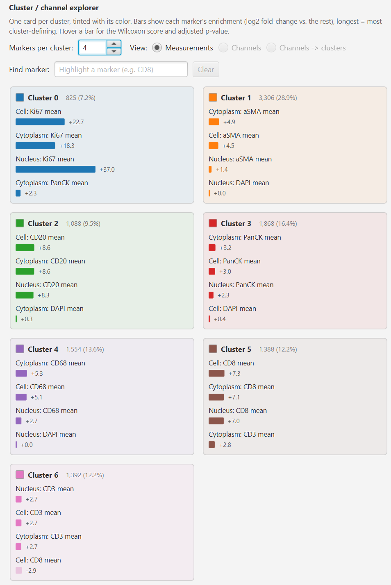
<figcaption><b>The same seven clusters, described by markers.</b> Compare with the panel
further up, where every card read <code>3DUMAP1/2/3</code>. Same cells, same groups, a
description you can put a cell-type name to.</figcaption>
</figure>

**And the answer to the question.** Every population lands on the ground truth, and the T
cells come apart:

| Cluster | Cells | Led by | Read it as | Ground truth |
|---|---|---|---|---|
| 1 | 3,306 (28.9%) | aSMA | fibroblast | 28.9% |
| 3 | 1,868 (16.4%) | PanCK | tumor | 16.4% |
| 4 | 1,554 (13.6%) | CD68 | macrophage | 13.6% |
| 5 | 1,388 (12.2%) | **CD8** and CD3 | **CD8 T** | 24.3% between them |
| 6 | 1,392 (12.2%) | CD3, **CD8 at -2.9** | **helper T** | |
| 2 | 1,088 (9.5%) | CD20 | B cell | 9.5% |
| 0 | 825 (7.2%) | Ki67 and PanCK | proliferating tumor | 7.2% |

Look at clusters 5 and 6. Both are CD3-positive; cluster 5 is CD8-positive and cluster
6 is CD8-*negative*, which is what separates the two T-cell lineages in this dataset.
KMeans at k = 6 merged them and spent its spare cluster on proliferation instead. Letting the
data choose the number recovered both, and neither run could have told you which markers
those clusters carry.

Your own run may split or merge differently; the ground-truth column is how you check it
rather than take the above on trust.

**Cluster in one space, characterize in another.** HDBSCAN
on the UMAP decides *which cells group together*; analyzing those groups over the markers
decides *what to call them*. Neither run can do both.

> **Worth reading before you rely on this:**
> [Using UMAP for Clustering](https://umap-learn.readthedocs.io/en/latest/clustering.html).
> Cross-check against a full-marker-space run — which, conveniently, is the run you did in
> step 3.

### 5. Is the tumor infiltrated?
*Concept: immune infiltration at the invasive margin.*

The tissue was built with four structures to find: **tumor nests** (PanCK), an
**immune-infiltrated nest boundary** (CD3, CD8), **B-cell follicles** (CD20), and **stroma**
(aSMA). This step is about the second one.

Cell types alone do not tell you much. **Where** they sit does. In this image, T cells (CD3)
are concentrated in a band just outside each tumor nest (PanCK), the computational version of
a pathologist's read on whether an immune response has reached the tumor.

Your cells carry cluster numbers, not cell-type names. These are the clusters from step 4:

| Cluster | Led by | Likely cell type |
|---|---|---|
| 0 | Ki67 and PanCK | proliferating tumor |
| 1 | aSMA | fibroblast |
| 2 | CD20 | B cell |
| 3 | PanCK | tumor |
| 4 | CD68 | macrophage |
| 5 | CD3 and CD8 | CD8 T cell |
| 6 | CD3, no CD8 | helper T cell |

If the numbers from your own run differ, match each cluster by the marker that leads its card
on the **Marker Fingerprints** tab.

#### 5.1 Run the spatial statistics

1. **Open `Extensions > QP-CAT > Explore & spatial > Spatial statistics on existing clusters...`.**
2. **Check these settings:**

   | # | Setting | Set to |
   |---|---|---|
   | 1 | **Label source** | *Current cell classifications* (already selected) |
   | 2 | Statistics to compute: **Ripley L** | ticked (already ticked) |
   | 3 | Statistics to compute: **Co-occurrence (pairwise)** | tick it |
   | 4 | Statistics to compute: **Neighborhood enrichment** | **untick it** |

   > **Why untick Neighborhood enrichment.** It is on by default and it is a real statistic,
   > but nothing in step 5 reads it, and in *this* dialog it has nowhere to appear: the
   > per-image results window has no tab for it, so the numbers reach only **Save combined
   > CSV...** on the summary and the word *Nhood* in the summary's **Statistics** column. It is
   > a permutation test, so on eight images you would be waiting for a result you never see.
   > Leave it on if you want that CSV column. You do see it drawn when you tick
   > `Neighborhood enrichment + Moran's I` during a **clustering** run instead — that route
   > writes a **Neighborhood Enrichment** heatmap tab.

   > **Ripley L is slow, and we do not recommend running it on a lower-powered laptop.** By
   > default it draws **1,000** simulated random patterns per image to build the band each
   > curve is read against, and on top of that it materializes every pairwise distance within
   > each cluster. Eight images is a lot of arithmetic.
   >
   > Two ways to keep going if you want it anyway: open `tme_00.tif` and set **Scope** to
   > *Current image*, so the summary lists one image instead of eight; or set
   > **Permutations (0 = adaptive)** in the dialog to something small like 99.
   >
   > **Or just skip it.** Untick **Ripley L** and go on: steps 5.2 and 5.3 do not use it, and
   > 5.4 is written to be read from its figure, so you lose nothing but your own copy of the
   > chart.

3. **Click Run spatial statistics.** A window titled **QP-CAT - Spatial statistics summary**
   opens with one row per image, headed **8 area(s), 8 analyzed.**

   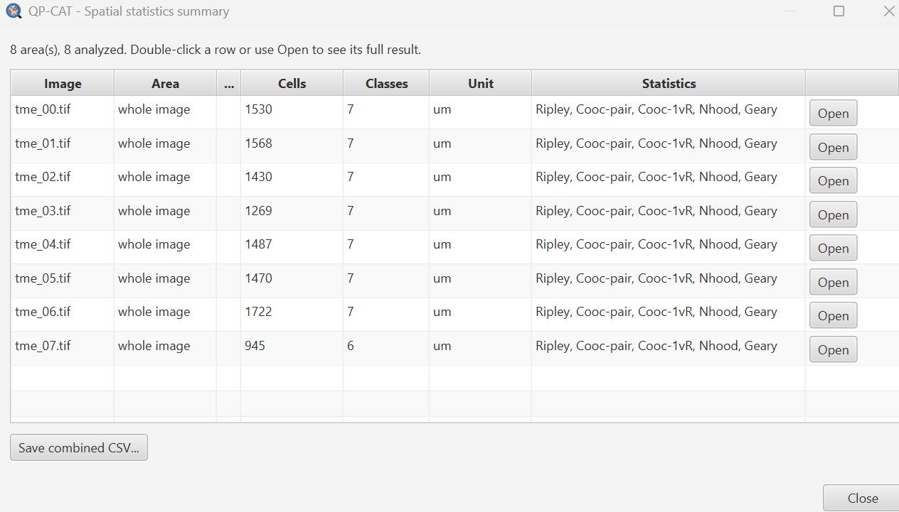

4. Double-click the **`tme_00.tif`** row, or click its **Open** button, to open that image's
   results.

> **The same statistics can be computed while clustering.** The Run Clustering dialog has a
> `Neighborhood enrichment + Moran's I` tick-box and the other statistics under **Spatial
> statistics**. Ticking them there on a future run gives these results without a separate step,
> and over several images they come back per image too — the **Ripley L** and co-occurrence
> tabs gain an **Area:** picker at the top. That is also the cheaper way round: Ripley's cost
> grows with the square of the largest cluster, so eight images measured separately is far less
> work than eight images measured as one.

#### 5.2 Compare four pairs of clusters

1. **Open the Co-occurrence (pairwise) tab.** It is a table of numbers with one row per radius
   and one column per ordered pair of clusters. Each number is a ratio: above 1 means the second
   cluster is found near the first more often than it is found near cells in general, below 1
   means less often, and about 1 means no preference. The ratio is descriptive, with no
   significance test behind it.
2. Find the four pairs below and predict each before you look. The table is wide, so
   **Save CSV...** under it, which writes one row per pair, is the easier way to find a pair.

   | Pair | Clusters | Expect at short radii | Because |
   |---|---|---|---|
   | tumor (PanCK) with tumor (PanCK) | 3 with 3 | above 1 | tumor grows in nests, not as single cells |
   | B cell (CD20) with B cell (CD20) | 2 with 2 | above 1 | follicles: dense aggregates, not scattered cells |
   | tumor (PanCK) with fibroblast (aSMA) | 3 with 1 | below 1 | they occupy different compartments |
   | tumor (PanCK) with CD8 T cell (CD3, CD8) | 3 with 5 | above 1 | cytotoxic T cells sit at the nest boundary |

#### 5.3 Check the control pair

In the same table, find tumor (PanCK, cluster 3) with helper T cell (CD3 without CD8,
cluster 6). Its ratio should sit closer to 1 than tumor with CD8 T cell (cluster 5): the
enrichment is specific to the cytotoxic subset. Step 3's k = 6 run put both T-cell lineages in
one cluster, which would have averaged the two into a single number.

#### 5.4 Read Ripley L

1. **Open the Ripley L tab.** The chart opens showing one cluster, with the rest unticked under
   **Show clusters**. Each cluster draws three lines, its curve plus both edges of its own
   random band, so tick only one or two at a time.
2. Under **Show clusters**, click **None**, then tick cluster 1, fibroblast (aSMA), and
   cluster 5, CD8 T cell (CD3, CD8).

Read each curve against the **flat line at zero**, which is randomness: the curve is
plotted relative to that cluster's own simulated-random median. **Above the dashed band**
at some radius means clustered at that radius, **below** means dispersed, and **inside the
band** means indistinguishable from random.

**Untick Relative to random** to see the raw `L(r)` instead.

| Cluster | Where its curve sits | Reading |
|---|---|---|
| 5, CD8 T cell (CD3, CD8) | far above its band from about 20 µm to about 550 µm, peaking near 230 µm | clustered over a wide range of distances |
| 1, fibroblast (aSMA) | below its band under about 30 µm | dispersed at very short range: neighboring fibroblasts keep apart |
| 1, fibroblast (aSMA) | above its band from about 60 µm to about 270 µm | clustered at that range |
| 1, fibroblast (aSMA) | inside its band beyond about 280 µm | indistinguishable from random |

A curve that comes back down at large radii, as cluster 5 does past 550 µm, does not contradict
the clustering. A group of cells has a size; beyond it you run out of same-type neighbors, so
the excess falls away. Where the curve peaks is a rough read on the scale of the structure.

Tick cluster 3, tumor (PanCK), and cluster 2, B cell (CD20), in the same way to read their
curves.

#### 5.5 Look at the cells

Click a CD8 T cell (cluster 5) at the edge of a tumor nest in the viewer and confirm that it
sits where the statistic says.

> **Taking the numbers with you.** Both tabs have `Copy CSV` and `Save CSV...` under them, and
> the co-occurrence table has `Copy text` as well for a copy of it exactly as shown. The CSV is
> written one row per observation, so a pairwise co-occurrence row names both clusters — easier
> to work with than the on-screen table, which is one column per ordered pair and scrolls off
> the right on a run with many clusters.

### 6. Inflamed versus desert
*Concept: immune phenotypes of the tumor microenvironment, and comparing separate tissue.*

**`tme_06`** is immune-rich and **`tme_07`** is immune-poor. Both are already in the project
with cells detected, so there is no new setup — but this **is** a new clustering run, over a
different set of images.

> **Requires QP-CAT 0.17.0 or later.** Before that version a run over several images pooled
> them into one coordinate frame, so the **Composition by area** tab this step uses did not
> appear at all. `Extensions > QP-CAT > Setup & help > About` shows your version; update from
> the catalog if it is older.

> **This run replaces the cluster labels on `tme_00`, `tme_06` and `tme_07`.** Step 4's
> labels stay on the other five images, and step 4's run is still saved — reopen it any time
> with `Results & populations > View Past Results...`, or put its labels back on the cells with
> `Apply saved result to detections...`. If you would rather start clean, re-download the
> **[clustered demo project](https://github.com/uw-loci/multiplex-synthetic-data/releases/download/v1.2/multiplex-synthetic-data-demo-project-clustered.zip)**
> and unzip it to a **new folder**: a project you have already run on carries the
> measurements and labels those runs wrote, so it is not the same starting point any more.

#### 6.1 Run it

**Open `Extensions > QP-CAT > Find cell populations (clustering)...`.** The dialog reopens with
step 4's settings, so there are only two things to change:

| # | Setting | Set to |
|---|---|---|
| 1 | Scope | **`Specific images...`**, then tick **`tme_00`**, **`tme_06`** and **`tme_07`** — three in total |
| 2 | Independent areas | **leave it empty.** Empty means one area per image, which is what this step is about |

Everything else stays as step 4 left it: measurements **`QPCAT 3D UMAP1/2/3`** only,
Normalization **None**, Dimensionality Reduction **None**, **HDBSCAN** with
min_cluster_size **500**, min_samples **0**, Cluster selection **Leaf**. If the dialog has
been reset, set those again from the table in [4.1](#41-set-up-the-second-run). About 4,200
cells, still fast.

#### 6.2 Read the composition per image

1. **Open the Composition by area tab.** Each image is an independent area, so you get one
    row per image. (**Composition by image** beside it shows the same rows for this run,
    because here the areas *are* the images. They part company as soon as you add a level —
    TMA cores, annotations — under **Independent areas**.)
2. **Your cluster numbers are not step 4's.** This is a fresh HDBSCAN run over a different
    set of cells, so it numbers its clusters from scratch. Identify them the same way as
    before: open **Marker Fingerprints** and read the marker leading each card — **CD20** is
    the B cells, **CD3 with CD8** the cytotoxic T cells, **CD3 without CD8** the helper
    T cells. The *lymphoid fraction* of an image is those three clusters' shares added up.
3. The contrast is stark. From the reference run:

    | | `tme_00` | `tme_06` | `tme_07` |
    |---|---|---|---|
    | Cells | 1,530 | 1,722 | 945 |
    | Lymphoid fraction | 33% | **50%** | **6%** |
    | B-cell follicles | present | more | **none at all** |

    Your percentages will not match to the point, because HDBSCAN may split or merge a
    population differently on this smaller set of cells. The *ordering* is the result:
    `tme_06` well above `tme_00`, `tme_07` far below it.

    `tme_06` and `tme_07` are the two ends of a distinction that matters clinically: an **immune-inflamed**
    tumor, with lymphocytes throughout and organized B-cell aggregates, versus an **immune
    desert**, where the tumor sits in fibroblast-rich stroma with almost no lymphoid presence.
    It is the same axis used to stratify patients for immunotherapy: inflamed tumors tend to
    respond; deserts tend not to.
4. Note what `tme_07` is *missing*. Zero B cells, no follicles. An absent population is easy
    to overlook in a UMAP, where it simply is not drawn, and obvious in a composition table.

#### 6.3 Why "independent areas" is not a technical detail

These are three separate images. Cell coordinates are per-image pixel positions, so pooling
them stacks all three on top of each other: cells in `tme_00` acquire "neighbors" from
`tme_07` that exist only because of how the files were laid out. QP-CAT builds one spatial
graph per area and no edge crosses a boundary, so that cannot happen — and an image is an
area whether or not you put anything in the **Independent areas** box. The same applies to
TMA cores on one slide, which is the case you are far more likely to meet.

You can see the consequence in this run: the **Ripley L** tab now has an **Area:** picker at
the top and gives one set of curves per image, exactly as the per-image results did in step 5.
There is deliberately no combined curve, because the combined point pattern would describe how
the three files were arranged rather than anything in the tissue.

If your project has annotation classes (Tumor, Stroma, …), the **Composition by class** tab
pools clusters by class across every image and area, the way to compare compartments that
share a spatial graph.

### 7. Optional, and slower: batch effects

Best done at home; clustering all eight images is ~11,400 cells.

1. `tme_02`, `tme_04` and `tme_05` carry deliberate intensity offsets (×0.8, ×1.2, ×0.85),
    a synthetic staining-day effect.
2. Cluster all eight jointly, **without** correction. Cells of one type from the offset images
    split off into their own clusters: you have discovered your slide scanner, not biology.
3. Re-run **with Harmony**. The same cell type should now cluster together across all eight
    images.

    > **Before any second run, click `Deselect QPCAT` in the Measurements list.** The first run
    > wrote its own columns onto the cells — embedding coordinates, spatial and component
    > measurements — all named with a leading `QPCAT`. They are output, not input: clustering on
    > them clusters on the previous run's answer. One button clears every one of them and leaves
    > your own measurements ticked.

### 8. Saved results: reopen a run instead of repeating it

Clustering is the slow part of this exercise, and you do not have to do it twice. **Every
successful run auto-saves** to `<project>/qpcat/cluster_results/` under a timestamped name like
`auto_20260617_193235_leiden`. Nothing to click.

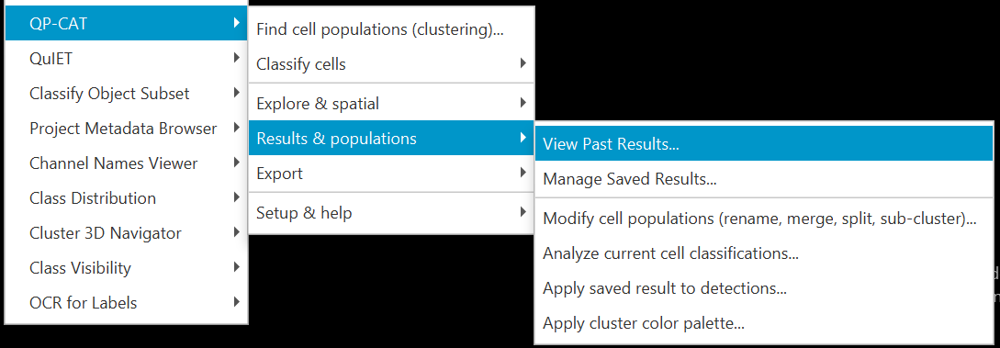

- **`Extensions > QP-CAT > Results & populations > View Past Results...`** reopens the whole results window — heatmap,
  marker rankings, embedding, every tab — with no Python run and no re-clustering. Use it
  to go back to step 3's plots while working on step 5, or to look again
  after the session.
- **`Extensions > QP-CAT > Results & populations > Apply saved result to detections...`** writes a saved run's labels
  back onto the cells. Reach for it when the labels are right in the saved result but are not on
  the image — most often after closing and reopening the project. It matches cells by source
  image id and centroid rather than by count, and shows a predicted match count before you
  commit, so cells it cannot match are reported rather than mislabeled.
- **`Extensions > QP-CAT > Results & populations > Manage Saved Results...`** lists everything saved with its size, for deleting the runs you
  no longer want. Auto-saves are never removed for you.

> Applied labels are namespaced by the result name — `<result>: Cluster N` — so results from
> different runs can coexist on the same detections without colliding. Handy, with one
> consequence worth knowing: any embedding measurements come back prefixed too
> (`<result>: QPCAT 3D UMAP1`). QP-CAT's own **3D View** tab is unaffected, because the result
> tells the view which columns it wrote; the standalone Cluster 3D Navigator reads the columns
> generically and may still need the three axes picked by hand.

### What to notice

- Every result stays clickable back to the tissue. The value here is the round trip.
- Changing the *measurement selection* usually changes the answer more than changing the
  algorithm. Try it.
- A statistical test that says two populations co-localize, over a slide where they visibly do
  not, means the test answered a different question than you asked. Look at both.
- **A single cluster is a result about your settings, not about the tissue.** Read the noise
  fraction before you conclude anything: *a lot* of noise means the algorithm found no density
  gap — try KMeans or Leiden on the same measurements; *almost none* means it found no
  boundary at all — that is step 4.
- Ground truth is a luxury you will not have again. Use this dataset to learn what a *correct*
  result looks like, so you can recognize a wrong one on data where nobody can tell you.

---

## Going further

- **[Documentation index](https://github.com/uw-loci/qupath-extension-cell-analysis-tools/blob/main/documentation/README.md)**: one page per topic; the place to start.
- **[Clustering](https://github.com/uw-loci/qupath-extension-cell-analysis-tools/blob/main/documentation/clustering.md)**: measurement selection, normalization and algorithm choice.
- **[Scripting (Groovy)](https://github.com/uw-loci/qupath-extension-cell-analysis-tools/blob/main/documentation/scripting.md)** and the **[YAML headless-batch runner](https://github.com/uw-loci/qupath-extension-cell-analysis-tools/blob/main/documentation/yaml-reference.md)**: for running this across a whole cohort, including `area_levels` for TMA cores.
- **[References](https://github.com/uw-loci/qupath-extension-cell-analysis-tools/blob/main/documentation/references.md)**: papers and DOIs for every algorithm used.
- **[Dataset instructions](https://github.com/uw-loci/multiplex-synthetic-data/blob/master/INSTRUCTIONS.md)**: channel tables, the full detection recipe, what every analysis should recover, and the ground-truth CSV reference.
- Once you have clusters, [Cluster 3D Navigator](04-cluster-3d-navigator.md) gives you a
  rotatable 3D point cloud with click-to-navigate.

**Full documentation:** the
[repository README](https://github.com/uw-loci/qupath-extension-cell-analysis-tools#readme).

<b>The analysis libraries underneath</b> — where to read what a parameter actually does

QP-CAT is a QuPath front end for established Python tools: it moves your measurements out, runs
these, and brings the answers back onto the cells. Nothing in this guide re-teaches them, so when
you want to know what a parameter actually does, or how a method behaves, go to its own
documentation.

| Library | What QP-CAT uses it for |
|---|---|
| [scanpy](https://scanpy.readthedocs.io/) | Leiden clustering, marker ranking, PAGA, the dotplot / matrixplot / stacked-violin figures |
| [squidpy](https://squidpy.readthedocs.io/) | Neighborhood enrichment, Ripley's L, Geary's C, Moran's I, co-occurrence |
| [umap-learn](https://umap-learn.readthedocs.io/) | UMAP embeddings, 2D and 3D |
| [scikit-learn](https://scikit-learn.org/stable/) | KMeans, agglomerative clustering, HDBSCAN, PCA, t-SNE |
| [leidenalg](https://leidenalg.readthedocs.io/) + [python-igraph](https://python.igraph.org/) | The graph partitioning behind Leiden |
| [harmonypy](https://github.com/slowkow/harmonypy) | Harmony batch correction |
| [pybanksy](https://pypi.org/project/pybanksy/) | BANKSY spatially aware clustering |
| [anndata](https://anndata.readthedocs.io/) | The data structure the analysis is assembled in |

Versions are pinned per release; the exact set is in the extension's
[`pixi.toml`](https://github.com/uw-loci/qupath-extension-cell-analysis-tools/blob/main/src/main/resources/qupath/ext/qpcat/pixi.toml).

