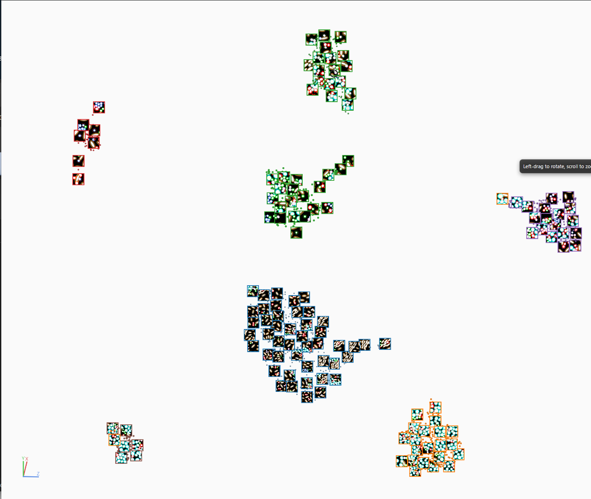
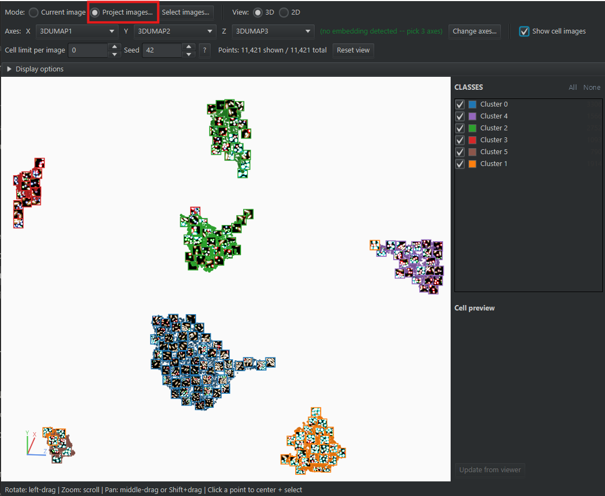
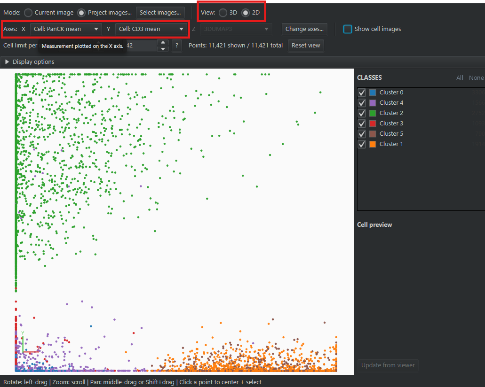

# Cluster 3D Navigator

> A rotatable **3D point cloud of your cells** inside QuPath — one point per cell, colored by
> its class. Click a point in cluster space and land on that cell on the slide.

| | |
|---|---|
| **Repository** | [uw-loci/qupath-extension-cluster-3d-navigator](https://github.com/uw-loci/qupath-extension-cluster-3d-navigator) |
| **Extension version** | 0.1.5 |
| **License** | GPL-3.0-or-later |
| **Requires** | QuPath 0.7.0+. Nothing else to install |
| **Where to find it** | `Extensions > Cluster 3D Navigator > Open 3D navigator...` |
| **Catalog** | LOCI QuPath Extensions |
| **Session** | Hands-on |

> **Walkthrough video:** %%VIDEO_CLUSTER_3D_NAVIGATOR%%
> The walkthrough below is self-contained. You can work through it in the hands-on hour, or on your own afterwards.

> **New to QuPath?** Words like *project*, *annotation*, *detection*, *class* and
> *measurement* are explained in the [glossary](glossary.md). For QuPath itself, the
> [official documentation](https://qupath.readthedocs.io/en/stable/) is the place to go.

---

## What it does

View your analyzed cells in three dimensions. Each point is one cell, **colored by its
class** — a clustering result, or any classification already on the cells. The three axes are
numeric measurements you choose, normally a dimensionality reduction that is already stored on
the cells: in the picture below, three UMAP components.

Tick **Show cell images** and the points carry thumbnails, so you can see what the cells in one
region actually look like. Click a point to **select that cell and center it in the QuPath
viewer** — a spot in cluster space becomes a real cell on the slide.

It only reads your cells: looking changes no class and no measurement.

<b>Install</b> — from the LOCI catalog, then restart QuPath

Install from the **LOCI QuPath Extensions** catalog, then restart QuPath. Full steps, including
the catalog URL, are in the [setup guide](setup.md).

---

## Try it yourself

Uses the **clustered** version of the synthetic multiplex project — the same download as the
[QP-CAT](03-qp-cat-cell-analysis-tools.md) exercise. Nothing here needs QP-CAT installed: the
clustering has already been done, and the navigator only reads the cell data.

### 1. Get the data

**You will also need:** QuPath **0.7.0 or later**, and this extension installed from the LOCI
catalog (see the **Install** box above).

**Download:** `multiplex-synthetic-data-demo-project-clustered.zip` —
**[direct download](https://github.com/uw-loci/multiplex-synthetic-data/releases/download/v1.2/multiplex-synthetic-data-demo-project-clustered.zip)**
(23 MB). Eight synthetic 8-channel images with cells already detected, and a saved QP-CAT
KMeans run over all 11,421 of them.

<b>What is in the download</b> — the class, the three axes, the ground truth, and why the zip's README is wrong

Three things in it matter here:

- every cell carries a **class**, `Cluster 0` to `Cluster 5` — that is the color of its point;
- every cell carries **three embedding measurements**, `3DUMAP1`, `3DUMAP2` and `3DUMAP3` —
  those are the axes. They are not what the clustering used, which was KMeans on the
  measurements themselves. Do not expect the point cloud to match the clusters: the two come
  from different calculations;
- every image also carries **ground-truth point annotations**, one at each cell's center,
  classed by true type (`tumor`, `fibroblast`, `cd8_t`, `helper_t`, `b_cell`, `macrophage`) —
  select a point and read its class in the **Annotations** tab to check a cluster.

The classifications and the three display axes can be generated anywhere. The navigator needs
only three numeric measurements in the object data to position each point, and an object class
to colour it.

**The README inside the zip is the unclustered project's** and says the cells ship
unclassified and need a script run first. Ignore it for this exercise; the labels are on the
cells.

### 2. Load it into QuPath

1. Unzip it, then **drag `project.qpproj` onto an open QuPath window** — or the unzipped folder
   itself, either works. (Menu route: `File > Project > Open project...`.)
2. The images should open straight away: the project remembers the paths from the machine it was
   built on, and QuPath repoints them to the `images/` folder beside `project.qpproj` on its own.
   If instead an **Update URIs** dialog appears with rows marked missing, click **Search...**
   (bottom-right), choose the folder you unzipped, and QuPath fills the **Replacement URI**
   column; then **Apply changes**.
3. Double-click **`tme_00.tif`** to open it. The cells should already be colored, six colors in
   all. If they are one flat color, see [If something looks wrong](#if-something-looks-wrong).

### 3. Open the navigator and confirm the axes

1. `Extensions > Cluster 3D Navigator > Open 3D navigator...`. A window titled
   **Cluster 3D Navigator** opens with a cloud already drawn.
2. Look at the **Axes** row at the top. Next to the dropdowns is the tag
   **(no embedding detected -- pick 3 axes)**: the navigator did not recognize the
   `3D`-prefixed names (see [axis auto-detection](#what-it-does-in-full)). With nothing
   recognized it takes the first three numeric measurements in alphabetical order, and `3DUMAP1`,
   `3DUMAP2` and `3DUMAP3` sort ahead of every `Cell:` and `Nucleus:` column — so the dropdowns
   already hold the right axes and the cloud is right, by luck. On your own data it will not be.
3. Click **Change axes...** (boxed in red below) and check the picker reads:

   | Field | Set to |
   |---|---|
   | **X axis** | `3DUMAP1` |
   | **Y axis** | `3DUMAP2` |
   | **Z axis** | `3DUMAP3` |
   | **Use these axes automatically next time you open this project.** | Ticked |

   Then **Apply**. The tag goes away and stays away for this project.

You should see six colored blobs. The counter under the top row reads
`Points: 1,530 shown / 1,530 total`, and the **CLASSES** legend lists Cluster 0 (404),
Cluster 1 (294), Cluster 2 (389), Cluster 3 (106), Cluster 4 (217) and Cluster 5 (120).

### 4. Explore the cloud

- **Left-drag to rotate**, **scroll to zoom** toward the cursor, **middle-drag or Shift+drag to
  pan**. **Reset view** puts everything back in frame. The same hints are written along the
  bottom of the window.
- **Hover** a point and a tooltip names its class and shows its values on the three axes.
- The **CLASSES** legend lists each cluster with its color and how many cells it holds (that
  number does not change when you uncheck the cluster; only the Points counter does).
  **Uncheck a cluster** to hide it. **All** shows every cluster again; **None** hides them all.
- **Colors come from QuPath.** To recolor a cluster, right-click the class list in the
  **Annotations** tab and populate it from the existing objects (the `Cluster` classes are not
  in the project's list until you do), change the color there, then change an axis or reopen the
  navigator so it re-reads.

Rotate the cloud and watch it from several angles. A third axis gives the embedding more room
to spread groups apart than a flat one has; rotating is how you see that spread, since any
single view is a flat projection of it.

<!-- TODO: Add screenshot — the rotated cloud of six clusters on tme_00, legend visible -->

### 5. Click a point, land on the cell

Click a point. The matching cell is **selected and centered in the QuPath viewer**, and its crop
appears in the **Cell preview** panel with the class name under it.

Try a point at the dense core of a blob, then one sitting **between** two colors. A cell at a
color boundary has neighbors from another cluster in the embedding, so it is a natural place to
look for cells that could have gone either way. The clustering itself decided in the
30-measurement space, not in this picture, so a confident mistake can also sit deep inside a
blob. Either way, each one is a single click rather than a scripting job. Because every cell has a
ground-truth point at its center, you can check on the spot whether the cell you landed on is
what its cluster claims; the cluster-to-type key is the table in the
[QP-CAT guide](03-qp-cat-cell-analysis-tools.md#hands-on-exercise).

Expand **Display options** (the collapsed bar under the top row) and check two boxes:

- **Show detection outlines** draws the cell's segmentation boundary on the preview crop, in the
  cluster's color. If most of a cluster's crops show merged or clipped outlines, that cluster is
  probably collecting segmentation failures rather than a cell type. You will not find one in
  this dataset, whose detections are clean, but it is the first thing to check on your own data.
- **Preview crop on hover** loads the crop as you hover, instead of waiting for a click.

The crop is rendered with whatever channels and brightness the viewer is showing at that moment.
Change the viewer's display and click **Update from viewer** under the preview to re-render it.

*A point at the edge of Cluster 2, clicked. The viewer has jumped to that cell and filled it
yellow; the preview shows its crop with the segmentation outlines on.*

### 6. See the cells instead of the points

Tick **Show cell images** in the top row. Three cells per cluster turn into crops straight away,
at any zoom; those are representatives (**Representative cells per cluster** under Display
options). Zoom in and the points near the front fill in as crops too, each with a thin border in
its cluster color, up to a few hundred non-overlapping cells at a time. Clicking a crop still
jumps to the cell. Zoom back out and all but the representatives collapse to points.

*Show cell images on tme_00, zoomed in enough for the crops to fill in.*

### 7. The whole project at once

The clustering ran over all eight images together, so the embedding is shared and the other
seven images' cells belong in the same cloud.

1. Switch **Mode** to **Project images...**. A picker titled **Select project images** opens.
2. Click **Select all**, then **OK**. A busy indicator reads *Read image 1 of 8...* and counts
   up; wait for it. (Changing an axis in this mode re-reads all eight images, so expect the same
   pause each time.)
3. The counter reads `Points: 11,421 shown / 11,421 total`, and the legend counts now match the
   QP-CAT guide's table: 3,306 / 1,914 / 2,752 / 1,093 / 1,566 / 790.

Click any point. If its cell is on another image, QuPath opens that image first, then centers
the cell; expect a short pause. **Select images...** next to the mode toggle reopens the picker if
you want a subset. `tme_02` and `tme_04` were generated with a deliberate brightness shift, a
simulated batch effect (see [batch effects](03-qp-cat-cell-analysis-tools.md#optional-and-slower-batch-effects)).
The cloud does not mark which image a point came from, so the way to look for that shift is to
click points along one edge of a blob and watch which image opens: if the same image keeps
opening, that edge is a staining-day effect, not a cell type.

### 8. A two-marker scatter in 2D

**View** at the top switches between **3D** and **2D**. Set the top row like this (both boxed
in red in the picture below):

| Field | Set to |
|---|---|
| **View** | **2D** |
| **X** | `Cell: PanCK mean` |
| **Y** | `Cell: CD3 mean` (the Z dropdown grays out) |

You get an ordinary marker-versus-marker plot: Cluster 1 and Cluster 5, the two tumor clusters, run out along the
PanCK axis, Cluster 2 (T cells) up the CD3 axis, and the other three sit near the origin. There
is nothing to rotate in 2D, so left-drag pans. Every point is still a click from its cell.

> The 2D view is for a genuine two-component embedding or a plain scatter like this one. Plotting
> `3DUMAP1` against `3DUMAP2` is not a 2D UMAP; it is the 3D cloud seen from one side with depth
> flattened, so two groups that only overlap in depth will look like one (step 4 is the
> demonstration). The navigator warns you when it recognizes the column names as an embedding,
> but not for the `3D`-prefixed names in this project.

---

## If something looks wrong

Symptoms you may hit during the walkthrough:

| You see | Why | Do |
|---|---|---|
| Cells on the slide are all one color, or gray points in the cloud | The cluster labels are not on the detections | Re-unzip the download and open the fresh copy; the labels ship on the cells. If you would rather use QP-CAT (installed, with its analysis environment set up; the menu is hidden until then): `Extensions > QP-CAT > Results & populations > Apply saved result to detections...`, acknowledge the backup warning, pick `auto_20260924_135415_kmeans`. The classes then come back named `auto_20260924_135415_kmeans: Cluster 0` and so on, and that is what the legend will show |
| The cloud reads *No cells have finite values on all three chosen axes.* | An axis is a column these cells do not have | Set X, Y, Z to `3DUMAP1`, `3DUMAP2`, `3DUMAP3` (step 3) |
| The cloud reads *No image open. Open an image with detections, then reopen this view.* | You opened the navigator before opening an image | Double-click `tme_00.tif` in the project list (step 2), then reopen the navigator |
| The cloud reads *No images selected...* | You clicked **OK** in the image picker with nothing checked | **Select images...**, **Select all**, **OK** |
| Mode flipped back to **Current image** | You canceled the picker | Switch to **Project images...** again and click **OK** this time |
| Points counter ends in *(… omitted: missing axis value)* | Those cells have no value on one of the chosen axes | Expected only if you picked a column that not every cell has; with the three `3DUMAP` columns none are omitted |
| Clicking a point selects the wrong cell | The target image is still opening | Give it a moment, then click again |
| Project mode is slow to read | Eight images of detections | Wait for the busy indicator; use **Current image** for quick checks |

## What to notice

- Boundary cells, where two colors meet in the cloud, are the first place to look for cells that
  could have gone either way. They are not the only place a clustering goes wrong: the next
  bullet is a mistake with no boundary at all.
- Six clusters for six cell types looks like a success. Click into Cluster 2, the one that
  merges the CD8 and helper T cells (the QP-CAT guide shows why), and the crops show you what
  "right number, wrong partition" looks like.

---

## What it does, in full

**Axis auto-detection** looks for columns named `UMAP1/2/3`, `PCA1/2/3`, `PC1/2/3` or
`tSNE1/2/3`, with an underscore, hyphen, space or nothing between the name and the number.
Anything else — including the `3DUMAP` columns in this exercise — you pick by hand, once per
project.

The controls in the top row that the walkthrough does not use:

| Control | What it does | Default |
|---|---|---|
| **Cell limit per image** | Caps how many cells per image are read. Every cluster keeps at least its representative cells; the rest are sampled at random | 0 (no limit) |
| **Seed** | Which cells are sampled when a limit is set; change it to resample | 42 |
| **?** | Explains how the limit chooses cells | |

**How it relates to QP-CAT.** QP-CAT ships its own embedding views inside its results window.
Cluster 3D Navigator is the standalone, in-QuPath, click-to-cell tool that works from the
measurements alone, so it works on clusters from any source. The download also contains the
saved QP-CAT run (`qpcat/cluster_results/auto_20260924_135415_kmeans`); the
[QP-CAT guide](03-qp-cat-cell-analysis-tools.md#saved-results-reopen-a-run-instead-of-repeating-it)
explains reopening it.

> **Platform caveat:** the extension's own documentation lists Linux as the verified platform,
> with Windows and macOS not yet verified. If clicking a point selects the *wrong* cell on
> Windows or macOS, report it at the
> [repository issues page](https://github.com/uw-loci/qupath-extension-cluster-3d-navigator/issues).

**Full documentation:** the
[user guide](https://github.com/uw-loci/qupath-extension-cluster-3d-navigator/blob/main/documentation/user-guide.md)
in the repository covers display options, the per-image cell limit, and troubleshooting.
