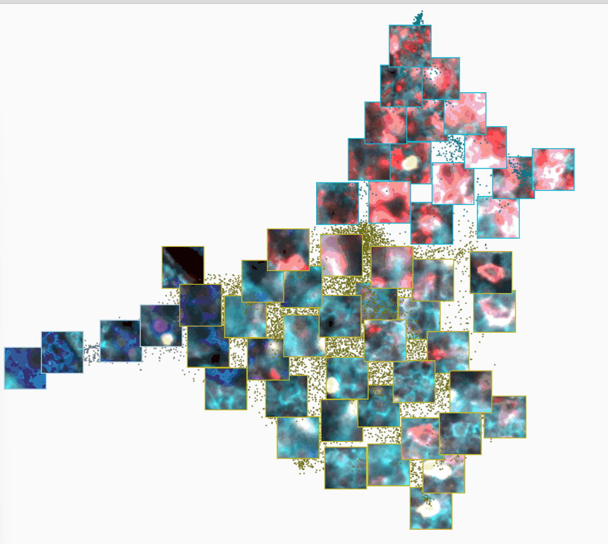

# Cluster 3D Navigator

> A rotatable **3D point cloud of your cells** inside QuPath — one point per cell, colored by
> its class. Click a point in cluster space and land on that cell on the slide.

| | |
|---|---|
| **Repository** | [uw-loci/qupath-extension-cluster-3d-navigator](https://github.com/uw-loci/qupath-extension-cluster-3d-navigator) |
| **Extension version** | 0.1.5 |
| **License** | GPL-3.0-or-later |
| **Requires** | QuPath 0.7.0+. No Python, no browser, no network. Pure Java |
| **Where to find it** | `Extensions > Cluster 3D Navigator > Open 3D navigator...` |
| **Catalog** | LOCI QuPath Extensions |
| **Session** | Hands-on |

> **Walkthrough video:** %%VIDEO_CLUSTER_3D_NAVIGATOR%%

---

## The idea in one sentence

It plots every cell as a point in a 3D space you choose (three measurements as the axes),
colors each point by its class, and lets you **click a point to select and center that exact
cell in the viewer** — so a spot in cluster space becomes a real cell on the slide.

It reads detections only and writes nothing to the hierarchy, so you can explore freely.

*The window, on a different dataset from the one used below (a real tissue section, 25 clusters).
The layout is the same: axes and mode across the top, the cloud in the middle, the class legend
and cell preview on the right, gesture hints along the bottom. The
[repository README](https://github.com/uw-loci/qupath-extension-cluster-3d-navigator#readme)
has the animated version.*

---

## Walkthrough: navigate cells in 3D and land on the real thing

Uses the **clustered** version of the synthetic multiplex project — the same download as the
[QP-CAT](03-qp-cat-cell-analysis-tools.md) exercise. Nothing here needs QP-CAT installed: the
clustering has already been done, and the navigator only reads what is on the cells.

### 1. The data

**Download:** `multiplex-synthetic-data-demo-project-clustered.zip` —
**[direct download](https://github.com/uw-loci/multiplex-synthetic-data/releases/download/v1.2/multiplex-synthetic-data-demo-project-clustered.zip)**
(23 MB). Eight synthetic 8-channel images with cells already detected, and a saved QP-CAT
KMeans run over all 11,421 of them. Two things from that run are what the navigator needs:

- every cell carries a **class**, `Cluster 0` to `Cluster 5` — that is the color of its point;
- every cell carries **three embedding measurements**, `3DUMAP1`, `3DUMAP2` and `3DUMAP3` — those
  are the axes.

The navigator does not care that QP-CAT produced them. Any tool that puts a class and three
numeric measurements on a detection would do.

> **The saved run is also in the project.** It sits in `qpcat/cluster_results/` as
> `auto_20260924_135415_kmeans`. If you have QP-CAT installed with its environment built, you can
> reopen the heatmap and the other result plots without recomputing anything, and put labels back on
> cells that have lost them. The [QP-CAT guide](03-qp-cat-cell-analysis-tools.md#saved-results-reopen-a-run-instead-of-repeating-it)
> covers both. Neither is needed for this exercise.

### 2. Load it into QuPath

1. Unzip it, then **drag `project.qpproj` onto an open QuPath window** — or the unzipped folder
   itself, either works. (Menu route: `File > Project... > Open project`.)
2. QuPath pops up an **Update URIs** dialog with the images listed in red. This is expected:
   the project ships with relative image paths so the zip is portable, and QuPath cannot resolve
   them until you show it the folder once. Click **Search...** (bottom-right), choose the folder
   you unzipped, and QuPath fills in the **Replacement URI** column; then **Apply changes**.
3. Double-click **`tme_00.tif`** to open it. The cells should already be colored, six colors in
   all. If they are one flat color, see *If something looks wrong* at the end.

### 3. Open the navigator and pick the axes

1. `Extensions > Cluster 3D Navigator > Open 3D navigator...`.
2. Look at the **Axes** row at the top. Next to it you will see the tag
   **(no embedding detected -- pick 3 axes)**, and the three dropdowns will be holding the first
   three numeric measurements it found, not the embedding. This is because the navigator
   recognizes columns named `UMAP1`, `PCA1`, `tSNE1` and so on, and this project's columns start
   with `3D`.
3. Set **X** to `3DUMAP1`, **Y** to `3DUMAP2` and **Z** to `3DUMAP3` from the dropdowns. The cloud
   redraws after each change. Or click **Change axes...** for a picker that sets all three at
   once and offers **Use these axes automatically next time you open this project.** — tick it,
   and you will not have to do this again.

<!-- screenshot: the Axes row with 3DUMAP1/2/3 selected, and the "(no embedding detected)" tag before the change -->

You should now see six colored blobs, and the **Points** counter should read 1,530 shown out of
1,530 total for this image.

### 4. Explore the cloud

- **Left-drag to rotate**, **scroll to zoom** toward the cursor, **middle-drag or Shift+drag to
  pan**. **Reset view** puts everything back in frame. The same hints are written along the
  bottom of the window.
- **Hover** a point and a tooltip names its class and shows its values on the three axes.
- The **CLASSES** legend on the right lists each cluster with its color and how many of the
  shown cells it holds. **Untick a cluster** to hide it; **All** and **None** flip every box at
  once. Hidden points stop counting as "shown" in the Points counter.
- **Colors come from QuPath**, not from the navigator. To recolor a cluster, change the class
  color in QuPath's class list and the cloud follows.

Rotate until two blobs that overlap from one angle separate from another. That is the reason for
a third axis: a flat scatter of the same cells would have hidden it.

<!-- screenshot: the rotated cloud of six clusters on tme_00, legend visible -->

### 5. Click a point, land on the cell

Click a point. The matching cell is **selected and centered in the QuPath viewer**, and its crop
appears in the **Cell preview** panel with the class name under it.

Try a point at the dense core of a blob, then one sitting **between** two colors. The boundary
cells are where a clustering is least sure of itself, and this makes each one a single click
rather than a scripting job. Because this data has ground truth — the colored points on the
slide, one per cell — you can see straight away whether the cell you landed on is what its
cluster claims.

Two options under **Display options** (the collapsed bar under the top row) are worth turning on
here:

- **Show detection outlines** draws the cell's segmentation boundary on the preview crop, in the
  cluster's color. If a cluster's crops keep showing merged or clipped outlines, that cluster is
  a segmentation problem, not biology.
- **Preview crop on hover** loads the crop as you hover, instead of waiting for a click.

The crop is rendered with whatever channels and brightness the viewer is showing at that moment.
Change the viewer's display and click **Update from viewer** under the preview to re-render it.

<!-- screenshot: a point selected in the cloud with the cell centered in the viewer and the Cell preview showing its crop -->

### 6. See the cells instead of the points

Tick **Show cell images** in the top row and zoom in. Points near the front turn into the actual
cell crops, each with a thin border in its cluster color, and clicking one still jumps to the
cell. Zoom back out and they collapse to points again. On a cloud this size (1,530 cells) every
cell can be drawn as an image once you are close enough.

*Show cell images, zoomed in, on the real-tissue dataset from the first picture. On the synthetic
project the crops are simpler — one nucleus and its ring — but the behavior is the same.*

### 7. The whole project at once

The clustering ran over all eight images together, so the embedding is shared and the other
seven images' cells belong in the same cloud.

1. Switch **Mode** to **Project images...**. A picker opens listing the project's images.
2. Click **Select all**, then confirm. A busy indicator counts through the images while their
   detections are read; wait for it.
3. The Points counter should now read 11,421 total.

Click a point that belongs to another image and QuPath **opens that image first**, then centers
the cell. **Select images...** next to the mode toggle reopens the picker if you want a subset —
`tme_02` and `tme_04` are the two with the strongest intensity offsets, if you want to see
whether they sit apart from the rest inside a cluster.

### 8. 2D, and when not to use it

**View** at the top switches between **3D** and **2D**. The 2D view is for a genuine two-component
embedding, which this project does not have — and plotting `3DUMAP1` against `3DUMAP2` is not a
2D UMAP, only a slice through the 3D one. The navigator warns when it catches you doing that with
columns it recognizes; with these `3D`-prefixed names it will not, so you are on your own.

What the 2D view *is* good for here is a plain two-measurement scatter. Switch to **2D**, set
**X** to `Cell: PanCK mean` and **Y** to `Cell: CD3 mean`, and you get an ordinary marker-versus-
marker plot with every point still clickable: tumor clusters along one axis, T cells along the
other, and the click-to-cell round trip works exactly as in 3D.

### What to notice

- Boundary cells — where two colors meet in the cloud — are where a clustering is wrong, and
  here they are one click from the tissue.
- Six clusters for six cell types looks like a success. Click into the cluster that mixes two
  T-cell types (the QP-CAT guide names it) and the crops show you what "right number, wrong
  partition" looks like.
- The tool only reads, so nothing you do here can damage your project.

### If something looks wrong

| You see | Why | Do |
|---|---|---|
| Cells on the slide are all one color | The cluster labels are not on the detections | With QP-CAT installed: `Extensions > QP-CAT > Results & populations > Apply saved result to detections...` and pick `auto_20260924_135415_kmeans`. Without it, re-unzip the download; the labels ship on the cells |
| Blank cloud, or a shape that looks like a line | The three axes are not the embedding, or two dropdowns hold the same measurement | Set X, Y, Z to `3DUMAP1`, `3DUMAP2`, `3DUMAP3` (step 3) |
| Gray points in the cloud | Those cells are unclassified | Same fix as the first row |
| Points counter says some cells are omitted | Those cells have no value on one of the chosen axes | Expected only if you picked a column that not every cell has; with the three `3DUMAP` columns none are omitted |
| Clicking a point selects the wrong cell | Stale point-to-cell map, or the cell is on another image that is still opening | Reopen the navigator; in project mode, give the target image a moment |
| Project mode is slow to read | Eight images of detections | Wait for the busy indicator; use **Current image** for quick checks |

---

## What it does, in full

One point per detection, colored by its classification; a **3D** view for three-component data
and a flat **2D** view for two. It is deliberately **generic** — it does not care which tool
produced your clusters. Any detections carrying a class and at least three numeric measurement
columns will plot: QP-CAT output, or anything you computed elsewhere and imported as
measurements. It **reads detections only and writes nothing to the hierarchy**.

**Axis auto-detection** looks for columns named `UMAP1/2/3`, `PCA1/2/3`, `PC1/2/3` or
`tSNE1/2/3`, with or without a `QPCAT` prefix and with any separator before the number. Anything
else — including the `3DUMAP` columns in this exercise — you pick by hand, once per project.

**How it relates to QP-CAT.** QP-CAT ships its own embedding views inside its results window.
Cluster 3D Navigator is the standalone, **in-QuPath, click-to-cell** tool that works from the
measurements alone, so it works on clusters from any source. Use either, or both.

> **Platform caveat:** the extension's own documentation lists Linux as the verified platform,
> with Windows and macOS not yet verified. If clicking a point selects the *wrong* cell on
> Windows or macOS, that is a bug worth reporting.

> **New to QuPath?** *project*, *detection*, *class* and *measurement* are in the
> [glossary](glossary.md); QuPath's [official docs](https://qupath.readthedocs.io/en/stable/) go
> deeper.

**Full documentation:** the
[user guide](https://github.com/uw-loci/qupath-extension-cluster-3d-navigator/blob/main/documentation/user-guide.md)
in the repository covers display options, the per-image cell limit, and troubleshooting.
