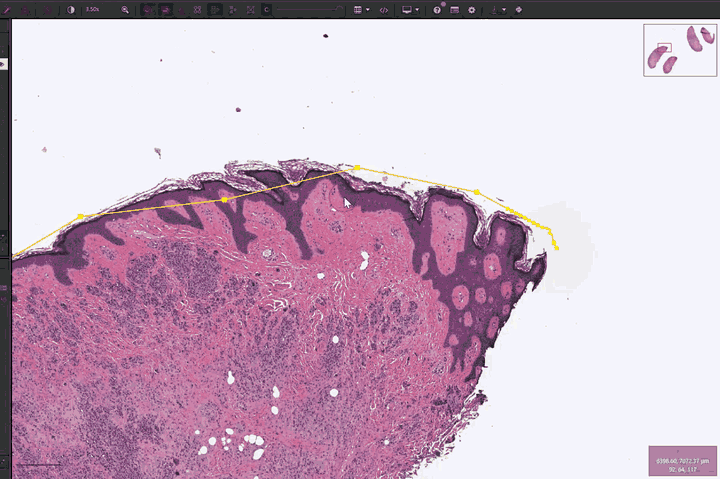
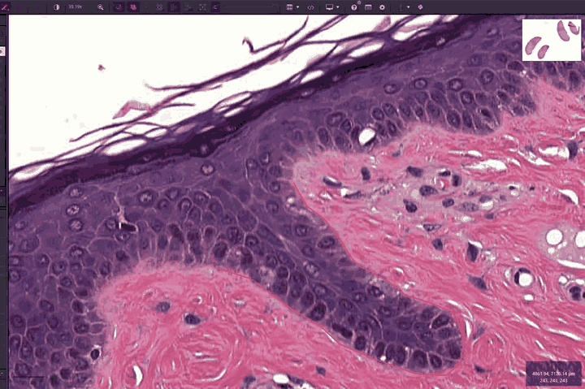

# Polyline Wand and Brush

> QuPath's brush and wand work on areas. This adds the same fluid editing to **lines and
> polylines**: push a section of a traced boundary outward, erase backwards from an
> overshot endpoint, smooth a noisy trace, or cut a polyline in two.

| | |
|---|---|
| **Repository** | [uw-loci/qupath-extension-polyline-wand](https://github.com/uw-loci/qupath-extension-polyline-wand) |
| **Extension version** | 0.3.10 |
| **License** | GPL-3.0 |
| **Requires** | QuPath 0.6.0+ (use 0.7 today) |
| **Where to find it** | Toolbar  · **Shift+P** |
| **Catalog** | LOCI QuPath Extensions |
| **Session** | Hands-on |

> **Walkthrough video:** %%VIDEO_POLYLINE_WAND%%
> The walkthrough below is self-contained. You can work through it during the workshop, or on your own afterwards.

---

## Finding the button

The Polyline Wand adds its own toolbar button, to the right of QuPath's own wand. So does the
[Wizard Wand](05-wizard-wand.md) — which of the two comes first depends on the order you
installed them, so match the icon rather than the position:


| | Which button | How to tell it apart |
|---|---|---|
|  | QuPath's own wand | Outline only, no fill |
|  | **Wizard Wand** (Shift+W) | Solid wand, sparkles, no arrow |
|  | **Polyline Wand** (Shift+P) | Crosses a line, and has a small gray arrow in the corner |

---

> ## Select the line first — nothing works without it
>
> **Every** action here acts on the *currently selected* annotation: pushing, smoothing,
> erasing from an endpoint, and the cut. If nothing is selected, or the selected thing is not
> a line or polyline, or it is locked, the tool **does nothing at all** — no new annotation,
> no error, no message. It looks exactly like a broken extension.
>
> So: click your polyline to select it, *then* use the tool. If a stroke
> seems to do nothing, check the selection before anything else.

## Why this exists

Four situations, all of which currently mean "delete it and start over":

- Tracing the leading edge of a tumor along a long polyline, then needing to push one
  section outward to include tissue you originally passed through.
- Drawing a long polyline for a vessel and overshooting the endpoint with a jerky hand
  movement.
- A trace that is correct but noisy.
- A polyline that should be two annotations.

## Two engines, one tool

The toolbar exposes a single **Polyline Wand** tool. Right-click the button to switch engines
at runtime; each solves "push the line around" differently.

**Direct vertex push** (default) uses a per-frame brush to displace affected vertices with a
configurable falloff (cosine / linear / gaussian). Local densification keeps sparse segments
responsive; end-of-stroke runs a vertex compactor and a self-intersection loop remover, so
the line collapses cleanly when pushed over itself. The most reactive of the two: the brush
can start anywhere and pulls the line toward it whenever the line enters the brush footprint.

**Arc-length displacement field** locks an active arc-length window of 2× brush radius at
press, and per frame touches only the K vertices in that window. Each vertex moves by
`kernel_weight × strength × (brush_motion · local_normal)`, so **only the perpendicular
component of cursor motion shifts the curve**. Holding still, or dragging along the line,
produces zero push. A self-intersection guard refuses any move that would create a local
crossing.

If you want a brush that feels like paint, use the first. If you want a brush that cannot
accidentally drag your line sideways, use the second.

## Other behavior worth knowing

- **Local region editing.** At mouse-press only the section within ~3× brush radius is
  editable; head and tail are spliced back bit-exact at commit, so untouched segments are
  never re-shaped. This also keeps long polylines fast, because the engine sees ~50 vertices, not
  10,000.
- **Scissors / cut-at-click.** Right-click → **Mode** → *Scissors (cut at click)*. The icon swaps to
  scissors and the brush circle becomes a crosshair with a small ring on the selected polyline
  showing exactly where the cut will land. A click splits the polyline into two annotations at
  that point, removes the original, and selects the first half. Both pieces inherit the
  original's class, name, and color.
- **Zoom-aware brush.** By default the radius is in *screen* pixels, so the on-screen size
  stays constant and zooming out covers more image, matching QuPath's built-in brush. Turn
  it off to lock the brush to image pixels.
- **Cursor matches felt effect.** The solid circle is drawn where the falloff still has
  significant strength (75% of radius by default); the faint dashed ring is the true maximum
  reach.
- **Auto endpoint erase.** Start a stroke near an endpoint and the brush shortens the line
  from that end instead. Hold **Shift** to override and edit normally at an endpoint.
- **LineROI promotion.** Editing a 2-point line densifies it into a polyline (32 vertices by
  default) so the engines have interior vertices to work with.
- **Clean undo.** Mid-drag commits are throttled to ~30 Hz, so one stroke is one undo entry.

## Right-click menu

```
Mode >                (Auto (push, erase-near-endpoint) / Push / Smooth /
                       Erase from end / Scissors (cut at click))
Engine >              (Direct vertex push / Displacement field)
Engine settings >     (rebuilds for the active engine)
Set brush radius...
Reset Polyline Wand preferences
```

Preferences live under **Polyline Wand** in QuPath's Preferences pane, with per-engine
sub-categories.

<details markdown="1">
<summary><b>Install</b> — from the LOCI catalog, then restart QuPath</summary>

Install from the **LOCI QuPath Extensions** catalog, then restart QuPath. Full steps, including the catalog URL, are in the [setup guide](setup.md).

</details>

---

> **New to QuPath?** Words like *project*, *annotation*, *detection*, *class* and
> *measurement* are explained in the [glossary](glossary.md). For QuPath itself, the
> [official documentation](https://qupath.readthedocs.io/en/stable/) is the place to go.

## Hands-on exercise
**Data:** `DATA-01_HE_WSI`, the CMU-1 H&E slide in the **[`Scripting Demo.zip`](https://drive.google.com/uc?export=download&id=1bWZtjZEtgqZnJOVBc91_Wk_HPgw8dmNY)** (229 MB; see [setup](setup.md#5-download-the-workshop-data)).

**Before you start.** Unzip `Scripting Demo.zip`, then **drag the unzipped folder onto an open QuPath window** — it is already a project, and dropping it opens it. (The menu route is `File > Project > Open project`, if you prefer.) Then double-click the **CMU-1 H&E** slide in the project list to open it.

Like the Wizard Wand this is a toolbar tool: with an image open, press **Shift+P**.


1. Draw a long polyline along a tissue boundary with QuPath's normal polyline tool, then
   **click it to select it** — everything below needs it selected. Deliberately
   overshoot the end.
2. Press **Shift+P**. Start a stroke *near the overshot endpoint* and the line erases backwards.
3. Find a section where your trace cuts a corner. Push it outward with the default engine.

   

4. Right-click → **Engine** → *Displacement field*. Push the same kind of section. Notice that
   dragging **along** the line now does nothing, and only perpendicular motion moves it.
5. Right-click → **Mode** → *Smooth*. Clean up a noisy stretch.
6. Right-click → **Mode** → *Scissors (cut at click)*. Click on the polyline to split it in two. Check that
   both halves kept the class and color.

   

7. Press Ctrl+Z a few times and confirm each *stroke* is one undo step, not each frame.

### What to notice

- The two engines feel genuinely different. Pick by task, not by which is "better."
- Local region editing means you can work on a 10,000-vertex boundary without lag and without
  disturbing the parts you already got right.
- Scissors is the fastest way to turn one over-eager trace into two correct annotations.

---

**Full documentation:** the
[repository README](https://github.com/uw-loci/qupath-extension-polyline-wand#readme).
