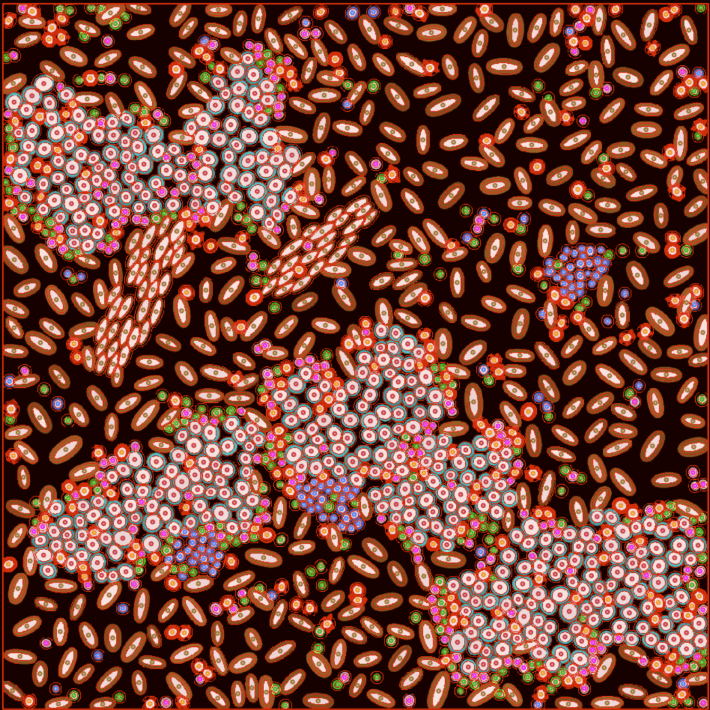
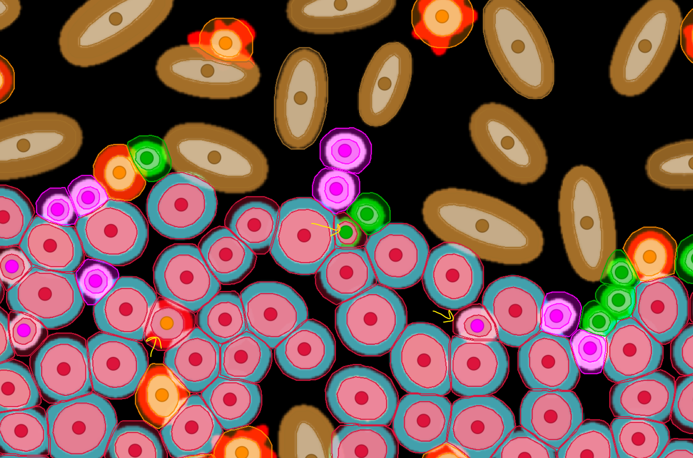
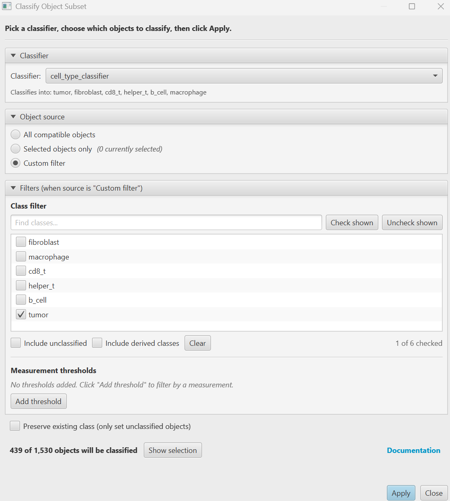
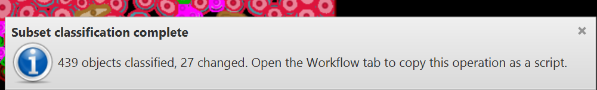
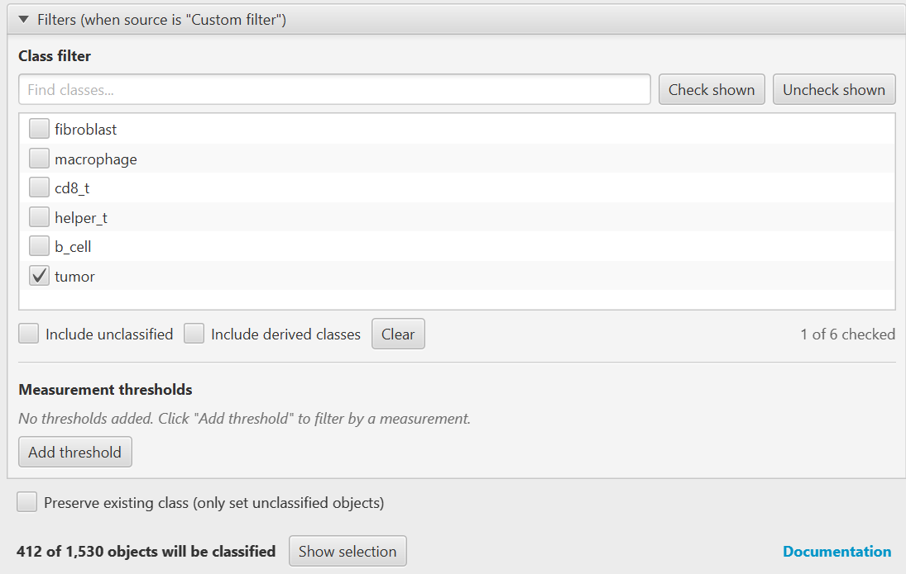

# Classify Object Subset

> Run a saved object classifier on a *chosen subset* of objects instead of every object in
> the image. Pick the subset by class, by measurement value, by what you have selected, or
> any combination, with a live count before you commit.

| | |
|---|---|
| **Repository** | [uw-loci/qupath-extension-classify-object-subset](https://github.com/uw-loci/qupath-extension-classify-object-subset) |
| **Extension version** | 0.3.1 |
| **License** | Apache-2.0 |
| **Requires** | QuPath 0.7.0+ |
| **Where to find it** | `Extensions > Classify Object Subset > Apply Classification to Subset...` |
| **Catalog** | LOCI QuPath Extensions |
| **Session** | Mentioned; presented in Sara McArdle's Monday session |

> **Walkthrough video:** %%VIDEO_CLASSIFY_OBJECT_SUBSET%%
> The walkthrough below is self-contained. You can work through it in the hands-on hour, or on your own afterwards.

---

## What it does

QuPath's built-in `Classify > Object classification > Apply classifier` always runs on
**every** compatible object in the image. There is no built-in GUI for "apply this classifier
only to cells that are tumor," or "only to cells the previous classifier left unclassified."

You can do it in Groovy. This pattern was originally explored in
[Sara McArdle's `B_Helper_Cyto.groovy`](https://github.com/saramcardle/Image-Analysis-Scripts/blob/master/QuPath%20Groovy%20Scripts/Workshop%20Examples/B_Helper_Cyto.groovy)
and discussed in [this image.sc thread](https://forum.image.sc/t/feature-request-apply-classifiers-to-only-some-selected-objects/86383),
but only if you are comfortable writing scripts. This extension is the GUI for it.

**Pick the subset by:**

- **class** (one or several),
- **measurement value** (for example `Cell: CD3 mean` greater than some threshold), **as many
  conditions as you need**, added a row at a time,
- **current viewer selection**,
- or any combination of the above.

The dialog shows a **live count** — "439 of 1,530 objects will be classified" — before you
click Apply, so you find out you targeted the wrong cells *before* you overwrite them.

> **"Objects" means annotations and detections both.** QuPath calls everything in the image
> hierarchy an object. Cells are *detections*; the regions you draw, and the colored
> ground-truth dots in this exercise, are *annotations*. This distinction matters more than it
> sounds: **this extension filters only the objects your classifier can process**, which for a
> cell classifier means detections. Classes that exist only on annotations will not appear in
> the class filter. See the [glossary](glossary.md).

<b>Install</b> — from the LOCI catalog, then restart QuPath

Install from the **LOCI QuPath Extensions** catalog, then restart QuPath. Full steps, including the catalog URL, are in the [setup guide](setup.md).

---

## Try it yourself
The point of this exercise is to **make a classification mistake on purpose, then repair only
the part that is wrong** — which is the situation the extension exists for.

### What you need

**Data — one download, everything included.**
`multiplex-synthetic-data-demo-project-v1.2.zip`,
**[direct download](https://github.com/uw-loci/multiplex-synthetic-data/releases/download/v1.2/multiplex-synthetic-data-demo-project-v1.2.zip)**
(20 MB). This is a **ready-made QuPath project**, not a loose pile of files — you unzip it and
open it as a project. Inside:

- `images/` — eight synthetic 8-channel multiplexed images (`tme_00.tif` … `tme_07.tif`)
- **cells already detected** on every image, with measurements — you do **not** run cell
  detection yourself
- **ground truth**: one classified point per cell, so you can check whether you got the right
  answer. A training dataset with ground truth is unusual, and it is the whole reason this one
  exists
- a **trained object classifier**, `cell_type_classifier`, in `classifiers/object_classifiers/`
- a `scripts/` folder of helper scripts (one is used below)

**You will also need:** QuPath **0.7.0 or later**, and this extension installed from the LOCI
catalog (see the **Install** box above, or the [setup guide](setup.md)). Nothing else — no
server, no GPU, no internet once the zip is downloaded.

Unzip it anywhere you like. **Work on `tme_00.tif`, and use that one image throughout.**

> **Use `tme_00`, not whichever image opens first.** The eight images are deliberately
> different. `tme_07` is an immune-poor variant with **no B cells at all**, and `tme_06` is
> immune-rich. Every number below is from `tme_00`; on another image they will differ, and
> nothing will have gone wrong.

`tme_00` contains **1,530 cells**, of which the ground truth says exactly **412 are tumor
cells**. Hold on to that number — you are going to measure it twice.

### Set up the project

1. Start QuPath, then **drag the unzipped folder — or the `project.qpproj` file inside it —
   onto the QuPath window.** That opens it as a project. (Menu route, if you prefer:
   `File > Project... > Open project`.)
2. **The images will show as missing.** This is expected, it is not your fault, and you do
   not need to re-download or re-unzip — the project cannot know where you unzipped it. Fix it
   once: **`Automate > Project scripts > fix_image_paths` > Run**, then reopen the project. That
   repoints all eight images at the bundled `images/` folder.

   (If QuPath instead offers to locate the missing images, point it at the `images/` folder
   beside `project.qpproj`; fixing one fixes all.)
3. In the project list on the left, double-click **`tme_00.tif`** to open it.

**There are three different things drawn on this image, and telling them apart is most of the
exercise:**

- **The square outline around the whole image** is an *annotation* — a rectangle someone drew
  so that `Analyze > Cell detection` had a region to run in. It produced everything else here,
  and you will not touch it again.
- **The cell outlines** are *detections*, one per cell, about 1,530 of them. They are all the
  same color because they are **unclassified**: no cell yet carries a class.
- **The small colored dots**, one sitting on each cell, are *point annotations*. Their colors
  are the six cell types, and they are the **ground truth** — what each cell really is. They
  are reference only; you never edit them, and the classifier never reads them.

That last distinction is the one that catches people. The classes you can see on screen belong
to the **dots**, which are annotations. The extension classifies **cells**, which are
detections — so until something classifies a cell, the extension has no classes to offer you.

**The extension lives at** `Extensions > Classify Object Subset > Apply Classification to Subset...`.

### Part A: make a mistake worth fixing

A classifier that is right about everything teaches you nothing. So first, classify the cells
with a deliberately crude method that gets most of them right and a few of them wrong.

1. Run the imperfect classifier: **`Automate > Project scripts > classify_with_marker_gate`**,
   then **Run**. It is bundled with the project, so there is nothing to download.

   It thresholds each marker channel and assigns a cell type from which markers are above
   threshold. Its errors are real ones: QuPath expands each nucleus by 5 µm to approximate the
   cell, and at the edge of a tumor nest that expansion picks up PanCK signal from the tumor
   cell next door — so **T cells touching a tumor nest get called `tumor`**.

2. The cells are now colored by predicted class. Zoom into the boundary of a tumor nest and
   look at the cells there against the ground-truth dots underneath. Some disagree — the
   arrows below mark three of them.

   

3. Score it: **`Automate > Project scripts > check_against_ground_truth`**, then **Run**.
   It needs no extension.

   You get three things: a text confusion matrix, an **overall accuracy** line, and the
   misclassified cells **selected in the viewer**, so you can jump straight to them.

   > **If you see no matrix.** The script prints with `println`, which lands in the **output
   > pane at the bottom of the Script Editor window** — the panel under the code, often
   > collapsed to a sliver, so drag the divider up. The same text also goes to
   > `View > Show log`. The matrix is printed *above* the accuracy line, so scroll up in
   > whichever panel you are looking at.
   >
   > If both are genuinely empty, the usual causes are: the script was opened but never
   > **Run**; or the cells were not classified first, so the first step of Part A needs doing before this one.

   Read down the `tumor` column of the printed matrix: **14 CD8 T cells, 9 macrophages, 3
   helper T cells and 1 B cell** were called tumor. That is **27 cells wrongly in the tumor
   class**, nearly all of them at a nest boundary. A further **19 cells matched no marker
   rule** and were left unclassified.

### Part B: measure the error

**Nothing has been fixed yet.** All you have done so far is run a deliberately poor classifier
and find out *that* it is wrong and *which* cells it got wrong. The repair is Part C.

What this part does is get the same error out of the extension as a **single number**, so that
in Part C you can watch that number move. The dialog is a measuring instrument before it is a
repair tool.

1. `Extensions > Classify Object Subset > Apply Classification to Subset...`. A dialog opens.
2. Set **Classifier** to `cell_type_classifier`. Set **Object source** to **Custom filter**.
3. In the **Class filter** list, tick **`tumor`** only.
4. Read the live count: it should say **"439 of 1,530 objects will be classified."**

    **439 is the gate's tumor call. The truth is 412.** The extra 27 are the boundary cells
    from the matrix above. You have now measured the error with the same dialog you are about
    to fix it with.

The dialog also tells you what the classifier can produce — *Classifies into: tumor,
fibroblast, cd8_t, helper_t, b_cell, macrophage* — and **Show selection** highlights the
matching cells in the viewer, if you would rather see them than count them.

> **Why was the class list empty before you ran the script?** If you open this dialog on a
> fresh project, the **Class filter** shows *"No classes present in image."* That is correct
> behavior, not a bug. The list is built from the classes actually found on the cells, and
> the cells started out unclassified. The colored ground-truth dots have classes, but they
> are annotations, and a cell classifier does not process annotations. The filter only fills
> in once something has classified the cells.

### Part C: repair only the cells that are wrong

1. Leave the filter set to **`tumor`**. You are now targeting exactly the cells the gate
    called tumor — the correct ones and the mistaken ones together — and nothing else.
2. Click **Apply**. The confirmation reads **"439 objects classified, 27 changed."**

    

    **27 is the repair, and it is the same 27** you counted off the confusion matrix: the 14
    CD8 T cells, 9 macrophages, 3 helper T cells and 1 B cell the gate had pushed into the
    tumor class. The other 412 it looked at were already right and were left alone.

3. Now measure again. Reopen the dialog, set **Object source** to **Custom filter**, tick
    **`tumor`** only, and read the live count.

    

    **412 of 1,530** — the ground truth exactly. You repaired the tumor calls without touching
    any of the other five cell types: every fibroblast, macrophage and B cell the gate got
    right is exactly as it was.

    > **Why it lands exactly on 412.** `cell_type_classifier` was trained on the ground-truth
    > points of all eight images, this one included, with nothing held back. So recovering 412
    > is the model reproducing labels it was fitted on — it shows the repair worked, but it is
    > not an accuracy estimate. On your own data, train and score on different images.

### Part D: the leftovers (optional)

The gate leaves a few cells matching no marker rule at all, and those stay unclassified.

1. Reopen the dialog, and in the **Class filter** tick **Include unclassified** and nothing
    else. The count shows how many cells the gate could not call.
2. Apply the trained classifier to just those. This is the "stacked classifiers" pattern:
    a first pass that is confident about the easy cases, a second that mops up the rest,
    with each pass leaving the other's work alone.

    The dialog has a switch built for exactly this: **Preserve existing class (only set
    unclassified objects)**, at the bottom. Tick it and you can point the classifier at
    everything while it still only fills in the blanks — the safer habit once the calls you
    already have are ones you care about.

### Part E: turn it into a script

Every Apply is recorded so the same operation can be re-run across a whole project.

1. Open `Automate > Show workflow command history`. Look for the step named
    **`Apply classify object subset`** — one for each time you clicked Apply.
2. Get it into Groovy, one of two ways:

    - **Copy the step** out of the history and paste it into the script editor. Use this when
      you want that one operation and nothing else.
    - **Click Create script**, which turns the *whole* workflow into a script — every step
      you ran, not just the Apply — then delete down to the parts you want.

    There is no per-step *Create script*; the button works on the workflow as a whole.

### What to notice

You read 439, applied, and read 412. Both numbers came from the extension itself — what made
them checkable was the answer key, which independently says 412. That is the part you will not
have on your own slides: the live count will still tell you **how many** cells you are about to
change, which is the useful thing, but nothing will tell you the right answer.

Running the trained classifier over the whole image would have fixed the tumor calls too — and
rewritten all 1,530 cells while doing it. Here the other five classes came through untouched.
On your own slides those other calls are often manual work.

The gate and the trained classifier each did one job. A pass that only has to separate tumor
from not-tumor is easier to check than one that has to get all six right at once.

Each Apply is recorded in the workflow history, so the same operation runs over a whole project
from a script.

---

> **Sara McArdle demonstrated this extension in her session on Monday 28 September**,
> *Tips and tricks for maintaining sanity during hi-plex classification in QuPath*. Both this
> extension and its sibling grew out of her Groovy scripts. If you were not at that session,
> the walkthrough above stands on its own.

**Full documentation:** the
[repository README](https://github.com/uw-loci/qupath-extension-classify-object-subset#readme).
