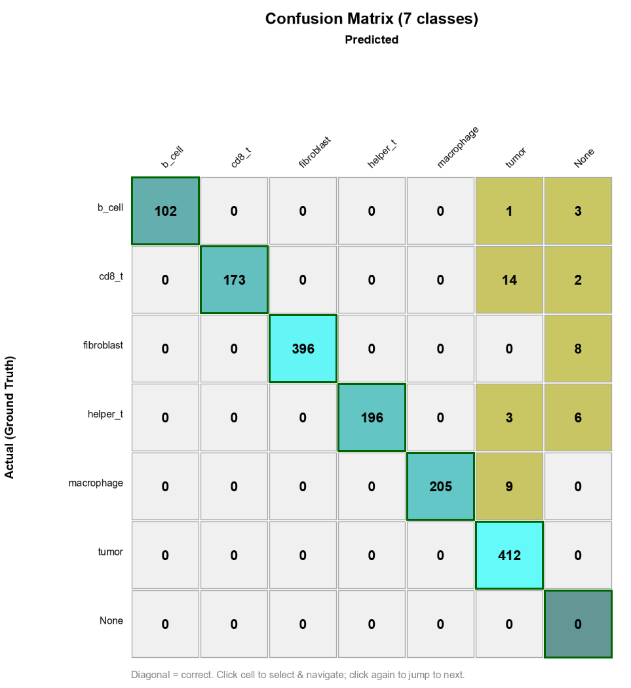

# Classify Object Subset

> Run a saved object classifier on a *chosen subset* of objects instead of every object in
> the image. Pick the subset by class, by measurement value, by what you have selected, or
> any combination, with a live count before you commit.

| | |
|---|---|
| **Repository** | [uw-loci/qupath-extension-classify-object-subset](https://github.com/uw-loci/qupath-extension-classify-object-subset) |
| **Version at workshop** | 0.2.0 |
| **License** | Apache-2.0 |
| **Requires** | QuPath 0.7.0+ |
| **Where to find it** | `Extensions > Classify Object Subset > Apply Classification to Subset...` |
| **Catalog** | LOCI QuPath Extensions |
| **Session** | Mentioned; presented in Sara McArdle's Monday session |

> **Walkthrough video:** %%VIDEO_CLASSIFY_OBJECT_SUBSET%%
> The walkthrough below is self-contained. You can work through it in the hands-on hour, or on your own afterwards.

---

## What it does

QuPath's built-in `Classify > Object classification > Apply classifier` always runs on
**every** compatible object in the image. There is no built-in GUI for "apply this classifier
only to cells that are tumor," or "only to cells the previous classifier left unclassified."

You can do it in Groovy. This pattern was originally explored in
[Sara McArdle's `B_Helper_Cyto.groovy`](https://github.com/saramcardle/Image-Analysis-Scripts/blob/master/QuPath%20Groovy%20Scripts/Workshop%20Examples/B_Helper_Cyto.groovy)
and discussed in [this image.sc thread](https://forum.image.sc/t/feature-request-apply-classifiers-to-only-some-selected-objects/86383),
but only if you are comfortable writing scripts. This extension is the GUI for it.

**Pick the subset by:**

- **class** (one or several),
- **measurement value** (for example `Cell: CD3 mean` greater than some threshold), **as many
  conditions as you need**, added a row at a time,
- **current viewer selection**,
- or any combination of the above.

The dialog shows a **live count** — "439 of 1,530 objects will be classified" — before you
click Apply. That number is the whole point: you find out you targeted the wrong cells
*before* you overwrite them.

> **"Objects" means annotations and detections both.** QuPath calls everything in the image
> hierarchy an object. Cells are *detections*; the regions you draw, and the colored
> ground-truth dots in this exercise, are *annotations*. This distinction matters more than it
> sounds: **this extension filters only the objects your classifier can process**, which for a
> cell classifier means detections. Classes that exist only on annotations will not appear in
> the class filter. See the [glossary](glossary.md).

<b>Install</b> — from the LOCI catalog, then restart QuPath

Install from the **LOCI QuPath Extensions** catalog, then restart QuPath. Full steps, including the catalog URL, are in the [setup guide](setup.md).

If you already have a version older than 0.2.0, replace it. Releases before 0.2.0 shipped a jar
named `qupath-extension-gated-object-classifier-*.jar` and appear in the menu as **Gated Object
Classifier**, the extension's former name. 0.2.0 is the first release carrying the current name,
and it is the one with multiple measurement thresholds and class checkboxes.

---

## Try it yourself
The point of this exercise is to **make a classification mistake on purpose, then repair only
the part that is wrong** — which is the situation the extension exists for.

### What you need

**Data — one download, everything included.**
`multiplex-synthetic-data-demo-project-v1.2.zip`,
**[direct download](https://github.com/uw-loci/multiplex-synthetic-data/releases/download/v1.2/multiplex-synthetic-data-demo-project-v1.2.zip)**
(20 MB). This is a **ready-made QuPath project**, not a loose pile of files — you unzip it and
open it as a project. Inside:

- `images/` — eight synthetic 8-channel multiplexed images (`tme_00.tif` … `tme_07.tif`)
- **cells already detected** on every image, with measurements — you do **not** run cell
  detection yourself
- **ground truth**: one classified point per cell, so you can check whether you got the right
  answer. A training dataset with ground truth is unusual, and it is the whole reason this one
  exists
- a **trained object classifier**, `cell_type_classifier`, in `classifiers/object_classifiers/`
- a `scripts/` folder of helper scripts (one is used below)

**You will also need:** QuPath **0.7.0 or later**, and this extension installed from the LOCI
catalog (see the **Install** box above, or the [setup guide](setup.md)). Nothing else — no
server, no GPU, no internet once the zip is downloaded.

Unzip it anywhere you like. **Work on `tme_00.tif`, and use that one image throughout.**

> **Use `tme_00`, not whichever image opens first.** The eight images are deliberately
> different. `tme_07` is an immune-poor variant with **no B cells at all**, and `tme_06` is
> immune-rich. Every number below is from `tme_00`; on another image they will differ, and
> nothing will have gone wrong.

`tme_00` contains **1,530 cells**, of which the ground truth says exactly **412 are tumor
cells**. Hold on to that number — you are going to measure it twice.

### Set up the project

1. Start QuPath, then **drag the unzipped folder — or the `project.qpproj` file inside it —
   onto the QuPath window.** That opens it as a project. (Menu route, if you prefer:
   `File > Project... > Open project`.)
2. **The images will show as missing.** This is expected, it is not your fault, and you do
   not need to re-download or re-unzip — the project cannot know where you unzipped it. Fix it
   once: **`Automate > Project scripts > fix_image_paths` > Run**, then reopen the project. That
   repoints all eight images at the bundled `images/` folder.

   (If QuPath instead offers to locate the missing images, point it at the `images/` folder
   beside `project.qpproj`; fixing one fixes all.)
3. In the project list on the left, double-click **`tme_00.tif`** to open it.

You should see cells outlined, and a scatter of small colored dots. The dots are the
**ground truth** — one per cell, colored by what that cell really is. The cells themselves
start out **unclassified**.

%%SHOT_COS_01_PROJECT_OPEN%%
> *Screenshot to add: `tme_00` open — cell outlines and the colored ground-truth dots, cells
> still unclassified.*

**The extension lives at** `Extensions > Classify Object Subset > Apply Classification to Subset...`.

### Part A: make a mistake worth fixing

A classifier that is right about everything teaches you nothing. So first, classify the cells
with a deliberately crude method that gets most of them right and a few of them wrong.

4. Run the imperfect classifier: **`Automate > Project scripts > classify_with_marker_gate`**,
   then **Run**. It is bundled with the project, so there is nothing to download.

   It thresholds each marker channel and assigns a cell type from which markers are above
   threshold. Its errors are real ones: QuPath expands each nucleus by 5 µm to approximate the
   cell, and at the edge of a tumor nest that expansion picks up PanCK signal from the tumor
   cell next door — so **T cells touching a tumor nest get called `tumor`**.

5. The cells are now colored by predicted class. Zoom into the boundary of a tumor nest and
   look at the cells there against the ground-truth dots underneath. Some disagree — the
   arrows below mark three of them.

   

6. Score it: **`Automate > Project scripts > check_against_ground_truth`**, then **Run**. It
   prints a confusion matrix and the overall accuracy to the log (`View > Show log`) and
   **selects the misclassified cells in the viewer**, so you can jump straight to them. This
   needs no extension.

   

   Read the `tumor` column: **14 CD8 T cells, 9 macrophages, 3 helper T cells and 1 B cell**
   were called tumor. That is **27 cells wrongly in the tumor class**, nearly all of them at a
   nest boundary. A further **19 cells matched no marker rule** and were left unclassified.

### Part B: measure the error

Now use the extension as a measuring instrument, before using it as a repair tool.

7. `Extensions > Classify Object Subset > Apply Classification to Subset...`. A dialog opens.
8. Set **Classifier** to `cell_type_classifier`. Set **Object source** to **Custom filter**.
9. In the **Class filter** list, tick **`tumor`** only.
10. Read the live count: it should say **"439 of 1,530 objects will be classified."**

    **439 is the gate's tumor call. The truth is 412.** The extra 27 are the boundary cells
    from the matrix above. You have now measured the error with the same dialog you are about
    to fix it with.

The dialog also tells you what the classifier can produce — *Classifies into: tumor,
fibroblast, cd8_t, helper_t, b_cell, macrophage* — and **Show selection** highlights the
matching cells in the viewer, if you would rather see them than count them.

> **Why was the class list empty before you ran the script?** If you open this dialog on a
> fresh project, the **Class filter** shows *"No classes present in image."* That is correct
> behavior, not a bug. The list is built from the classes actually found on the cells, and
> the cells started out unclassified. The colored ground-truth dots have classes, but they
> are annotations, and a cell classifier does not process annotations. The filter only fills
> in once something has classified the cells.

### Part C: repair only the cells that are wrong

11. Leave the filter set to **`tumor`**. You are now targeting exactly the cells the gate
    called tumor — the correct ones and the mistaken ones together — and nothing else.
12. Click **Apply**.

    A message confirms how many objects were classified and how many **changed**. The
    "changed" number is the repair: those are cells the trained classifier disagreed with the
    gate about.

13. Now measure again. Reopen the dialog, set **Object source** to **Custom filter**, tick
    **`tumor`** only, and read the live count.

    It should now be much closer to **412**. You repaired the tumor calls without touching
    any of the other five cell types — every fibroblast, macrophage and B cell the gate got
    right is exactly as it was.

%%SHOT_COS_04_AFTER_REPAIR%%
> *Screenshot to add: the dialog's live count on the second measurement, now close to 412.*

### Part D: the leftovers (optional)

The gate leaves a few cells matching no marker rule at all, and those stay unclassified.

14. Reopen the dialog, and in the **Class filter** tick **Include unclassified** and nothing
    else. The count shows how many cells the gate could not call.
15. Apply the trained classifier to just those. This is the "stacked classifiers" pattern:
    a first pass that is confident about the easy cases, a second that mops up the rest,
    with each pass leaving the other's work alone.

    The dialog has a switch built for exactly this: **Preserve existing class (only set
    unclassified objects)**, at the bottom. Tick it and you can point the classifier at
    everything while it still only fills in the blanks — the safer habit once the calls you
    already have are ones you care about.

### Part E: turn it into a script

Every Apply is recorded so the same operation can be re-run across a whole project.

16. Open `Automate > Show workflow command history`. Look for the step named
    **`Apply classify object subset`** — one for each time you clicked Apply.
17. Right-click it and choose **Create script** to get runnable Groovy. (The confirmation
    message calls this "Open the Workflow tab to copy this operation as a script" — same
    thing, two names.)

### What to notice

- **The live count is the feature.** You used it to measure the error before the fix and
  confirm it after, and at no point did you have to trust the tool — you had a number.
- **You repaired one class without disturbing five others.** Running the trained classifier
  over the whole image would also have fixed the tumor calls, but it would have overwritten
  every other call at the same time. On real data, where earlier calls often represent manual
  work you do not want to lose, that is the difference that matters.
- **Stacked classifiers are easier to build than one big one.** Each pass only has to be good
  at one distinction, and you can check each one separately.
- **The exploratory session converts to a batch script**, so what you just did by hand can be
  re-run across a project unchanged.

---

> **Sara McArdle demonstrated this extension in her session on Monday 28 September**,
> *Tips and tricks for maintaining sanity during hi-plex classification in QuPath*. Both this
> extension and its sibling grew out of her Groovy scripts. If you were not at that session,
> the walkthrough above stands on its own.

**Full documentation:** the
[repository README](https://github.com/uw-loci/qupath-extension-classify-object-subset#readme).
