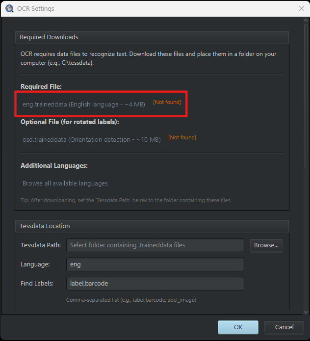
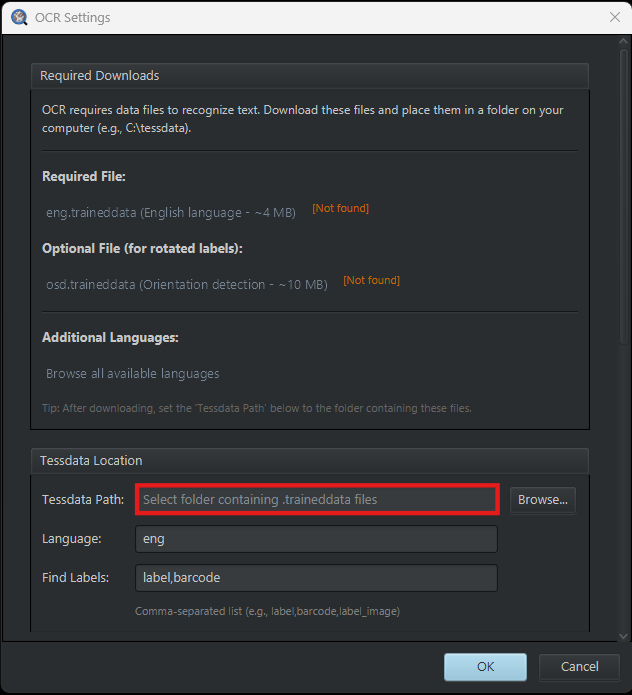
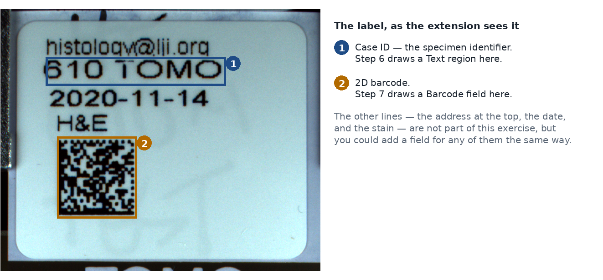
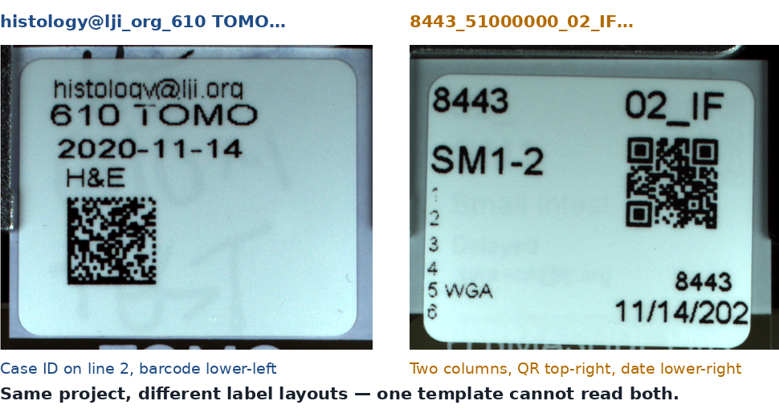

# OCR for Labels

> Read the slide label. Text via Tesseract OCR, barcodes via ZXing, saved straight into
> QuPath project metadata, for one image or for a whole project via a reusable template.

| | |
|---|---|
| **Repository** | [uw-loci/qupath-extension-ocr4labels](https://github.com/uw-loci/qupath-extension-ocr4labels) |
| **Version at workshop** | 0.4.2 |
| **License** | Apache-2.0 |
| **Requires** | QuPath 0.7.0+, Java 21+, Tesseract language data (see Setup) |
| **Where to find it** | `Extensions > OCR for Labels` |
| **Catalog** | LOCI QuPath Extensions |
| **Session** | Hands-on |

> **Walkthrough video:** %%VIDEO_OCR4LABELS%%
> The walkthrough below is self-contained. You can work through it during the workshop, or on your own afterwards.

---

## What it does

Whole-slide image files usually carry a **label image**: the photograph of the physical
slide label, with the case ID, stain, block number and often a barcode written on it. That
information is already in your file, and almost nobody uses it, because getting it out means
squinting at an image and typing.

This extension extracts the label image, runs OCR and/or barcode detection on it, and lets
you assign the detected content to QuPath metadata keys.

- **Label image access** pulls the label out of the WSI file and displays it.
- **Tesseract OCR** for text (via the Tess4J wrapper).
- **ZXing barcode scanning** for 1D and 2D barcodes, with no extra setup needed.
- **Hybrid templates**: mix text regions and barcode regions in one template.
- **Interactive review**: the detected content lands in an editable table before anything is
  written. Fix the OCR's mistakes, set the metadata key names, then apply.
- **Project navigation**: browse every project image without closing the dialog.
- **Batch processing**: apply a template across the whole project.
- **Text filtering**: one-click character filters to clean up OCR noise.
- **Literal transcription** *(on by default since 0.4.0)*: OCR reports the characters it saw
  instead of correcting them toward English words. Labels are overwhelmingly codes, dates and
  accession numbers, and dictionary correction damages those more than it repairs.
- **Vocabulary matching**: correct OCR errors by matching against a list of known valid
  values. If you know the only legal stains are `H&E`, `CD3`, `CD8`, then `CD９` resolves.
- **Rotated label support**: automatic orientation detection for sideways or upside-down
  labels.

Once the metadata is in the project, the
[Project Metadata Browser](09-project-metadata-browser.md) is how you review, correct, and
export it in bulk.

<details>
<summary><b>Step 1: install the extension</b> — from the LOCI catalog, then restart QuPath</summary>

Install from the **LOCI QuPath Extensions** catalog, then restart QuPath. Full steps, including the catalog URL, are in the [setup guide](setup.md).

It is also listed in the QPSC microscope catalog, but it needs no microscope, so the main catalog is all you need. It does need its language data: see [setup](#language-data) below.

</details>

## Step 2: the language data — do this before the workshop
{: #language-data}

*(This is separate from installing the extension above. The extension is a jar; the
language data are two files it reads at runtime, and it will not do OCR without them.)*

**You do not need to install Tesseract.** The OCR engine ships inside the extension. The only
thing missing is the *language data*, and you want both files:

| File | Size | What it does |
|---|---|---|
| `eng.traineddata` | 4 MB | Reads English text |
| `osd.traineddata` | 11 MB | Works out which way up the label is, so rotated labels still read |

There are two ways to get them, and they fetch the same files from the same place:

- **From inside QuPath.** `Extensions > OCR for Labels > OCR Settings...`. The
  **Required Downloads** section lists both files with the links right there, and shows
  **[Not found]** beside each until it can see them (see below).

  

  Once both files are in a folder, set **Tessdata Path** to that folder (see below) and click
  **OK**. The [Not found] markers clear once the path is right.

  

- **Directly.** [eng.traineddata](https://github.com/tesseract-ocr/tessdata_fast/raw/main/eng.traineddata) and [osd.traineddata](https://github.com/tesseract-ocr/tessdata_fast/raw/main/osd.traineddata).

Either way, put both in one folder — anywhere you like, say `Documents/tessdata` — then set
**Tessdata Path** to that folder and click **OK**.

They come from [tessdata_fast](https://github.com/tesseract-ocr/tessdata_fast). There is also
[tessdata_best](https://github.com/tesseract-ocr/tessdata_best): slower, slightly more accurate,
a drop-in replacement if you ever want it. Other languages live in the same two repositories,
named by their three-letter code.

Barcode scanning works immediately with no setup — that reader is built in.

> **Leave Enhance unticked.** As of 0.4.2 it is off by default, and it should stay that way
> unless you have measured it helping on your own labels. See
> [what to notice](#what-to-notice) below for what it was doing.

---

> **New to QuPath?** Words like *project*, *annotation*, *detection*, *class* and
> *measurement* are explained in the [glossary](glossary.md).

## Hands-on exercise (~15 min)

**Data:** [`DATA-03_labeled_slides`](https://drive.google.com/uc?export=download&id=1xm99nEa0okF7USeip0PTDv6PT4Ut5eWX): six CZI whole-slide images from LJI, each carrying an
embedded slide label. **Over 500 MB, so download it before you travel.**

> **Why it is not a folder of small PNGs.** The label lives *inside* the slide file, as an
> attachment alongside the pixel data. The extension pulls it out of the WSI. Hand it a
> screenshot of a label and there is nothing for it to read, because the thing it reads is the
> slide. That is the whole point of the tool: the information is already in the file you were
> given.

**Start with this one:** `histology@lji_org_610 TOMO___H&E_20201119-1-mip.czi`. Its label
carries printed text, a date **and** a 2D barcode, so it exercises OCR, barcode scanning and a
mixed template in a single image. It is also the label behind the `@` investigation in
[what to notice](#what-to-notice) below. The printed text reads:

```
histology@lji.org     <- the lab's contact address
610 TOMO              <- the specimen identifier: this is the "case ID"
2020-11-14            <- the date
H&E                   <- the stain
```

Below that text is a square 2D barcode. That is the one step 11 asks you to draw a field over.
Here is the label with the two regions the exercise uses marked (see below):



The other five, if you want more to try:

| File | Size |
|---|---|
| `histology@lji_org_610 TOMO___MT3B_20201119-mipcomp.czi` | 11 MB |
| `8443_51000000_02_IF_2022-11-18-mip.czi` | 138 MB |
| `8443_51000000_12_IF_2022-11-18-mipcomp.czi` | 91 MB |
| `8443_51000000_12_IF_2022-11-18-mipcompczi.czi` | 113 MB |
| `2014_04_08__12_24__0065.czi` | 168 MB |

### Part A: make a project

The extension works on a QuPath **project**, not on a loose file — its dialog lists project
images down the left side, and batch mode runs over the project. So before anything else:

1. Unzip the download somewhere you can find it.
2. In QuPath, `File > Project > Create project...` and choose an **empty folder** for it.
3. Drag the `.czi` files onto the QuPath window, or use **Add images**, and confirm.
4. Double-click `histology@lji_org_610 TOMO___H&E_20201119-1-mip.czi` in the project list to
   open it.

### Part B: one slide

5. With that slide open from Part A, run
   `Extensions > OCR for Labels > Run OCR on Label`.
6. The dialog lists all project images on the left; select one.
7. Set **Scope** to *Full Image*, **Decode As** to *Try Both* (barcode first, then OCR), and
   leave **Min Conf** at its default. *Try Both* matters here, because these labels carry text and a
   barcode, and you want whichever is more reliable per region. **Check that Enhance is unticked**. It is off by default
   in 0.4.2, and step 17 is about why.
8. **Scan.** Review the table: correct the **Text** column where OCR guessed wrong, and set
   sensible **Metadata Key** names.
9. **Apply.** Confirm the metadata landed on the image (right-click the image in the project
   pane → *Edit metadata*, or use the Metadata Browser).

### Part C: a template, then the whole project

**Stay on the same slide** you used in Part A, `histology@lji_org_610 TOMO___H&E_20201119-1-mip.czi`.
You are building a template from its label, then applying that template to the whole project —
so steps 10 to 13 are still one image, and step 14 is where the other five get used.

10. Draw a rectangle over just the part of the label that identifies the specimen. On this
   label that is the line reading **`610 TOMO`** — not the email address above it, not the
   date, not the stain. That line is what a pathology lab would call the *case ID*: the
   identifier that ties this slide to a particular specimen. Set **Decode As** to *Text* and
   click **Add Region**. This adds the row without reading it, which is what you
   want while laying out a template.
11. Now work the other way round for the barcode: set **Decode As** to *Barcode*, click
   **Add Field**, and drag its rectangle. This one decodes the moment you finish drawing.
12. Before saving anything, set **Scope** to *Drawn Regions* and click **Rescan Regions**. Every
   row is re-read in place, each using its own **Decode As** value, so you find out what your
   template will actually produce while it is still cheap to fix.
13. **Save this as a template** with the field positions, types, and metadata key assignments.
14. Run **batch processing** with that template — but **only over slides whose labels share
    the same layout**. A template is positional: it stores where each field sits on the label.
    Point it at a differently laid-out label and it reads whatever happens to be at those
    coordinates, which is usually nothing, and it will not warn you.

    The six slides here are three different layouts (see below), so batch the two
    `histology@lji_org_610 TOMO` slides together and leave the rest out:

    | Layout | Slides |
    |---|---|
    | `histology@lji_org_610 TOMO…` | `...H&E_20201119-1-mip.czi`, `...MT3B_20201119-mipcomp.czi` |
    | `8443_51000000…` | the three `8443_` files |
    | `2014_04_08__12_24__0065.czi` | on its own |

    

    This is the real constraint on batch OCR, and it is why the tool saves templates rather than
    one global setting: **one template per label design**, applied to the slides that use it.
15. Try a **vocabulary list** for a field with a small known set of valid values, and re-run.
16. Look through the batch results for a label that was not upright, and confirm orientation
    detection read it anyway. If every label in your run came out upright, this is the step
    `osd.traineddata` exists for — rotate one yourself and re-run to see it work.

### Part D: the two-minute experiment worth doing (~2 min)

17. Go back to the `histology@lji.org` label. Tick
    **Enhance**, set **Scope** to *Drawn Regions*, and **Rescan Regions**. Compare against the
    unenhanced read.

### What to notice

- Region templates beat full-image OCR by a wide margin when labels are laid out consistently
  which, within one institution, they nearly always are.
- Vocabulary matching converts OCR from "usually right" to "right or obviously wrong," which
  is the difference between usable and not for automated metadata.
- **"Enhance image contrast" made OCR worse, and it took measurement to find out.** Its adaptive
  threshold forces every pixel to pure black or white before Tesseract sees it, discarding the
  smooth edges the classifier depends on. Dense glyphs suffer first. On this very slide, `histology@lji.org` came
  back as `histoloawalli.org`, because `@` is the densest glyph in ASCII and hard thresholding
  closes the gap between the `a` and its ring. Across a blur series the untouched image read
  correctly at every level while the enhanced one degraded steadily. Tesseract already
  thresholds internally, and does it better. It is now off by default.
- **The generalisable lesson:** the option was called *Enhance*, it was recommended for faded
  labels, and it was wrong. A pre-processing step that sounds helpful is a hypothesis, not a
  fix, and OCR is one of the few places where you can actually test it, because you know what
  the answer should be.
- **If a read is still wrong, suspect the image before the settings.** A label image cropped
  through the descenders turns `g` into `a`, `y` into `v`, and `j` into `i`, which is why a real
  label kept coming back ending in `.ora`. No amount of processing recovers pixels that were
  never captured.
- The review step is not optional. OCR on a photographed label is *good*, not *correct*.

---

**Full documentation:** the
[repository README](https://github.com/uw-loci/qupath-extension-ocr4labels#readme).
