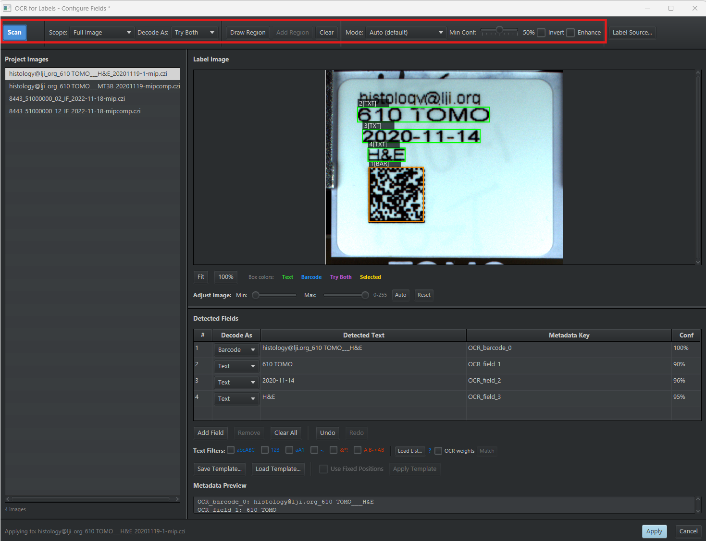
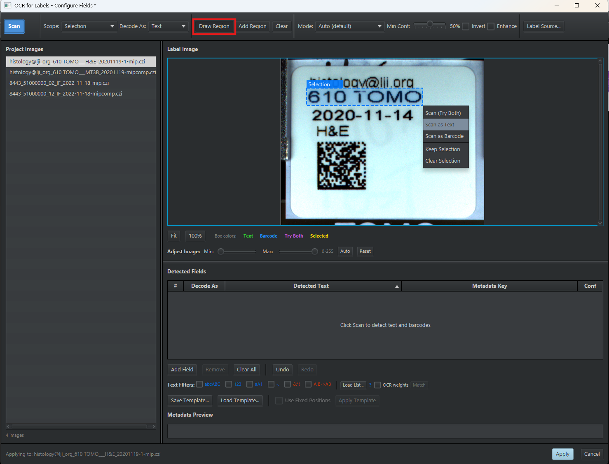
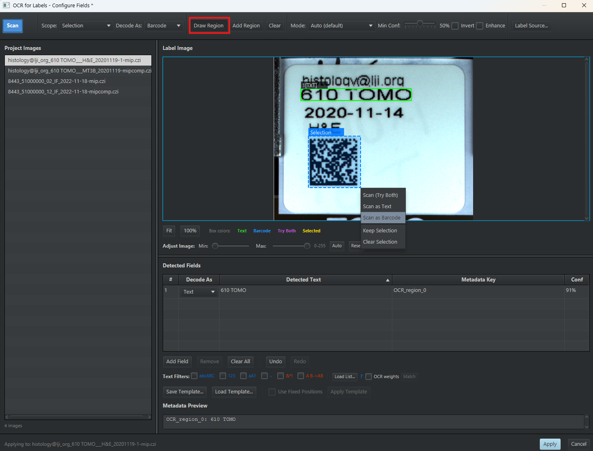
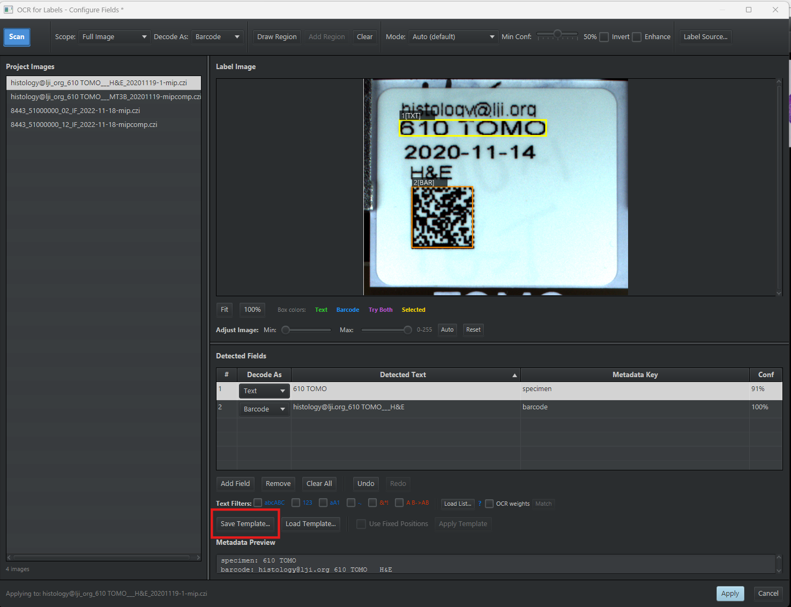

# OCR for Labels

> Read the slide label. Text via Tesseract OCR, barcodes via ZXing, saved straight into
> QuPath project metadata, for one image or for a whole project via a reusable template.

| | |
|---|---|
| **Repository** | [uw-loci/qupath-extension-ocr4labels](https://github.com/uw-loci/qupath-extension-ocr4labels) |
| **Extension version** | 0.4.3 |
| **License** | Apache-2.0 |
| **Requires** | QuPath 0.7.0+, Java 21+, Tesseract language data (see Setup) |
| **Where to find it** | `Extensions > OCR for Labels` |
| **Catalog** | LOCI QuPath Extensions |
| **Session** | Hands-on |

> **Walkthrough video:** %%VIDEO_OCR4LABELS%%
> The walkthrough below is self-contained. You can work through it during the workshop, or on your own afterwards.

---

## What it does

Whole-slide image files usually carry a **label image**: the photograph of the physical
slide label, with the case ID, stain, block number and often a barcode written on it. That
information is already in your file, and almost nobody uses it, because getting it out means
squinting at an image and typing.

This extension extracts the label image, runs OCR and/or barcode detection on it, and lets
you assign the detected content to QuPath metadata keys.

- **Label image access** pulls the label out of the WSI file and displays it.
- **Tesseract OCR** for text (via the Tess4J wrapper).
- **ZXing barcode scanning** for 1D and 2D barcodes, with no extra setup needed.
- **Hybrid templates**: mix text regions and barcode regions in one template.
- **Interactive review**: the detected content lands in an editable table before anything is
  written. Fix the OCR's mistakes, set the metadata key names, then apply.
- **Project navigation**: browse every project image without closing the dialog.
- **Batch processing**: apply a template across the whole project.
- **Text filtering**: one-click character filters to clean up OCR noise.
- **Literal transcription** *(on by default since 0.4.0)*: OCR reports the characters it saw
  instead of correcting them toward English words. Labels are overwhelmingly codes, dates and
  accession numbers, and dictionary correction damages those more than it repairs.
- **Vocabulary matching**: correct OCR errors by matching against a list of known valid
  values. If you know the only legal stains are `H&E`, `CD3`, `CD8`, then `CD９` resolves.
- **Rotated label support**: automatic orientation detection for sideways or upside-down
  labels.

Once the metadata is in the project, the
[Project Metadata Browser](09-project-metadata-browser.md) is how you review, correct, and
export it in bulk.

<details markdown="1">
<summary><b>Install</b> — from the LOCI catalog, then restart QuPath</summary>

Install from the **LOCI QuPath Extensions** catalog, then restart QuPath. Full steps, including the catalog URL, are in the [setup guide](setup.md).

It is also listed in the QPSC microscope catalog, but it needs no microscope, so the main catalog is all you need. It does need its language data: see [the next section](#language-data).

</details>

## Before the workshop: the language data
{: #language-data}

*(This is separate from installing the extension above. The extension is a jar; the
language data are files it reads at runtime, and it will not do OCR without them.)*

The OCR engine is built into the extension. What it does not include is the language data:

| File | Size | What it does |
|---|---|---|
| `eng.traineddata` | 4 MB | Reads English text. **Required.** |
| `osd.traineddata` | 11 MB | Works out which way up the label is, so rotated labels still read. The Settings dialog files this one under *Optional*, because upright labels read without it. Step 16 of the exercise is about rotated labels, so get it too. |

There are two ways to get them, and they fetch the same files from the same place:

- **From inside QuPath.** `Extensions > OCR for Labels > OCR Settings...`. The
  **Required Downloads** section has a link for each file (`osd.traineddata` sits under its
  *Optional File* subheading), and shows **[Not found]** beside each until it can see them
  (see below).

  

  Once both files are in a folder, set **Tessdata Path** to that folder (see below) and click
  **OK**. The [Not found] markers clear once the path is right.

  

- **Directly.** [eng.traineddata](https://github.com/tesseract-ocr/tessdata_fast/raw/main/eng.traineddata) and [osd.traineddata](https://github.com/tesseract-ocr/tessdata_fast/raw/main/osd.traineddata).

Either way, put both in one folder — anywhere you like, say `Documents/tessdata` — then set
**Tessdata Path** to that folder and click **OK**.

They come from [tessdata_fast](https://github.com/tesseract-ocr/tessdata_fast). There is also
[tessdata_best](https://github.com/tesseract-ocr/tessdata_best): slower, slightly more accurate,
a drop-in replacement if you ever want it. Other languages live in the same two repositories,
named by their three-letter code.

Barcode scanning works immediately with no setup — that reader is built in.

---

> **New to QuPath?** Words like *project*, *annotation*, *detection*, *class* and
> *measurement* are explained in the [glossary](glossary.md). For QuPath itself, the
> [official documentation](https://qupath.readthedocs.io/en/stable/) is the place to go.

## Hands-on exercise

You are going to read the printed label off a slide file, correct what the reader got
wrong, save that layout as a template, and then run it over a second slide without
retyping anything.

**Data:** [`DATA-03_labeled_slides`](https://drive.google.com/uc?export=download&id=1HIAm8hbVkVQHNqJziyfBf3r1hYDjUaRS): four CZI whole-slide images from LJI, each carrying an
embedded slide label. **244 MB, so download it before you travel.**

> **Why it is not a folder of small PNGs.** The label lives *inside* the slide file, as an
> attachment alongside the pixel data. The extension pulls it out of the WSI. Hand it a
> screenshot of a label and there is nothing for it to read, because the thing it reads is the
> slide. The information is already in the file you were given.

**These four slides are two different label designs, two slides each.** That matters more than
it sounds: a template records *where* each field sits, so one built on a brightfield label reads
nothing useful on an IF one. You will work through the brightfield pair, and the IF pair is left
for you to repeat on.

| File | Size | Label design |
|---|---|---|
| `histology@lji_org_610 TOMO___H&E_20201119-1-mip.czi` | 83 MB | **Brightfield** — the one Part B reads |
| `histology@lji_org_610 TOMO___MT3B_20201119-mipcomp.czi` | 11 MB | **Brightfield** — batched in step 14 |
| `8443_51000000_02_IF_2022-11-18-mip.czi` | 138 MB | **IF** — the on-your-own pair |
| `8443_51000000_12_IF_2022-11-18-mipcomp.czi` | 91 MB | **IF** — the on-your-own pair |

### Part A: start here — get the data and make a project

The extension works on a QuPath **project**, not on a loose file — its dialog lists project
images down the left side, and batch mode runs over the project. So before anything else:

1. Download `DATA-03_labeled_slides` (link above) and unzip it somewhere you can find it.
2. In QuPath, `File > Project > Create project...` and choose an **empty folder** for it.
3. Drag the `.czi` files onto the QuPath window, or use **Add images**, and confirm.
4. Double-click `histology@lji_org_610 TOMO___H&E_20201119-1-mip.czi` in the project list to
   open it.

### Part B: read one label

Now look at the label on the slide you just opened. It
carries printed text, a date **and** a 2D barcode, so it exercises OCR, barcode scanning and a
mixed template in a single image. It is also the label behind the `@` investigation in
[what to notice](#what-to-notice) below. The printed text reads:

```
histology@lji.org     <- the lab's contact address
610 TOMO              <- the specimen identifier: this is the "case ID"
2020-11-14            <- the date
H&E                   <- the stain
```

Below that text is a square 2D barcode. That is the one step 11 asks you to draw a field over.
Here is the label with the two regions the exercise uses marked:


5. With that slide open from Part A, run
   `Extensions > OCR for Labels > Run OCR on Label`.
6. The dialog lists all project images on the left. Select the same H&E slide you opened —
   `histology@lji_org_610 TOMO___H&E_20201119-1-mip.czi`.
7. Set **Mode** to *Auto (default)*. In 0.4.3 that is where the dropdown opens; on an older
   build it may open on *Sparse Text*, which does not read these labels properly, so check it
   rather than assume it. Then set **Scope** to *Full Image*, **Decode As** to *Try Both*
   (barcode first, then OCR), and leave **Min Conf** at its default. *Try Both* matters here,
   because these labels carry text and a barcode, and you want whichever is more reliable per
   region. **Leave Enhance unticked.** It has been off by default since 0.4.2 and should stay
   that way unless you have measured it helping on your own labels; step 17 is where you
   measure it.
8. **Scan.** Review the table: correct the **Text** column where OCR guessed wrong, and set
   sensible **Metadata Key** names.

   Everything you need is on the one strip along the top, boxed in red here. Project images are
   down the left, the label and its detected boxes in the middle, and the results table below:

   

9. **Apply.** Confirm the metadata landed on the image (right-click the image in the project
   pane → *Edit metadata*, or use the Metadata Browser).

### Part C: a template, then the whole project

**Same slide, empty table.** Stay on `histology@lji_org_610 TOMO___H&E_20201119-1-mip.czi` —
you are not starting the project or the scan over.

But clear the table before you begin: click **Clear All** underneath it. Part B's *Full Image*
scan left a row for every piece of text it found, and a template is saved from **everything in
the table**, not just the regions you draw. Skip this and those rows go into your template too,
which is not what you want and is not obvious afterwards. The metadata you applied in step 9 is
already on the image and is not affected.

You are building a template from this one label, then applying it to the slides that share its
design — so steps 10 to 13 are still one image, and step 14 is where the second slide comes in.

10. Click **Draw Region** in the toolbar, then drag a box over just the line that identifies
    the specimen — **`610 TOMO`**, not the email address above it, not the date, not the stain.
    That line is what a pathology lab would call the *case ID*: the identifier tying this slide
    to a particular specimen. Right-click inside the box you drew and choose **Scan as Text**.

    

11. Same again for the barcode: **Draw Region**, drag a box over the square 2D barcode, then
    right-click and choose **Scan as Barcode**. It decodes immediately, and the row appears
    underneath the one you just made.

    

12. Before saving anything, set **Scope** to *Drawn Regions* and scan again — the **Scan**
    button renames itself to **Rescan Regions**. Every row is re-read in place, each using its
    own **Decode As** value, so you find out what your template will actually produce while it
    is still cheap to fix.
13. Give each row a **Metadata Key** you will recognize later: double-click the cell and replace
    `OCR_field_0` with something like `specimen`, and the barcode row with `barcode`. The
    **Metadata Preview** at the bottom shows exactly what will be written. Then click
    **Save Template...**, which stores the field positions, their types, and these key names.

    
14. Run **batch processing** with that template — but **only over slides whose labels share
    the same layout**. A template is positional: it stores where each field sits on the label.
    Point it at a differently laid-out label and it reads whatever happens to be at those
    coordinates, which is usually nothing, and it will not warn you.

    The slides here fall into two sets, and they happen to split by modality — the brightfield
    slides came off one labeling system, the IF ones off another (see below):

    | Set | Slides | Label design |
    |---|---|---|
    | **Brightfield** | `histology@lji_org_610 TOMO…H&E…`, `…MT3B…` | Case ID on line 2, barcode lower-left |
    | **IF** | the two `8443_51000000…` files | Two columns, QR top-right, date lower-right |

    You built your template on the brightfield H&E slide, so **run the batch over the two
    brightfield slides only** — the one you just did, plus its `MT3B` partner. Leave the two IF
    slides out.

    

    This is the real constraint on batch OCR, and it is why the tool saves templates rather than
    one global setting: **one template per label design**, applied to the slides that use it.

    > **On your own: the IF pair.** The two `8443_51000000` slides are the other label design.
    > Nothing you have built so far applies to them — the template you saved knows where fields
    > sit on the *brightfield* label. Start again from step 10 on one of them, save a second
    > template, and batch it over the two. That is the whole workflow in miniature, and it is
    > what you would do on arriving at a new set of slides from a different lab.
15. Try a **vocabulary list** for a field with a small known set of valid values, and re-run.
16. Look through the batch results for a label that was not upright, and confirm orientation
    detection read it anyway. If every label in your run came out upright, this is the step
    `osd.traineddata` exists for — rotate one yourself and re-run to see it work.

### Part D: the two-minute experiment worth doing
17. Go back to the `histology@lji.org` label. Tick
    **Enhance**, set **Scope** to *Drawn Regions*, and **Rescan Regions**. Compare against the
    unenhanced read.

### What to notice

- **A template is positional, so it belongs to one label design.** Batch it over slides laid
  out differently and it reads whatever sits at those coordinates, usually nothing, without
  complaining. Grouping slides by label design is the real unit of work in a batch OCR run,
  and it is why the tool saves templates rather than one global setting.

- Region templates beat full-image OCR by a wide margin when labels are laid out consistently
  which, within one institution, they nearly always are.
- Vocabulary matching converts OCR from "usually right" to "right or obviously wrong," which
  is the difference between usable and not for automated metadata.
- **"Enhance image contrast" made OCR worse, and it took measurement to find out.** Its adaptive
  threshold forces every pixel to pure black or white before Tesseract sees it, discarding the
  smooth edges the classifier depends on. Dense glyphs suffer first. On this very slide, `histology@lji.org` came
  back as `histoloawalli.org`, because `@` is the densest glyph in ASCII and hard thresholding
  closes the gap between the `a` and its ring. Across a blur series the untouched image read
  correctly at every level while the enhanced one degraded steadily. Tesseract already
  thresholds internally, and does it better. It is now off by default.
- **The generalisable lesson:** the option was called *Enhance*, it was recommended for faded
  labels, and it was wrong. A pre-processing step that sounds helpful is a hypothesis, not a
  fix, and OCR is one of the few places where you can actually test it, because you know what
  the answer should be.
- **If a read is still wrong, suspect the image before the settings.** A label image cropped
  through the descenders turns `g` into `a`, `y` into `v`, and `j` into `i`, which is why a real
  label kept coming back ending in `.ora`. No amount of processing recovers pixels that were
  never captured.
- The review step is not optional. OCR on a photographed label is *good*, not *correct*.

---

**Full documentation:** the
[repository README](https://github.com/uw-loci/qupath-extension-ocr4labels#readme).
