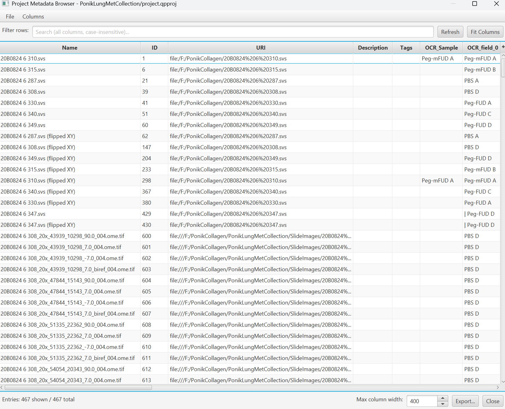

# Project Metadata Browser

> Every image in your project as a row, every metadata key as a sortable, filterable column.
> with buffered editing, full undo, Excel-style copy/paste, template import/export, and regex
> extraction from filenames.

| | |
|---|---|
| **Repository** | [uw-loci/qupath-extension-project-metadata-browser](https://github.com/uw-loci/qupath-extension-project-metadata-browser) |
| **Extension version** | 1.0.0 |
| **License** | GPL-3.0 |
| **Requires** | QuPath 0.7.0+ |
| **Where to find it** | `Extensions > Project Metadata Browser > Browse Metadata...` |
| **Catalog** | LOCI QuPath Extensions |
| **Session** | Hands-on |

> **Walkthrough video:** %%VIDEO_PROJECT_METADATA_BROWSER%%
> The walkthrough below is self-contained. You can work through it during the workshop, or on your own afterwards.

> **New to QuPath?** Words like *project*, *annotation*, *detection*, *class* and
> *measurement* are explained in the [glossary](glossary.md). For QuPath itself, the
> [official documentation](https://qupath.readthedocs.io/en/stable/) is the place to go.

---

## What it does

One window for all the metadata in a project: one row per image, one column per metadata key.
You can **view** it (filter, sort, hide columns), **edit** it (type into cells, with undo, and
nothing written to disk until you save), and run **bulk workflows** that add, fill or remove
metadata on many images at once, from a spreadsheet, a filename pattern or a fill-in template.

<b>Install</b> — from the LOCI catalog, then restart QuPath

Install from the **LOCI QuPath Extensions** catalog, then restart QuPath. Full steps, including the catalog URL, are in the [setup guide](setup.md).

---

## Hands-on exercise

> ⚠️ **Do the [OCR for Labels exercise](08-ocr4labels.md) first.** This tool displays and edits
> metadata that is already on your images; it does not create any. A project built straight
> from the `.czi` files has nothing in it but image names, so every column here would be empty
> and there would be nothing to sort, filter or export.
>
> Parts A and B of that exercise are enough: they leave you with a project carrying real
> OCR fields.

**Data:** the project you built in the [OCR exercise](08-ocr4labels.md), from
[`OCR_Test_Images_LJI.zip`](https://drive.google.com/uc?export=download&id=1HIAm8hbVkVQHNqJziyfBf3r1hYDjUaRS)
(**244 MB**). Nothing extra to download.

After the OCR exercise your project holds the four slides, and the ones you ran OCR on carry
the keys you typed into that dialog (`specimen` and `barcode` if you followed its Part C).
Those are the **OCR columns** referred to below.

### Part A: look around

1. Open `Extensions > Project Metadata Browser > Browse Metadata...`. The **Entries** tab shows
   one row per image: Name, ID, URI, Description, Tags, then one column per metadata key.
2. Click **Fit Columns**. Then open the **Columns** menu, click **Select None**, and tick
   **Name** and your OCR columns. The table shrinks to just those.
3. Type `TOMO` in the **Filter rows** box. Only the two brightfield slides remain: the filter
   searches every visible column, so `TOMO` matches both their filenames and the case ID that
   OCR read off their labels. Clear the box and all four rows come back.
4. Click the header of one of your OCR columns to sort by it. With four images there is little
   to see. On a project of hundreds this is the quickest check there is, because a misread value
   sorts to the top or bottom, away from the real ones.

### Part B: edit, undo, redo

1. Double-click a cell in one of your OCR columns, type a different value and press Enter. The
   window title gains a `*` and a **1 unsaved change** marker appears.
2. Press **Ctrl+Z**. The old value comes back. Press **Ctrl+Shift+Z** and your edit returns.
   Leave it there, and **do not save yet**.

### Part C: two new columns pulled out of the filenames

Every filename in this project carries a stain and a scan date, written two different ways:

| Filename | Stain | Date |
|---|---|---|
| `histology@lji_org_610 TOMO___H&E_20201119-1-mip.czi` | H&E | 20201119 |
| `histology@lji_org_610 TOMO___MT3B_20201119-mipcomp.czi` | MT3B | 20201119 |
| `8443_51000000_02_IF_2022-11-18-mip.czi` | IF | 2022-11-18 |
| `8443_51000000_12_IF_2022-11-18-mipcomp.czi` | IF | 2022-11-18 |

The extension can copy those into their own columns using a regular expression (a "regex"): a
pattern that describes the shape of the text you want. You do not need to write one. Paste
the pattern below, which was written for these four filenames.

1. Open `Edit > Extract columns from filenames (regex)...`.
2. Set these, top to bottom:

   | | Field | Set to |
   |---|---|---|
   | 1 | **Source column** | `Name` (already selected) |
   | 2 | **Regex pattern** | `_(?<stain>[^_]+)_(?<date>\d{4}-?\d{2}-?\d{2})-` |
   | 3 | **If a group's column name already exists on entries** | *Skip -- keep current values, leave non-collisions alone* |
   | 4 | **Skip non-matching entries** | leave ticked |

   What the pattern says: `(?<stain>[^_]+)` is "the text between two underscores, into a
   column called `stain`", and `(?<date>\d{4}-?\d{2}-?\d{2})` is "four digits, two digits, two
   digits, with or without dashes between them, into a column called `date`". The `_` and `-`
   around them pin it to the one place in each filename where a stain sits just before a date.

3. Check the preview before you apply. Under the pattern box it says **Valid regex. 2 named
   groups detected.** The preview table lists each filename with its `stain` and `date` filled
   in as in the table above, and the line under it reads **Matched 4 of 4; 0 unmatched.** If a
   row shows *(no match)*, the pattern was not pasted exactly.
4. Click **Apply**. Two new columns, `stain` and `date`, appear in the Entries table, filled in
   for all four images. This is one undoable action: **Ctrl+Z** removes both columns at once.

> **For your own filenames.** Change the names inside `(?<...>)` and the text around them to
> match how your files are named. [regex101.com](https://regex101.com/) with the *Java*
> flavor selected lets you paste a filename and see what a pattern captures before you bring
> it here, and the dialog's preview shows the same thing on your real project.

### Part D: rename a key across the project

1. Open the **Metadata Keys** tab. It lists every key with the number of images it is set on
   (**Used by**) and a sample value. `date` shows *4*.
2. Select `date` and click **Rename...**. The dialog header reads **Rename "date" (used by
   4 entries)**. Type `scan_date` in **New key** and click **Rename**.
3. Back on the **Entries** tab, the column header now reads `scan_date`. Press **Ctrl+Z**: it
   reads `date` again on every image. Press **Ctrl+Shift+Z** to put the rename back.

### Part E: save, then export

1. `File > Save` (**Ctrl+S**). The `*` and the unsaved-changes marker disappear. To confirm the
   changes are on disk, click **Refresh**: it reloads the project from disk, and `stain` and
   `scan_date` are still there with their values.
2. Click **Export...** at the bottom of the window (or `File > Export > Export visible
   columns...`), keep the *Comma-separated values* type and save. Open the file in a
   spreadsheet: one row per image, one column per column you left visible.

### Why this matters for finding images again

QuPath's own project pane has a **Sort by...** menu that takes a metadata key: pick one and the
image list groups under it, with a heading row per value. The pane's filter box searches name and
type only, so metadata is what gives you an axis worth sorting on. A project of four hundred files
named by scanner ID becomes a list grouped by stain, by case, or by block.

That is the payoff for filling metadata in at all, and it is why label recognition, this browser
and the project pane form a chain: recover the fields, check them here, then navigate the project
by what is written on the slide.

### What to notice

- The buffered editor changes how you work: you can be aggressive, because nothing is real
  until Save.
- A project-wide key rename as a single undoable operation is not something you would attempt
  with a script.
- Sorting by an OCR column is the fastest QC pass available, because bad reads are almost always
  outliers.

---

**Full documentation:** the
[repository README](https://github.com/uw-loci/qupath-extension-project-metadata-browser#readme)
and the [user guide](https://github.com/uw-loci/qupath-extension-project-metadata-browser/blob/main/docs/user-guide.md).
