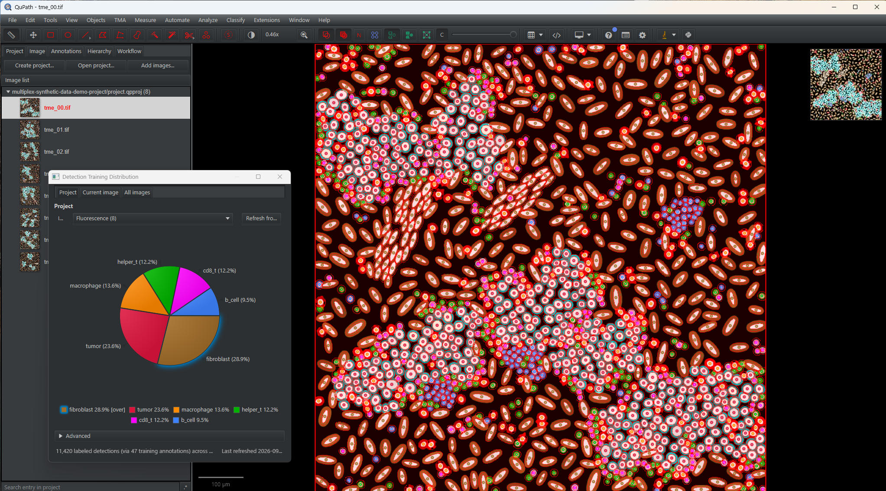
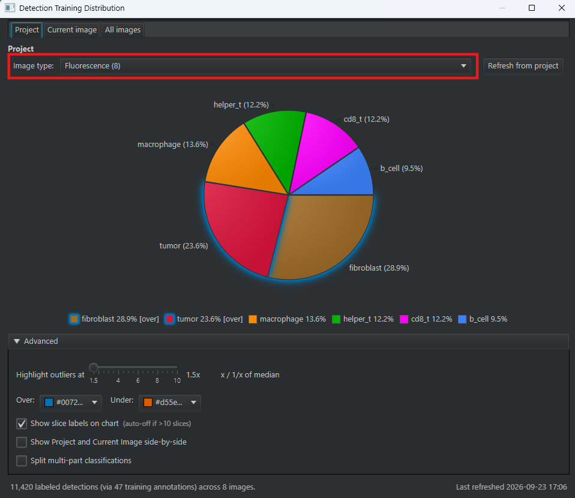
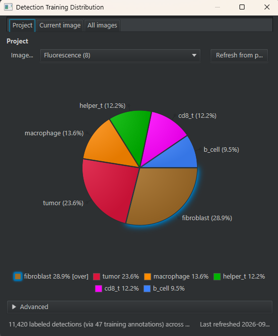
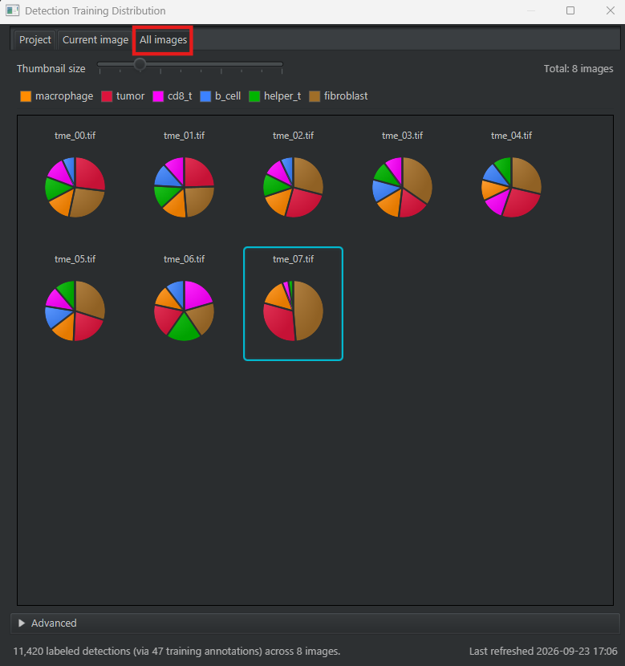
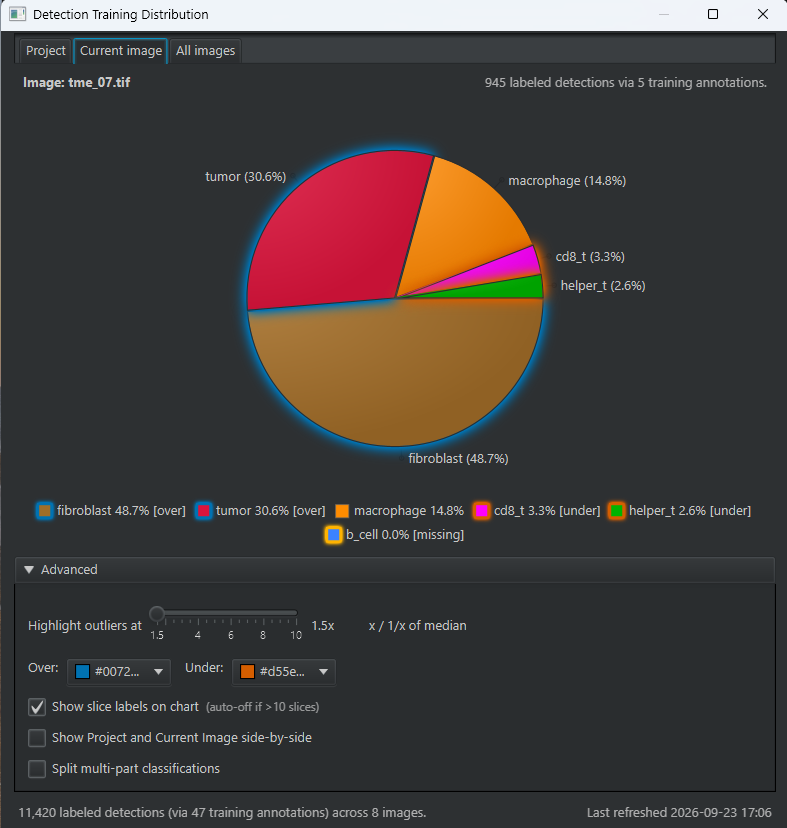

# Class Distribution

> Live pie charts of how your classes are distributed across a whole project — by annotation
> area, or by how many detections each class labels. Spot class imbalance *before* it quietly
> wrecks a classifier, not after.

| | |
|---|---|
| **Repository** | [uw-loci/qupath-extension-class-distribution](https://github.com/uw-loci/qupath-extension-class-distribution) |
| **Extension version** | 0.1.8 |
| **License** | Apache-2.0 |
| **Requires** | QuPath 0.7.0+ and a project (single-image use works but is degraded) |
| **Where to find it** | `Extensions > Class Distribution` |
| **Catalog** | LOCI QuPath Extensions |
| **Session** | Hands-on |

> **Walkthrough video:** %%VIDEO_CLASS_DISTRIBUTION%%

---

## The idea in one sentence

It charts how your classes are distributed — across the project, the current image, or every
image side by side — so class imbalance, the most common and least visible reason a classifier
underperforms, is something you can see at a glance.

---

## Walkthrough: read the class balance across a project

This one follows **after classification or labeling**: once your cells carry classes, it is how
you check whether those classes are balanced enough to train on.

### 1. The data

**Download:** `multiplex-synthetic-data-demo-project-v1.2.zip` —
**[direct download](https://github.com/uw-loci/multiplex-synthetic-data/releases/download/v1.2/multiplex-synthetic-data-demo-project-v1.2.zip)**
(20 MB). A ready-made project of eight images. Each cell carries a **classified ground-truth
point** — a labeled point annotation — and the eight images were built with deliberately
different compositions: **`tme_06` is immune-rich**, **`tme_07` is immune-poor with no B cells
at all**. That built-in imbalance is exactly what this tool is for.

### 2. Load it into QuPath

1. **Drag `project.qpproj` onto an open QuPath window** — or the unzipped folder itself, either works. (Menu route: `File > Project... > Open project`.)
2. QuPath pops up an **Update URIs** dialog with the images listed in red. This is expected.
   The project ships with *relative* image paths so the zip is portable,
   and QuPath cannot resolve those until you show it the folder once. Click **Search...** (bottom-right),
   choose the folder you unzipped, then **Apply changes**.
3. Double-click any image (e.g. `tme_00.tif`) so the viewer has something open.

### 3. Open the distribution that uses your labels

The ground-truth points are classified **point** annotations, and they are what labels the
cells. Open **`Extensions > Class Distribution > Show Detection Training Distribution...`** — it
counts, for each class, how many detections those points label.

It works on the **project**, not just the image in the viewer: the Project and All images tabs
aggregate across all eight. Open a loose file instead of a project and there is nothing for it
to read.

### 4. The project as a whole

On the **Project** tab, each slice is a class in its own QuPath color, sized by how many cells
carry it across all eight images. The percentage is printed on each slice and again in the
legend beneath — `fibroblast 28.9%`, `tumor 23.6%`, and so on — so there is nothing to hover.

The **Image type** dropdown above the chart narrows the total to images of one type, which
matters when a project mixes stains or magnifications. It lives on this tab only.

**Advanced**, at the bottom, is where the outlier rule lives — see step 5.

> **If the labels pile up on top of each other**, drag the **Highlight outliers at** slider in
> **Advanced** a notch and back. The chart redraws and they separate.

### 5. Every image at once — where the imbalance shows

Switch to the **All images** tab: one mini-chart per image, shared legend. `tme_06`'s chart is
visibly heavier on the immune classes, and **`tme_07` has no B-cell slice at all**.

**The `[over]` / `[under]` markers are deliberately left off this tab.** A mini-chart is
stripped down to the pie alone — no labels, no per-chart legend, no highlight aura — so that
eight of them stay readable at thumbnail size under one shared legend. Nothing is missing and
nothing has gone wrong; this tab is for comparing *shapes* across images. For the markers, go
back to **Project** or **Current image**, where they sit beside the class name in the legend,
as `fibroblast 28.9% [over]`.

### 6. One image, and what is missing from it

The **Current image** tab charts just the open image, and — more usefully — surfaces project
classes that are **absent** from it. Open `tme_07` and `b_cell` appears in the legend as
**`0.0% [missing]`** rather than simply not being drawn. A class you cannot see is easy to
forget; a class labeled *missing* is not.

That is the check worth running before you train on a single slide.

(The **Image type** filter is not on this tab; it is on **Project**, from step 4.)

### 7. The other dialog, and when to use it

Everything so far used **Show Detection Training Distribution...**, which counts *detections*
labeled by your annotations — the number that predicts classifier behavior.

Now open **`Extensions > Class Distribution > Show Class Distribution...`**. Same tabs, same
layout, different measurement: it sums **annotation area**, so a class is big here because you
drew a lot of it, not because it covers a lot of cells. On this project it is nearly empty,
because the ground truth is **points** and points have no area.

Use the area dialog while you are drawing regions, and the detection dialog once those regions
are labeling cells. They disagree on purpose, and the disagreement is the point: ten large
stroma regions and forty small tumor ones can be 20:1 by area and the other way round by cell
count.

### What to notice

- **The number that predicts classifier behavior is the detection count per class, not the
  count of annotations you drew.** Ten big stroma regions and forty small tumor ones can be 20:1
  by the count that matters.
- **`[over]` / `[under]` are relative to your project's own median.** A class is flagged
  `[over]` when its share reaches the multiplier shown on the **Highlight outliers at** slider
  (2.0× by default) and `[under]` at the reciprocal, 0.5×. Lowering it flags more: the
  screenshots above sit at **1.5×**, which is why `tumor` is marked `[over]` there and not on
  the default. The median is taken over the classes
  actually present, and the slider is yours to move — so these describe *your* balance, not a
  universal target.
- The `tme_07` gap (no B cells) is the kind of thing that silently produces a classifier that
  cannot call a class it never really saw — and here it is, obvious, before you train anything.

---

## What it does, in full

**Two dialogs.** *Show Class Distribution...* charts **annotation** classes — closed annotations
by pixel area, polylines by length × width (points contribute nothing). *Show Detection Training
Distribution...* charts how many **detections** each class would label given your training
annotations (area regions, or classified counting **points** like this dataset's ground truth).

**Three tabs each** — Project (aggregate), Current image (live), and All images (a grid of one
mini-chart per image with a shared legend and a thumbnail-size slider). Two controls are tab-specific
by design: the **Image Type** filter sits on the **Project** tab only, and the `[over]`/`[under]`
markers appear on **Project** and **Current image**, never on the mini-charts.

**Live as you annotate.** With the annotation dialog open on the Current image tab, draw or edit
area annotations and the chart updates immediately — the feedback arrives while you can still act
on it. That is the intended workflow for building balanced training data; try it by drawing a
couple of classified rectangles on an image and watching the chart move.

**It stores nothing in your project** — preferences live in QuPath's own settings.

> **New to QuPath?** *project*, *annotation*, *detection*, *class* are in the
> [glossary](glossary.md).

**Full documentation:** the
[repository README](https://github.com/uw-loci/qupath-extension-class-distribution#readme).
