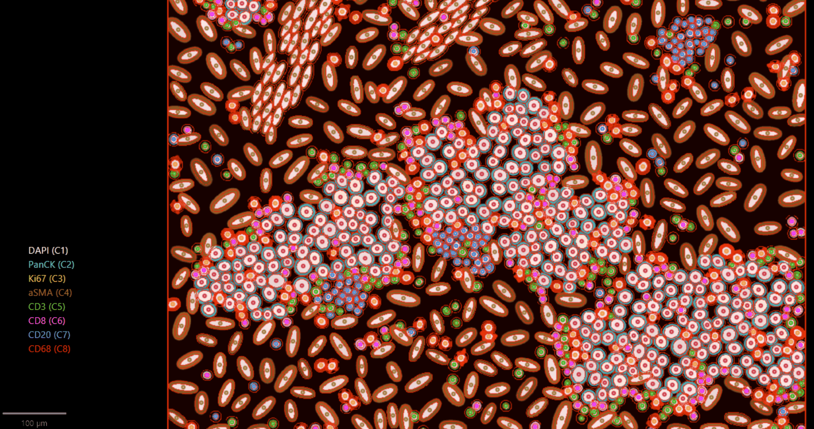

# Channel Names Viewer

> A small always-visible legend listing the currently-selected fluorescence channels,
> color-coded, updating live as you toggle channels. Resizes freely, and the text scales
> with the window, so you can shrink it out of the way on a laptop or blow it up for a projector.

| | |
|---|---|
| **Repository** | [uw-loci/qupath-extension-channel-names-viewer](https://github.com/uw-loci/qupath-extension-channel-names-viewer) |
| **Extension version** | 1.0.9 |
| **License** | Apache-2.0 |
| **Requires** | QuPath 0.7.0+ |
| **Where to find it** | Toolbar button beside brightness/contrast · `Extensions > Channel Names Viewer > Channel Names Viewer...` · **Ctrl+Shift+C** (**Cmd+Shift+C** on macOS) |
| **Catalog** | LOCI QuPath Extensions |
| **Session** | Mentioned; presented in Sara McArdle’s Monday session |

> **Walkthrough video:** %%VIDEO_CHANNEL_NAMES_VIEWER%%
> The walkthrough below is self-contained. You can work through it in the hands-on hour, or on your own afterwards.

---

> **Sara McArdle demonstrated this in her session on **Monday 28 September**, in *Tips and tricks for maintaining sanity during hi-plex classification in QuPath*.
> Both this extension and its sibling grew out of her Groovy scripts, so we point back to her
> demo rather than repeating it. The walkthrough below is here for the hands-on hour.

## What it does

Anyone who has presented a multiplex image has been asked "which one is the green one?" and
had to go open brightness/contrast to find out. This is the fix.

The window mirrors what brightness/contrast calls *selected*: toggle a channel there and the
legend updates immediately. Each channel name is drawn in its display color, and keeps that
color — a dark channel stays dark, which is your choice to make.

If that is hard to read, right-click the legend: **Outline dark channels in white** adds a white
halo around the glyphs, and **Backdrop panel on dark channels** puts a light chip behind them.
Both apply only to channels below a perceived-brightness (BT.601) threshold, and both are off by
default.

- **Move:** drag the body. **Resize:** drag any edge or corner. **Close:** double-click the
  body, press the shortcut again, or Esc.
- **Resize-with-text.** There is no font-size control by default. Drag the window and the text scales
  with it. If you want a fixed size (e.g. matched screenshots across different channel
  counts), use **Lock font size** in the right-click menu.
- **Right-click for settings** on the window body or the toolbar button: background opacity,
  lock font size, reset opacity.
- **Image switching** rebinds automatically; RGB/brightfield images show an empty-state
  placeholder rather than crashing.
- Position, size, opacity, and lock state persist across sessions.

## Provenance

This packages [Sara McArdle's `FluorescentChannelNames.groovy`](https://github.com/saramcardle/Image-Analysis-Scripts/blob/master/QuPath%20Groovy%20Scripts/FluorescentChannelNames.groovy)
(originally written by Pete Bankhead at the 2022 QuPath Hackathon) as a real extension, with a
toolbar button, menu item and keyboard accelerator, plus handling for image switching, RGB
images, and listener cleanup.

**It does not replace the script.** Both can be installed at once, because they create independent
JavaFX windows and do not conflict. Keep using the script if you have customised it or wired
it into automation. The extension adds discoverability, resize-with-text scaling, clean
rebinding, an RGB empty state, persisted state, and a right-click settings menu. The
`Ctrl/Cmd+Shift+C` accelerator is exclusive to the extension; the script registers no global
shortcut.

<b>Install</b> — from the LOCI catalog, then restart QuPath

Install from the **LOCI QuPath Extensions** catalog, then restart QuPath. Full steps, including the catalog URL, are in the [setup guide](setup.md).

If the toolbar button, menu entry or shortcut are not there yet, restart QuPath.

---

## Try it yourself

### 1. Get the data

Either download works here, and **if you already have one for another guide, use that one.**
Both carry the same eight synthetic 8-channel images, and all eight carry real channel names
(DAPI, PanCK, Ki67, aSMA, CD3, CD8, CD20, CD68), so the legend has something meaningful to show.

| | | |
|---|---|---|
| **Synth multiplex project** | [`multiplex-synthetic-data-demo-project-v1.2.zip`](https://github.com/uw-loci/multiplex-synthetic-data/releases/download/v1.2/multiplex-synthetic-data-demo-project-v1.2.zip) | 20 MB — a ready-made QuPath project. Open it and you are done. This is what the screenshot above shows. |
| **Synthetic images** | [`multiplex-synthetic-data-v1.2.zip`](https://github.com/uw-loci/multiplex-synthetic-data/releases/download/v1.2/multiplex-synthetic-data-v1.2.zip) | 14 MB — the raw dataset: eight `.tif` files plus ground truth. You build the project yourself. |

### 2. Open it in QuPath

**If you took the project:** unzip it, then **drag `project.qpproj` onto an open QuPath
window** — or the unzipped folder itself, either works. (Menu route:
`File > Project... > Open project`.) QuPath pops up an **Update URIs** dialog with the images
listed in red. This is expected: the project ships with *relative* image paths so the zip is
portable, and QuPath cannot resolve those until you show it the folder once. Click
**Search...** (bottom-right), choose the folder you unzipped, then **Apply changes**.
Double-click `tme_00.tif` to open it.

**If you took the images:** unzip them, then `File > Project > Create project...`, choose an
empty folder, and drag in **`tme_00.tif`** (any of the eight will do). Set the image type to
**Fluorescence** if prompted, and double-click it to open it.

### 3. Open the legend

**Ctrl+Shift+C** (**Cmd+Shift+C** on macOS), or the channel-bars toolbar button beside
brightness/contrast. Menu route: `Extensions > Channel Names Viewer > Channel Names Viewer...`.

### 4. Work through it

1. Toggle channels on and off in brightness/contrast. Watch the legend track live.
2. Drag a corner to resize, and note that the text scales with the window.
3. Right-click the body: reduce **background opacity** so the legend floats over the image.
4. Turn on **Lock font size** and resize again. Decide which behavior you prefer.
5. Open an RGB/brightfield image and confirm the empty-state placeholder rather than an error.
6. Switch back and confirm the legend rebinds to the new image's channels.

### What to notice

- This is a five-minute extension that solves a problem you have every time you present. Not
  every useful tool needs to be large.
- Lock font size exists specifically so a series of screenshots can be visually consistent
  across images with different channel counts.

---

**Full documentation:** the
[repository README](https://github.com/uw-loci/qupath-extension-channel-names-viewer#readme)
and its [user guide](https://github.com/uw-loci/qupath-extension-channel-names-viewer/blob/main/docs/user-guide.md).
