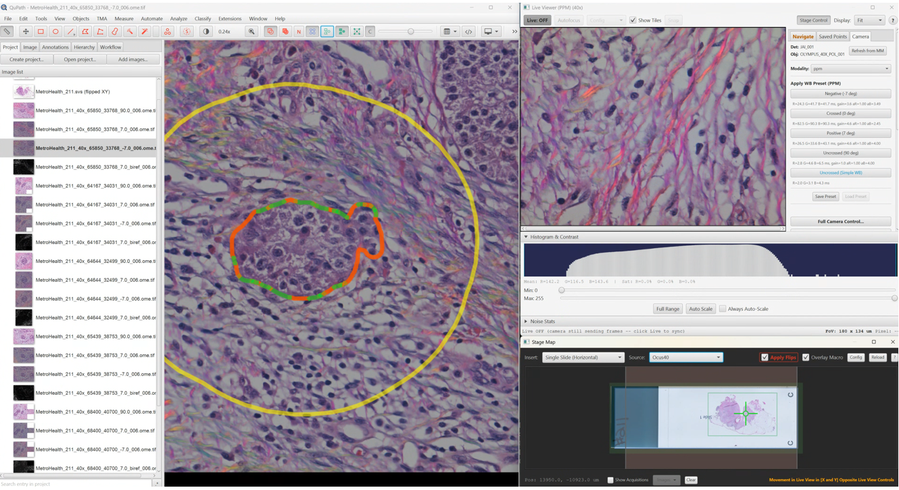
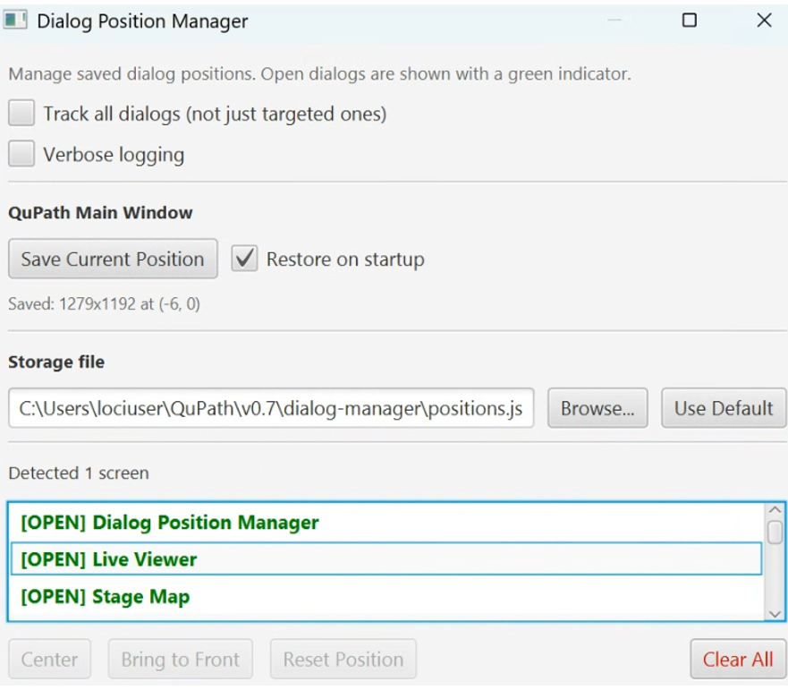

# Dialog Position Manager

> Remembers and restores dialog window positions across QuPath sessions, and recovers windows
> that have become unreachable: the classic "I unplugged the second monitor and now the
> dialog is gone" problem.

| | |
|---|---|
| **Repository** | [uw-loci/qupath-extension-dialog-manager](https://github.com/uw-loci/qupath-extension-dialog-manager) |
| **Version at workshop** | 0.4.1 |
| **License** | Apache-2.0 |
| **Requires** | QuPath 0.7.0+ |
| **Where to find it** | `Window > Dialog Position Manager...` and `Window > Recover Off-Screen Dialogs` |
| **Catalog** | LOCI QuPath Extensions |
| **Session** | Hands-on |

> Note the menu: this one lives under **Window**, not **Extensions**.

> **Walkthrough video:** %%VIDEO_DIALOG_POSITION_MANAGER%%
> The walkthrough below is self-contained. You can work through it during the workshop, or on your own afterwards.

---

## What it does

- **Automatic position persistence.** Dialog positions and sizes are saved when closed and
  restored when reopened.
- **Off-screen recovery.** Detects dialogs positioned on a disconnected monitor and brings
  them back.
- **HiDPI awareness.** Handles display scaling changes and mixed-DPI multi-monitor setups,
  the case where a window is technically on-screen but drawn at the wrong scale or position.
- **Tracks all dialogs by default.** Works out of the box with any QuPath dialog, including
  ones from other extensions.
- **Shared storage (0.4.0+).** Point several workstations at one JSON file on a network drive
  and share dialog layouts across a core facility, so each workstation opens with the same arrangement.

## Why it exists

The case it was written for looks like this: QuPath on one side, and the
[QPSC](presented/qpsc.md) microscope-control dialogs — **Live Viewer** and **Stage Map** —
arranged around it. That layout takes a minute to rebuild by hand, and you rebuild it every
session unless something remembers it.

This is the least glamorous extension in the suite. Undock a laptop, present on a projector, come back, and QuPath dutifully reopens a
dialog at coordinates that no longer exist on any attached display. Without a recovery path,
the fix is editing preferences by hand or reinstalling.

It is also an example from [how this suite was built](how-this-was-built.md): this
class of bug is invisible to automated testing and to an AI agent. It only shows up when a
human unplugs a monitor.

## Recovering a lost dialog

**All at once:** `Window > Recover Off-Screen Dialogs`. Every off-screen dialog is instantly
centered on your primary monitor.

**One specific dialog:** `Window > Dialog Position Manager...`, find it in the list
(off-screen entries are marked `[OFF-SCREEN]` in orange), select, click **Center**.

**Reset a dialog that keeps opening somewhere annoying:** same dialog, select it, click
**Reset Position**. Next time it opens QuPath uses its default positioning.

**Start completely fresh:** **Clear All** in the management UI.

## The manager window

Worth knowing about, top to bottom:

- **Track all dialogs (not just targeted ones)** — whether every dialog is remembered, or
  only ones the extension targets specifically.
- **QuPath Main Window** is handled separately from the dialogs. **Save Current Position**
  records where the main window is and how big it is, and **Restore on startup** puts it back
  there next launch. The size and position it captured are printed underneath.
- **Storage file** is where all of this is written: `positions.json`, under your QuPath user
  directory in `dialog-manager/`. **Browse...** points it somewhere else — which is how the
  shared-layout trick below works — and **Use Default** puts it back.
- The list shows every dialog it knows about. Open ones are marked **[OPEN]** in green, and
  off-screen ones **[OFF-SCREEN]** in orange. **Center**, **Bring to Front** and
  **Reset Position** act on the one you select; **Clear All** forgets everything.

<b>Install</b> — from the LOCI catalog, then restart QuPath

Install from the **LOCI QuPath Extensions** catalog, then restart QuPath. Full steps, including the catalog URL, are in the [setup guide](setup.md).

---

> **New to QuPath?** Words like *project*, *annotation*, *detection*, *class* and
> *measurement* are explained in the [glossary](glossary.md). For QuPath itself, the
> [official documentation](https://qupath.readthedocs.io/en/stable/) is the place to go.

## Hands-on exercise
**Data:** none needed — this is the one tool here that does not care what is on screen.
Have any image open, though, since several QuPath dialogs will not open without one.

The manager is at `Window > Dialog Position Manager...`, not under `Extensions`.

1. Open two or three QuPath dialogs (brightness/contrast, the script editor, and one of
   today's extension dialogs). Arrange them where you like.
2. Close and reopen them. Confirm they came back where you put them.
3. `Window > Dialog Position Manager...` and look at the tracked list — the ones currently
   open are green and marked **[OPEN]**.
4. Drag a dialog mostly off the edge of the screen, then use **Recover Off-Screen Dialogs**.
5. Pick a dialog and **Reset Position**; reopen it and see QuPath's default placement.
6. Size the QuPath main window the way you like it, then click **Save Current Position** and
   leave **Restore on startup** ticked. It comes back that way next launch.
7. If you have a second display: move a dialog to it, disconnect, and recover.

### For core facilities

Point **Storage file** at a shared `positions.json` on a network drive with **Browse...**, and
every workstation opens with the same layout. Worth ten minutes of setup if you support more than about three
machines.

---

**Full documentation:** the
[repository README](https://github.com/uw-loci/qupath-extension-dialog-manager#readme).
