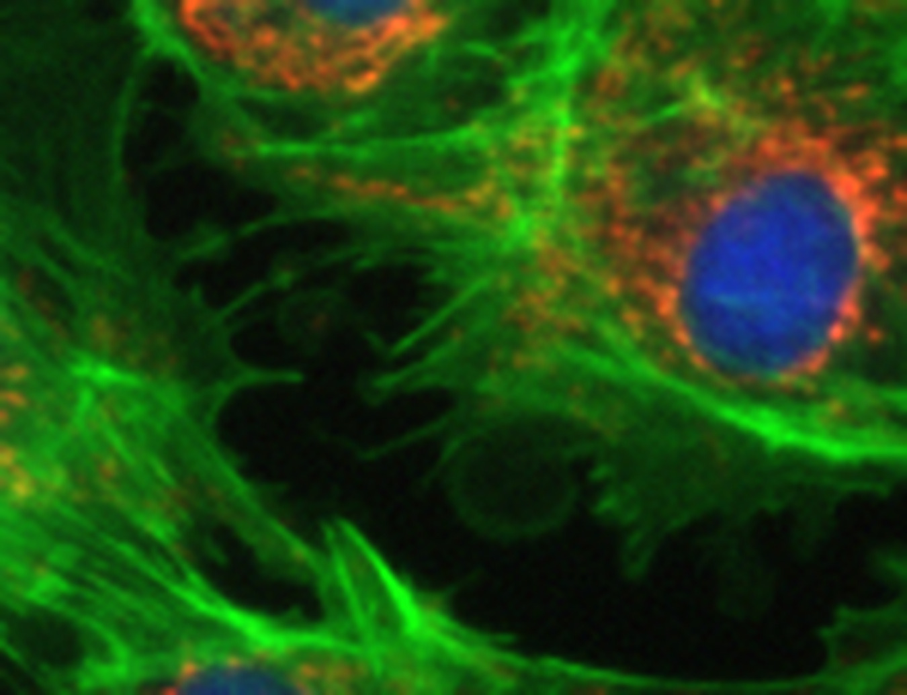
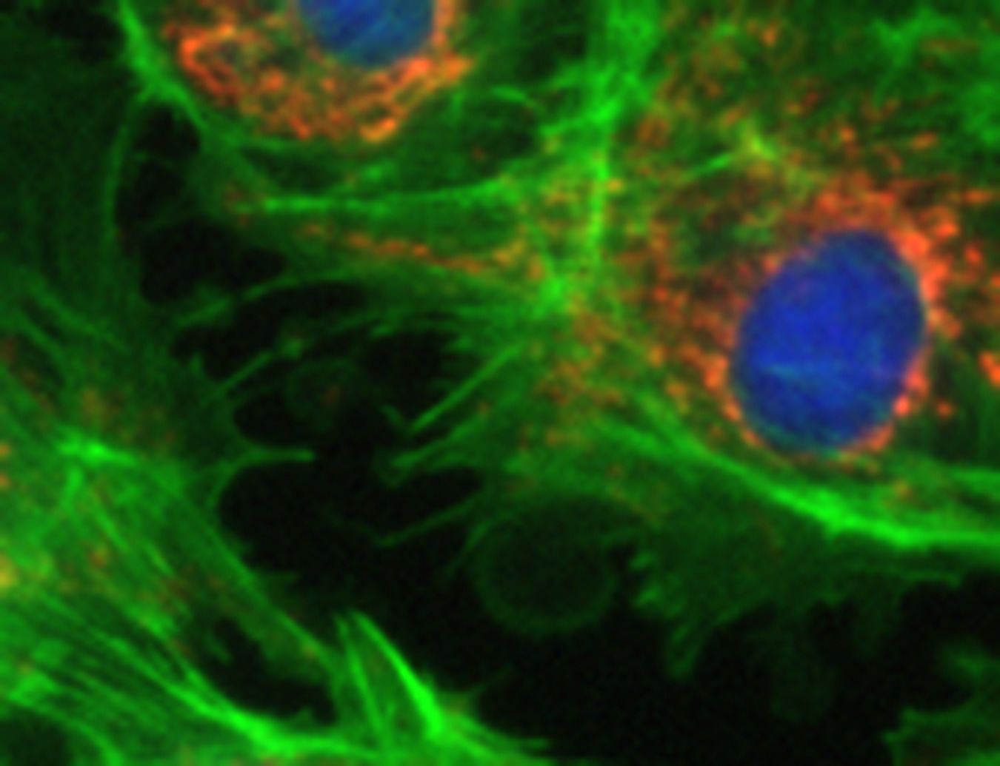

# Tiles to Pyramid

> Stitch a directory of acquisition tiles into a seamless pyramidal OME-TIFF or OME-ZARR,
> from inside QuPath, with optional content-based tile registration for stages that lie
> about where they were.

| | |
|---|---|
| **Repository** | [uw-loci/qupath-extension-tiles-to-pyramid](https://github.com/uw-loci/qupath-extension-tiles-to-pyramid) |
| **Version at workshop** | 0.6.5 |
| **License** | Apache-2.0 |
| **Requires** | QuPath 0.7.0+ |
| **Where to find it** | `Extensions > Tiles to Pyramid` |
| **Catalog** | LOCI QuPath Extensions |
| **Session** | Hands-on |

> Part of the [QPSC](presented/qpsc.md) system, but **usable entirely on its own**. It needs
> no microscope, no Python server, and no acquisition running. If you have a folder of tiles,
> this stitches them.

> **Walkthrough video:** %%VIDEO_TILES_TO_PYRAMID%%
> The walkthrough below is self-contained. You can work through it during the workshop, or on your own afterwards.

---

## What it does

**Multiple stitching strategies**, depending on how your acquisition recorded positions:

| Strategy | Reads positions from |
|---|---|
| Filename `[x,y]` | The tile filenames |
| TileConfiguration.txt | A Fiji-style position file |
| Vectra | Vectra metadata |
| MicroManager | MMStack or single-plane TIFF series metadata |

**Content-based tile registration** (off by default) positions tiles by correlating the image
content in their overlap, rather than trusting nominal stage coordinates. It corrects
backlash, encoder error, and thermal drift. One solve is measured on a reference subdirectory
and **reused by every angle and channel**, so co-captured images stay registered *to each
other*, which is the property that matters for multi-angle or multi-channel acquisitions.

**Output**

- **OME-TIFF** or cloud-native **OME-ZARR** (directory-based, good for cloud storage and
  parallel access).
- True multi-resolution **pyramids**, so the result opens instantly at low zoom.
- Compression from QuPath's OME writer set (`LZW`, `JPEG`, `J2K`, `J2K_LOSSY`, `ZLIB`,
  `UNCOMPRESSED`); for OME-ZARR these map to Blosc codecs internally.
- **Batch processing** across multiple slides with matching criteria, creating separate outputs
  per matched subdirectory.
- **Multichannel merge**: combine N same-shape single-channel pyramids into one multichannel
  image via a separate `ChannelMerger` step.

**Memory behavior** is worth calling out: the direct tile stitcher holds roughly **40 MB
steady state regardless of tile count** (the older SparseImageServer approach used 2–4+ GB),
and handles 1600+ tiles without running out of memory via spatial indexing and a bounded
reader pool.

## Read this before planning an acquisition

Whether Z and time survive stitching depends on **how the input encodes them**:

| Input layout | Z | T |
|---|---|---|
| TileConfiguration.txt + `z{nn}/` directories | preserved | — |
| TileConfiguration.txt + `t{nn}/z{nn}/` directories | preserved | preserved |
| TileConfiguration.txt, flat | 2D (z=0) | 2D (t=0) |
| MicroManager, Filename[x,y], Vectra | 2D only | 2D only |
| Z/T **inside** a multi-page file (e.g. an MMStack z-stack per position) | **collapsed** | **collapsed** |

Two limits stated plainly:

- **MicroManager, Filename[x,y], and Vectra strategies are 2D only.** They read each tile's XY
  position and place it at z=0, t=0.
- **Planes inside a multi-page or multi-series file are not expanded.** The tile reader reads
  only the *first* image in each file. An MMStack storing a z-stack inside one file is
  stitched as a single plane. To preserve those dimensions, export to the separate-file
  `z{nn}/` / `t{nn}/` layout and use the TileConfiguration.txt strategy.

Directory names must be exactly `z00`, `z01`, `t00`, … (a number after `z`/`t`,
case-insensitive). The two levels match independently, so both `z{nn}/t{nn}/` and
`t{nn}/z{nn}/` nesting work.

There is no maximum-intensity projection and no flattening; planes are written through as-is.

<b>Install</b> — from the LOCI catalog, then restart QuPath

Install from the **LOCI QuPath Extensions** catalog, then restart QuPath. Full steps, including the catalog URL, are in the [setup guide](setup.md).

Also listed in the QPSC microscope catalog, but it needs no microscope, so the main catalog is all you need.

---

> **New to QuPath?** Words like *project*, *annotation*, *detection*, *class* and
> *measurement* are explained in the [glossary](glossary.md). For QuPath itself, the
> [official documentation](https://qupath.readthedocs.io/en/stable/) is the place to go.

## Hands-on exercise
**Data:** `DATA-04_tiles`, a directory of tiles with a `TileConfiguration.txt`.

> ⚠️ **This one is not ready to download yet.** Every other track links straight to its
> data; this is the exception, and the [setup guide](setup.md) says the same. The tiles are a
> real polarised-light acquisition of pancreatic cancer and are being packaged now. Until the
> link appears here, you can still follow the steps against any folder of tiles that has a
> `TileConfiguration.txt` beside it.

**What you are looking for.** These two are the same join through the same cells, from a real
2×2 fluorescence acquisition. On the left the tiles sit where the stage said they were; on the
right they sit where the image content says they are. The stage was about 5 px out, and because
the tiles are feathered together that error does not show up as a visible seam — it shows up as
blur. Smeared spots and soft filaments on the left, crisp on the right. Steps 3 to 5 are asking
you to make this comparison on your own data (see below).

 

**Before you start.** This is the one tool here that runs *before* you have a project:
it reads a folder of tiles off disk and writes a single image. So there is nothing to open
first — point it at the tile folder, and open the result afterwards.

The extension is at `Extensions > Tiles to Pyramid`.

1. `Extensions > Tiles to Pyramid`.
2. Point it at the tile directory, choose the **TileConfiguration.txt** strategy, output
   **OME-TIFF** with `LZW`, and stitch.
3. Open the result in QuPath. Zoom to a seam between tiles and look for a visible offset.
4. Now stitch the drift-affected copy the same way. Find the seams. They should be obviously
   wrong.
5. Re-stitch that copy with **content-based tile registration** enabled. Compare the same
   seam — you are looking for the difference between the two pictures above, not for a line
   that disappears.
6. Stitch once more to **OME-ZARR** and compare the on-disk result (a directory, not a file)
   and the time it takes to open.
7. If time permits: run batch mode across two subdirectories at once.

### What to notice

- Nominal stage coordinates are a hypothesis. Content-based registration tests it, and on a
  drifting stage the difference is unmistakable at a seam.
- Reusing one solve across angles and channels is what keeps co-captured images aligned with
  each other, where re-solving per channel would not.
- Pyramid output is not cosmetic; it is the difference between an image that opens and one
  that does not.

---

**Full documentation:** the
[repository README](https://github.com/uw-loci/qupath-extension-tiles-to-pyramid#readme) and
`Workflow.md`.
