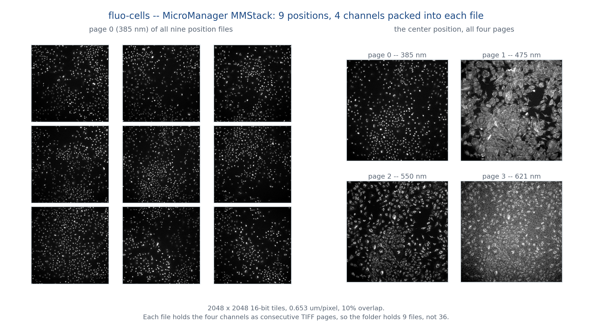
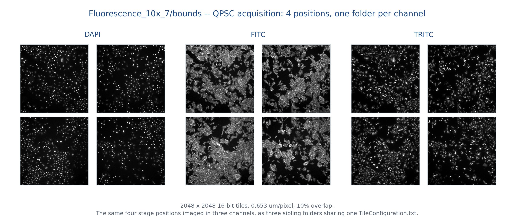
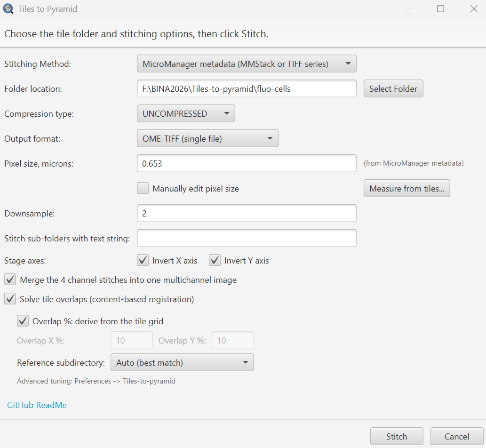

# Tiles to Pyramid

> Stitch a directory of acquisition tiles into a pyramidal OME-TIFF or OME-Zarr,
> from inside QuPath, with optional content-based tile registration for stages that lie
> about where they were.

| | |
|---|---|
| **Repository** | [uw-loci/qupath-extension-tiles-to-pyramid](https://github.com/uw-loci/qupath-extension-tiles-to-pyramid) |
| **Extension version** | 0.7.4 |
| **License** | Apache-2.0 |
| **Requires** | QuPath 0.7.0+ |
| **Where to find it** | `Extensions > Tiles to Pyramid > Tiles-to-pyramid` |
| **Catalog** | LOCI QuPath Extensions |
| **Session** | Hands-on |

> Part of the [QPSC](presented/qpsc.md) system, but **usable entirely on its own**. It needs
> no microscope, no Python server, and no acquisition running. If you have a folder of tiles,
> this stitches them.

> **Walkthrough video:** %%VIDEO_TILES_TO_PYRAMID%%
> The walkthrough below is self-contained. You can work through it during the workshop, or on your own afterwards.

> **New to QuPath?** Words like *project*, *annotation*, *detection*, *class* and
> *measurement* are explained in the [glossary](glossary.md). For QuPath itself, the
> [official documentation](https://qupath.readthedocs.io/en/stable/) is the place to go.

---

## What it does

**Multiple stitching strategies**, depending on how your acquisition recorded positions:

| Strategy | Reads positions from |
|---|---|
| Filename `[x,y]` | The tile filenames |
| TileConfiguration.txt | A Fiji-style position file |
| Vectra | Vectra metadata |
| MicroManager | MMStack or single-plane TIFF series metadata |

**Content-based tile registration** (off by default) places tiles by matching the image content
where they overlap, instead of trusting the stage. It absorbs backlash, encoder error and
thermal drift. When one acquisition produced several images of the same scene — channels of a
multiplex, or angles of a polarization series — the corrections are measured once and applied to
all of them, so they stay aligned with each other and not just internally.

### Output

- **OME-TIFF** or cloud-native **OME-Zarr** (directory-based, good for cloud storage and
  parallel access).
- True multi-resolution **pyramids**, so the result opens instantly at low zoom.
- Compression from QuPath's OME writer set (`LZW`, `ZLIB`, `J2K`, `UNCOMPRESSED`, `DEFAULT`,
  and the lossy `J2K_LOSSY` and `JPEG`). **`LZW` is the safe lossless choice**; avoid `JPEG`
  (8-bit RGB only, so it fails on 16-bit or multichannel data) and `J2K_LOSSY` (changes pixel
  values, so not for anything you will measure). Hover the dropdown for the per-option notes.
- **Batch processing** across multiple slides with matching criteria, creating separate outputs
  per matched subdirectory.
- **Multichannel merge**: combine N same-shape single-channel pyramids into one multichannel
  image via a separate `ChannelMerger` step.

**Memory stops growing.** The stitcher never holds the mosaic — it writes one output chunk at a
time and reads only the tile overlaps beneath it — so past a certain size the amount of memory it
needs stops growing. Measured as the smallest memory allowance in which the stitch completes: 87, 169 and 279
megapixels all finish in the same 128 MB.


The orange line is what it costs to hold every tile plus one fused canvas — arithmetic, not a
measurement of any particular program, and a generous lower bound at that. It is the shape that
matters: that approach grows with your slide, and this one does not. Both exercises below are
well inside the flat part.

<details markdown="1">
<summary><b>Install</b> — from the LOCI catalog, then restart QuPath</summary>

Install from the **LOCI QuPath Extensions** catalog, then restart QuPath. Full steps, including the catalog URL, are in the [setup guide](setup.md).

Also listed in the QPSC microscope catalog, but it needs no microscope, so the main catalog is all you need.

</details>

---

## Hands-on exercise

**Data:** `Tiles-to-pyramid.zip` — **[direct download](https://github.com/MichaelSNelson/BINA-I2K-2026-QuPath-Extensions/releases/download/data-v1/Tiles-to-pyramid.zip)** (459 MB). **Get this before the
workshop**: it is the largest download of the day, and conference wifi will be slow with several
people fetching it at once. Unzip it anywhere; you will point the extension at folders inside it,
not open it as a project.

Four tile folders, from two different microscopes:

| Folder | Acquired with | Scope | Tiles | Method to choose |
|---|---|---|---|---|
| `fluo-cells/` | MicroManager 2 MDA | A | 9 positions, 4 channels packed into each file | MicroManager metadata |
| `Fluorescence_10x_7/bounds/` | QPSC | A | 4 positions × 3 channel folders | TileConfiguration.txt file |
| `7.0.biref/`, `90.0/` | QPSC, polarized light | B | 12 tiles each, two analyzer angles | TileConfiguration.txt file |

Scope **A** and scope **B** differ in one way that matters here: A's stage runs opposite to its
camera on both axes and B's does not. Nothing in the files says so, which is what exercise 1 is
really about.

Exercises 1 and 2 below cover the two methods worth your time. The other two dropdown entries —
Vectra and Filename[x,y] — read positions the same way from different places, and this workshop
does not cover them.

### What goes in

Both fluorescence sets are cultured cells, 2048 × 2048 tiles at 0.653 µm/pixel with 10% overlap.
The polarized set is 2064 × 1544 tiles at 0.1732 µm/pixel, also 10%. Nothing here is
pre-processed; these are the files as the microscope wrote them.





The two acquisitions store channels differently, though what you do in the dialog is the same.
MicroManager writes **one file per position**, with the channels as pages inside it — nine files
for thirty-six images. QPSC writes **one folder per channel**, each holding the same four
positions. Either way you get one output image per channel.

**What you are looking for.** This is one join out of `fluo-cells`, the folder you are about to
stitch, done both ways. On the left the tiles sit where the stage said they were, and cells are
cut and shunted sideways at the join. On the right they sit where the image content says they
are, and the cells run straight through.


Both panels are cut from the same coordinates in the two mosaics and scaled identically, so the
only thing that differs is where the tiles were put. The step is sharp rather than blurred
because the shipped blend is a hard cut at the boundary; if you would rather it blended, that is
a QuPath preference — `Edit > Preferences > Tiles-to-pyramid > Stitching: overlap blending` — not
a field in the dialog. The color here is three channels merged for the figure; your own output
opens as separate grayscale channels.

**There is nothing to set up.** Unlike every other tool here, this one runs before you have a
project — it reads tiles off disk and writes an image. Open QuPath, go to
`Extensions > Tiles to Pyramid > Tiles-to-pyramid`, and start at step 1. The stitched files land
**in the folder you selected**, beside the tiles.

### Exercise 1 — a MicroManager acquisition

1. `Extensions > Tiles to Pyramid > Tiles-to-pyramid`.
2. **Stitching Method:** `MicroManager metadata (MMStack or TIFF series)`.
3. **Select Folder:** choose the `fluo-cells` folder.

   You should now see **Pixel size, microns** fill in as `0.653`, read from the MicroManager
   metadata, and a new checkbox appear reading **Merge the 4 channel stitches into one
   multichannel image** — the extension has found four channels inside the files. Leave it
   ticked; it is on by default, and the merged file in step 8 depends on it.
4. Leave **Stitch sub-folders with text string** empty. It starts empty, but it remembers
   whatever you last typed, so clear it if anything is there. The MicroManager method ignores it
   either way.
5. **Output format** `OME-TIFF (single file)`, **Compression type** `UNCOMPRESSED`,
   **Downsample** `2`. These two are what keep the exercise to a couple of minutes on a laptop:
   the shipped compression is `J2K`, which is over twice as slow overall and four times slower
   on the merge, and downsampling by 2 quarters the pixels written. Both fields are remembered
   between runs, so check them.
6. Tick **Solve tile overlaps (content-based registration)**. The dialog grows a group of
   registration options — leave every one of them alone. The defaults derive the overlap from
   the tile grid and pick the reference channel for you.
7. Under **Stage axes**, tick **both Invert X axis and Invert Y axis**. This acquisition came
   from a scope whose stage runs opposite to its camera on both axes; the box below shows how you
   would work that out for yourself.
8. Click **Stitch**. The dialog closes and a notification says the stitch started in the
   background; QuPath stays usable. Two to three minutes later a window titled **Tiles to
   Pyramid - Result** appears, headed "Stitching complete" and listing every file it wrote.
   Do not click Stitch again while you wait — you will get "A stitch is already running."

   Five files appear beside the tiles: `385.ome.tif`, `475.ome.tif`, `550.ome.tif`,
   `621.ome.tif`, and `fluo-cells_merged.ome.tif` holding all four channels. Each gets a
   `.stitch-info.txt` recording how it was made, including which axes were negated.


*The dialog with everything above set.*

9. Drag `fluo-cells_merged.ome.tif` onto the QuPath window to open it, then zoom in where two
   tiles meet — the vertical join about a third of the way across. Cells straddling the join
   should look as sharp as cells in the middle of a tile.

The result window tells you what registration did, on its own line:

```
Tile registration: 12 of 12 seams accepted, aligned on 385, moved 36 of 36 tile placements.
```

An *edge* is one pair of side-by-side tiles; a 3x3 grid has twelve such pairs, and here all
twelve correlated well enough to be believed. Fewer than all is normal on a sparse slide — a
tile whose overlap has no texture takes the correction its neighbors imply, and if nothing
matches at all the stitch still completes at the stage's own positions.

The `max 12.45 px` is how far one tile ended up from where the stage put it, accumulated
across the grid — not the error in a single stage step. The per-step figure is on the
following `Per-edge shifts used:` line.

> #### If you get the axes wrong
>
> Untick the two Invert boxes and stitch again. Nothing is overwritten: the second run writes
> `fluo-cells_merged_2.ome.tif` beside the first, and its per-channel images go into
> `fluo-cells_channels/` alongside the first set, suffixed `_2`. The `_2` files are the mirrored
> ones.
>
> You get a 5734 × 5735 image — within twenty pixels on both axes of the 5754 × 5749 you got a
> moment ago, and still a plausible-looking mosaic. But every tile is now in the mirrored slot of
> the grid. The *layout* is mirrored, not the pixels: no tile's own image is flipped, they are
> simply placed in the wrong cells. So no seam matches anything, and the log says so outright:
>
> ```
> Tile registration produced no corrections: no edge survived the confidence gates;
> keeping nominal positions
> ```
>
> Stage coordinates do not say which way the camera faces, so the extension cannot work it out,
> and a mirrored mosaic is not obviously wrong at a glance. Registration is what tells you: every
> seam accepted means the axes are right, none accepted means try inverting one or both.
>
> If you do not know, leave both boxes clear and turn registration on — clear is the common case,
> and this scope is the exception.

### Exercise 2 — a QPSC acquisition, three channels at once

1. Reopen the dialog. **Stitching Method:** `TileConfiguration.txt file`.
2. **Select Folder:** `Fluorescence_10x_7/bounds`.

   > **It must be `bounds`, not `Fluorescence_10x_7`.** `bounds` is the folder that *contains*
   > `DAPI`, `FITC` and `TRITC`. Selecting its parent finds no tiles, because this method reads
   > only the folder you pick and the position files are one level further down. Selecting one of
   > the three channel folders works too, but then you get that channel alone.
3. **Pixel size:** tick **Manually edit pixel size** and enter `0.653`. A
   `TileConfiguration.txt` records micrometers, so the stitcher needs the scale to convert them
   to pixels, and there is no MicroManager sidecar here to read it from.

   <details markdown="1">
   <summary>What a wrong pixel size does</summary>

   Two things go wrong together. The tiles are laid out at the wrong spacing — too large a value
   packs them, too small spreads them — and the output carries that wrong calibration, so every
   later measurement in micrometers is off by the same ratio. Far enough out and there is no
   overlap left for registration to work with.

   </details>

   > The **Measure from tiles...** button next to the field estimates a pixel size from the
   > actual tile overlap, which is the escape hatch when you do not know it. It reads
   > MicroManager metadata to find which tiles neighbor which, so it works on the `fluo-cells`
   > folder and **not** on this one — here it reports "Need at least two tiles with stage
   > positions to estimate pixel size.
4. **Sub-folders to stitch:** type `*`. That means every sub-folder, one image each — here, one
   per channel. Once it matches all three, the merge checkbox appears.

   > **Not empty, and not a letter they happen to share.** Empty means "stitch the folder I
   > selected", and because the tile search recurses, `bounds` on its own finds all twelve files —
   > the same four positions in three channels — and piles them into one image, whichever channel
   > lands last at each position. It does not fail or warn. `*` is the way to say "all of them,
   > separately".
5. Tick **Solve tile overlaps**, and again tick **both Invert** boxes — same microscope as
   exercise 1.
6. **Stitch.** You get `DAPI.ome.tif`, `FITC.ome.tif`, `TRITC.ome.tif`, and `bounds_merged.ome.tif`.

The log reports which channel it measured on and reuses that one solve for the other two:

```
Registration reference: 'FITC' (most decisive on sampled seams)
Tile registration: 4/4 edges accepted, ... corrections mean 5.87 px / max 6.04 px
```

Which channel it picks, and the exact correction sizes, vary between runs: **Reference
subdirectory** defaults to `Auto (best match)`, which samples seams and re-decides from the data
each time. (The `TileRegistration.txt` already sitting in `bounds` was solved on `DAPI`.) Pin a
named channel there if you need the same geometry across re-runs. What should not vary is
`4/4 edges accepted`.

Solving each channel separately would give each its own corrections and pull the channels out of
register *with each other* — worse than leaving all three on the same imperfect grid.

### Exercise 3 — color tiles, upright scope

Twelve RGB tiles from a polarized-light acquisition. Four changes from exercise 2:

1. **Select Folder:** `90.0`.
2. **Sub-folders to stitch:** empty — the tiles are in that folder, and RGB is already three
   channels, so no merge checkbox appears.
3. **Pixel size:** `0.1732`, manually.
4. **Untick both Invert boxes.** Upright scope; its stage runs the same way as its camera.

Expect `17 of 17 seams accepted` and one `90.0.ome.tif`. Color instead of 16-bit grayscale, a
different objective and the opposite stage convention — and only the pixel size and two
checkboxes changed.

### If you have time

- **Stitch to OME-Zarr** instead. Repeat exercise 2 with **Output format** set to
  `OME-Zarr (NGFF 0.4, Zarr v2)` — the label carries the versions it writes. You get
  `DAPI.ome.zarr/`, `FITC.ome.zarr/` and `TRITC.ome.zarr/` *directories* rather than files; drag
  the directory itself onto QuPath to open it, not something inside it. Compare how long each
  format takes to open.
- **Batch both polarization angles in one run.** Point the dialog at the top-level unzipped
  folder, method `TileConfiguration.txt file`, and type `.` in **Sub-folders to stitch** — which
  matches `7.0.biref` and `90.0` and nothing else. (`*` would take all four folders, including the
  two fluorescence sets, which need different settings.) Both angles stitch in one go, each
  reporting `17 of 17 seams accepted`.

  Three things the dialog will have wrong when you get there, all of them left over from the
  exercises above:

  - **Pixel size.** Tick **Manually edit pixel size** and enter `0.1732` (micrometers per pixel).
    The field is read-only until you do, and it will already show `0.653` labeled *(from
    MicroManager metadata)* — the scan that fills it recurses into sub-folders and found
    `fluo-cells` one level down. That is a different acquisition on a different scope, and these
    tiles are 2064 x 1544 rather than 2048 square.
  - **Invert X / Invert Y.** **Untick both.** They are still ticked from exercise 2, because the
    setting belongs to the scope and is remembered — and this scope needs neither.
  - **Merge channels.** **Untick it.** It appears because two folders matched, but these are two
    analyzer angles, not two channels of one image; they are not even the same pixel type
    (16-bit gray and 8-bit RGB), so the merge throws and the run reports "Stitching did not fully
    succeed" even though both stitches worked.

### If something goes wrong

| What you see | Why | What to do |
|---|---|---|
| "A stitch is already running. Wait for it to finish before starting another." | The stitch runs in the background and the menu stays live, so it looks like nothing happened | Wait for the **Tiles to Pyramid - Result** window; only one stitch runs at a time |
| "Stitching failed. See the log for details." | Usually the wrong method for the folder — the log says "No tile mappings produced by strategy" | Check the **Stitching Method** matches the folder you picked |
| "No TileConfiguration.txt in tile folder: ..." in the log | The TileConfiguration.txt method pointed at a MicroManager folder | Switch to the MicroManager method, or pick a folder that has that file |
| "Channel merge failed; the per-channel images were kept." | The matched folders are not the same size or pixel type | Untick the merge box; the per-channel stitches are already written and fine |

### What to notice

- The stage was wrong, and by more than you would guess: up to 12 px here, enough to break a
  filament across a seam. It is wrong on every microscope; the only question is by how much.
- Stage axis direction is a property of the microscope, not of the data. Two of the folders in
  this zip need both axes inverted and two need neither, and nothing in the files says which.
- Your channels are measured once, together. DAPI, FITC and TRITC in exercise 2 came off the
  same four stage positions, so they get one set of corrections and stay lined up on top of each
  other. Correcting each channel on its own evidence would nudge them apart, and a red dot would
  stop sitting inside its blue nucleus.
- Every output carries a `.stitch-info.txt` beside it, recording the method, pixel size, axis
  negation, blending, compression, what registration actually did, and the QuPath, Java and
  extension versions. Copy a methods section from that file, not from memory.

## Before you plan your own acquisition

<details markdown="1">
<summary><b>Z-stacks, time series, and the limits worth knowing</b> — only matters when you are deciding how to write tiles out</summary>

Whether Z and time survive stitching depends on **how the input encodes them**:

| Input layout | Z | T |
|---|---|---|
| TileConfiguration.txt + `z{nn}/` directories | planes preserved | — |
| TileConfiguration.txt + `t{nn}/z{nn}/` directories | planes preserved | preserved |
| TileConfiguration.txt, flat | 2D (z=0) | 2D (t=0) |
| MicroManager, Filename[x,y], Vectra | 2D only | 2D only |
| Z/T **inside** a multi-page file (e.g. an MMStack z-stack per position) | **collapsed** | **collapsed** |

Five limits worth knowing before you commit to a layout:

- **MicroManager, Filename[x,y], and Vectra strategies are 2D only.** They read each tile's XY
  position and place it at z=0, t=0.
- **Z and T inside a multi-page file are not expanded.** Channels are: an MMStack file whose
  page count equals its channel count is split into one tile per channel, which is how the
  four-channel exercise below works. But an MMStack storing a *z-stack* in those same pages is
  stitched as a single plane, from page 0. If the acquisition also has several channels the log
  says so; an ordinary single-channel z-stack is collapsed **silently**, with nothing in the log
  to tell you. To keep Z or T, export to the separate-file `z{nn}/` / `t{nn}/` layout and use the
  TileConfiguration.txt strategy.
- **On MicroManager input, seams are measured on the first channel only**, because every channel
  of a position lives in one file and there are no sibling folders to compare. You cannot choose
  a different one, and the first channel is not always the one that correlates best.
- **Translation only.** Registration shifts tiles; it does not correct rotation or scale.
- **Z spacing is never asked for, and is always recorded as 1.0 micrometer.** The dialog
  hard-codes it. Plane order and count come through correctly; the physical Z calibration does
  not, so any volume, 3D distance or orthogonal view measured afterwards is wrong by the ratio
  of the real spacing to 1.0 — silently. Fix it in QuPath after opening the result
  (`Image > Set pixel size`), or stitch from a script, where `StitchingConfig` takes a real
  Z spacing in micrometers.

Directory names must be a `z` or `t` followed by digits and nothing else — `z0`, `z00` and
`z000` all match, case-insensitively. The two levels match independently, so both `z{nn}/t{nn}/` and
`t{nn}/z{nn}/` nesting work.

There is no maximum-intensity projection and no flattening; planes are written through as-is.

</details>

---

**Full documentation:** the
[repository README](https://github.com/uw-loci/qupath-extension-tiles-to-pyramid#readme) and
`Workflow.md`.
