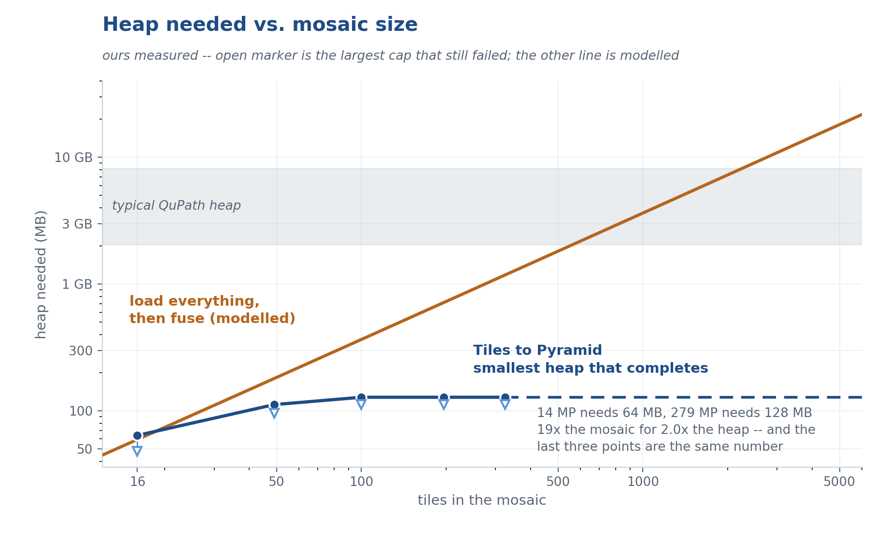
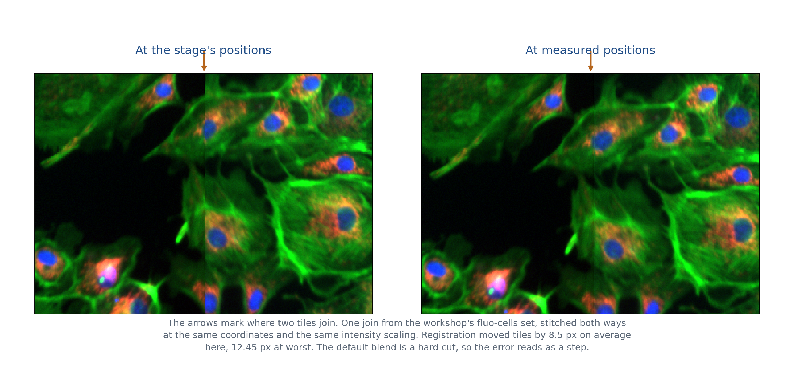
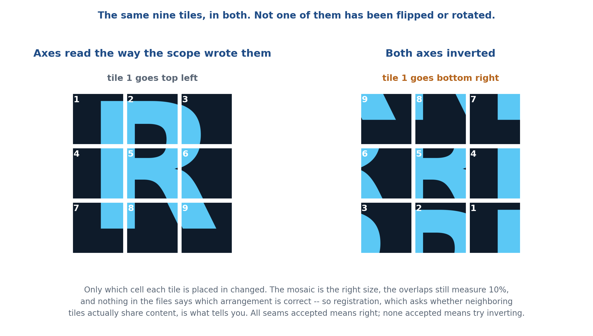
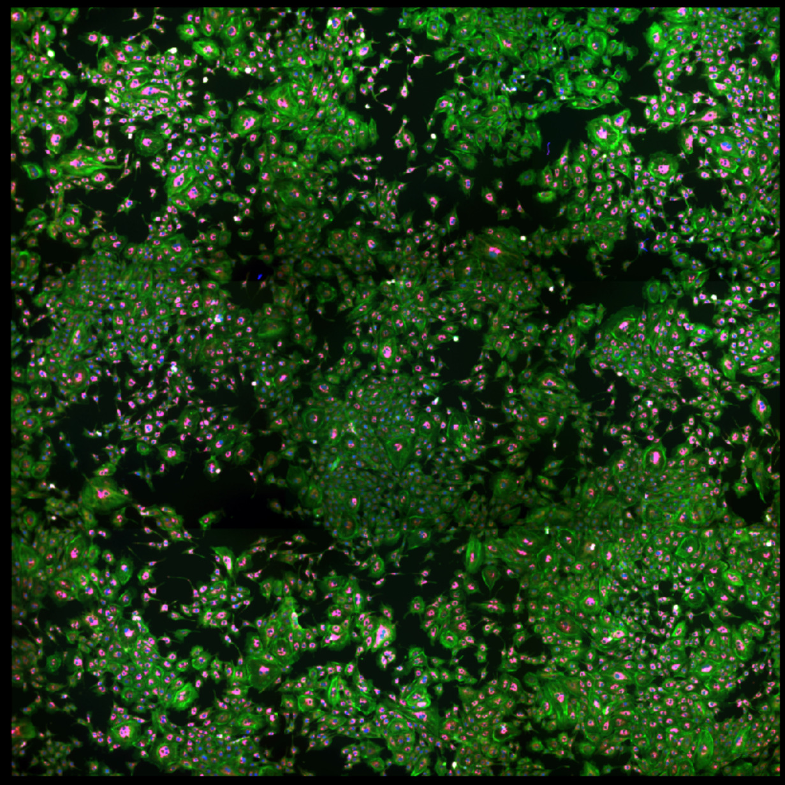

# Tiles to Pyramid

> Stitch a directory of acquisition tiles into a pyramidal OME-TIFF or OME-Zarr,
> from inside QuPath, with optional content-based tile registration for stages that lie
> about where they were.

| | |
|---|---|
| **Repository** | [uw-loci/qupath-extension-tiles-to-pyramid](https://github.com/uw-loci/qupath-extension-tiles-to-pyramid) |
| **Extension version** | 0.7.7 |
| **License** | Apache-2.0 |
| **Requires** | QuPath 0.7.0+ |
| **Where to find it** | `Extensions > Tiles to Pyramid > Tiles-to-pyramid` |
| **Catalog** | LOCI QuPath Extensions |
| **Session** | Hands-on |

> Part of the [QPSC](presented/qpsc.md) system, but **usable entirely on its own**. It needs
> no microscope, no Python server, and no acquisition running. If you have a folder of tiles,
> this stitches them.

> **Walkthrough video:** %%VIDEO_TILES_TO_PYRAMID%%
> The walkthrough below is self-contained. You can work through it during the workshop, or on your own afterwards.

> **New to QuPath?** Words like *project*, *annotation*, *detection*, *class* and
> *measurement* are explained in the [glossary](glossary.md). For QuPath itself, the
> [official documentation](https://qupath.readthedocs.io/en/stable/) is the place to go.

---

## What it does

**Multiple stitching strategies**, depending on how your acquisition recorded positions:

| Strategy | Reads positions from |
|---|---|
| Filename `[x,y]` | The tile filenames |
| TileConfiguration.txt | A Fiji-style position file |
| Vectra | Vectra metadata |
| MicroManager | MMStack or single-plane TIFF series metadata |

**Content-based tile registration** (off by default) places tiles by matching the image content
where they overlap, instead of trusting the stage. It absorbs backlash, encoder error and
thermal drift. When one acquisition produced several images of the same scene — channels of a
multiplex, or angles of a polarization series — the corrections are measured once and applied to
all of them, so they stay aligned with each other and not just internally.

### Output

- **OME-TIFF** or cloud-native **OME-Zarr** (directory-based, good for cloud storage and
  parallel access).
- True multi-resolution **pyramids**, so the result opens instantly at low zoom.
- Compression from QuPath's OME writer set (`LZW`, `ZLIB`, `J2K`, `UNCOMPRESSED`, `DEFAULT`,
  and the lossy `J2K_LOSSY` and `JPEG`). **`LZW` is the safe lossless choice**; avoid `JPEG`
  (8-bit RGB only, so it fails on 16-bit or multichannel data) and `J2K_LOSSY` (changes pixel
  values, so not for anything you will measure). Hover the dropdown for the per-option notes.
- **Batch processing** across multiple slides with matching criteria, creating separate outputs
  per matched subdirectory.
- **Multichannel merge**: combine N same-shape single-channel pyramids into one multichannel
  image via a separate `ChannelMerger` step.

**Memory stops growing.** The stitcher never holds the mosaic — it writes one output chunk at a
time and reads only the tile overlaps beneath it — so past a certain size the amount of memory it
needs stops growing. Measured as the smallest memory allowance in which the stitch completes: 87, 169 and 279
megapixels all finish in the same 128 MB.



The orange line is what it costs to hold every tile plus one fused canvas — arithmetic, not a
measurement of any particular program, and a generous lower bound at that. It is the shape that
matters: that approach grows with your slide, and this one does not. Both exercises below are
well inside the flat part.

<details markdown="1">
<summary><b>Install</b> — from the LOCI catalog, then restart QuPath</summary>

Install from the **LOCI QuPath Extensions** catalog, then restart QuPath. Full steps, including the catalog URL, are in the [setup guide](setup.md).

Also listed in the QPSC microscope catalog, but it needs no microscope, so the main catalog is all you need.

</details>

---

## Hands-on exercise

**Data:** `Tiles-to-pyramid.zip` — **[direct download](https://github.com/MichaelSNelson/BINA-I2K-2026-QuPath-Extensions/releases/download/data-v1/Tiles-to-pyramid.zip)** (459 MB). **Get this before the
workshop**: it is the largest download of the day, and conference wifi will be slow with several
people fetching it at once. Unzip it anywhere; you will point the extension at folders inside it,
not open it as a project.

<details markdown="1">
<summary><b>Why stitching needs more than the stage coordinates</b></summary>

The microscope records where the stage was for each tile, so the obvious way to build a mosaic is
to put every tile at its recorded position. It very nearly works. The stage is not precise to the
pixel, though — backlash, encoder error and thermal drift each add a little — so neighboring tiles
land a few pixels out of true and every join shows as a line through the picture.

The fix is to stop trusting the coordinates and look at the pixels. Neighboring tiles are set to
overlap, which means the strip where they meet is the same piece of sample photographed twice;
slide one tile against the other until those two strips agree, and the shift that makes them agree
is the error in the stage. Do that for every pair of neighbors, then solve the whole grid at once
so no tile is dragged out of line by one bad pair. That is **Solve tile overlaps** in the dialog,
and it is the same approach Fiji's Grid/Collection stitching takes — the method paper opens by
noting that stage coordinates "are not precise enough to allow direct reconstruction"
([Preibisch, Saalfeld &amp; Tomancak 2009](https://doi.org/10.1093/bioinformatics/btp184)).

Here are two tiles out of `fluo-cells` and the two mosaics they give, depending on where you put
them. The stage was out by up to 12 px:



> **About the figure.** By default no smoothing is done where overlapping tiles are merged, so a
> misplaced tile shows up as a noticeable vertical line rather than as a blur. If you would rather
> it blended, that is a QuPath preference — `Edit > Preferences > Tiles-to-pyramid > Stitching:
> overlap blending` — not a field in the stitch dialog.
>
> Both lower panels are cut from the same coordinates in the two mosaics, with the same brightness
> scaling, so the only thing that differs between them is where the tiles were placed. The color is
> three channels merged for the figure; your own output opens as separate grayscale channels.

</details>

<details markdown="1">
<summary><b>The data provided</b> &mdash; four folders, and which method each one needs</summary>

| Folder | What is in it | Tiles | Scope | Method to choose |
|---|---|---|---|---|
| `fluo-cells/` | Cultured cells, 4 fluorescence channels, from a MicroManager MDA. One file per position, channels stored as pages inside it | 9 positions, 2048 × 2048, 0.653 µm/px | A | MicroManager metadata |
| `Fluorescence_10x_7/bounds/` | The same kind of sample from QPSC. One folder per channel — `DAPI`, `FITC`, `TRITC` — each holding the same positions | 4 positions, 2048 × 2048, 0.653 µm/px | A | TileConfiguration.txt file |
| `7.0.biref/`, `90.0/` | One polarized-light acquisition at two analyzer angles. `90.0` is color (RGB), `7.0.biref` is 16-bit | 12 tiles each, 2064 × 1544, 0.1732 µm/px | B | TileConfiguration.txt file |

Everything is 10% overlap, and nothing is pre-processed — these are the files as the microscopes
wrote them. The exercises use the first three dropdown methods' two useful cases; Vectra and
Filename[x,y] read positions the same way from different places and are not covered here.

**Scopes A and B disagree about which corner the first tile belongs in.** On A, the position the
acquisition recorded first belongs at the bottom right of the finished image; on B, the top left.
Get it backwards and every tile lands in the wrong cell:



Nothing in the files says which you have, so you tell the extension with the **Invert X axis** and
**Invert Y axis** boxes. Exercise 1 is about how you find out.

</details>

**No project required.** Unlike every other tool here, this one does not need one — it reads
tiles off disk and writes an image. Open QuPath, go to
`Extensions > Tiles to Pyramid > Tiles-to-pyramid`, and start at step 1. The stitched files land
**in the folder you selected**, beside the tiles.

### Exercise 1 — a MicroManager acquisition

1. `Extensions > Tiles to Pyramid > Tiles-to-pyramid`.
2. Set the dialog up like this. The numbers match the badges in the picture below.

   | # | Field | Set to |
   |---|---|---|
   | 1 | **Stitching Method** | `MicroManager metadata (MMStack or TIFF series)` |
   | 2 | **Folder location** | **Select Folder**, choose `fluo-cells` |
   | 3 | **Compression type** | `UNCOMPRESSED` |
   | 4 | **Output format** | `OME-TIFF (single file)` |
   | 5 | **Pixel size, microns** | Fills in as `0.653` on its own once the folder is chosen. Leave it. If **Manually edit pixel size** is ticked, untick it -- the tick is remembered between runs, and while it is on nothing is read from the data |
   | 6 | **Downsample** | `2` |
   | 7 | **Stitch sub-folders with text string** | Empty. It remembers what you last typed, so clear it if anything is there |
   | 8 | **Stage axes** | Tick **both** `Invert X axis` and `Invert Y axis` |
   | 9 | **Merge the 4 channel stitches into one multichannel image** | Appears once the folder is chosen. Leave it ticked |
   | 10 | **Solve tile overlaps (content-based registration)** | Tick. Leave the options it reveals alone |

   

   Three of those are why the exercise takes minutes rather than most of the session.
   `UNCOMPRESSED` beats the shipped `J2K`, which is over twice as slow overall and four times
   slower on the merge. Downsample `2` quarters the pixels written. Both fields are remembered
   between runs, so check them. The two Invert boxes are there because this is a scope A
   acquisition, whose first tile belongs bottom right; the box further down shows how you
   would work that out for a scope you do not know.
3. Click **Stitch**. The dialog closes and a notification says it started in the background;
   QuPath stays usable. Do not click Stitch again while you wait — you will get "A stitch is
   already running."
4. **Read the result window before you close it.** A couple of minutes later **Tiles to Pyramid -
   Result** appears, headed "Stitching complete". It lists the files written and, on its own
   line, what registration did:

   ```
   Tile registration: 12 of 12 seams accepted, aligned on 385, moved 36 of 36 tile placements.
   ```

   Everything went into the folder you selected. Click **Open output folder** to go straight
   there: `fluo-cells_merged.ome.tif` holds all four channels, and the four single-channel images
   it was built from are in `fluo-cells_channels/`. Every image has a `.stitch-info.txt` beside it
   recording how it was made. Each later mention of a `Tile registration:` line in this guide
   means that same window — you never need the log.
5. Drag `fluo-cells_merged.ome.tif` onto the QuPath window to open it, then zoom in where two
   tiles meet — the vertical join about a third of the way across. Cells straddling the join
   should look as sharp as cells in the middle of a tile.



This is what you should get. Cells run straight through every join. The two faint horizontal
bands are a brightness difference between tile rows, not a placement error — [What to
notice](#what-to-notice) explains where they come from.

<details markdown="1">
<summary>What that registration line means</summary>

A *seam* is one pair of side-by-side tiles; a 3 × 3 grid has twelve of them, and here all twelve
matched well enough to be believed. Fewer is normal on a sparse slide: a tile whose overlap has no
texture takes the correction its neighbors imply, and if nothing matches at all the stitch still
completes, at the stage's own positions.

`moved 36 of 36 tile placements` counts every channel — nine tiles in four channels. One set of
corrections, applied to all of them.

</details>

### Exercise 2 — a QPSC acquisition, three channels at once

Reopen the Tiles to Pyramid dialog and change these settings; everything else stays as it was.

| Field | Set to |
|---|---|
| **Stitching Method** | `TileConfiguration.txt file` |
| **Folder location** | `Fluorescence_10x_7/bounds` |
| **Pixel size** | Tick **Manually edit pixel size** and enter `0.653` |
| **Sub-folders to stitch** | `*` |

Then **Stitch**. You get `DAPI.ome.tif`, `FITC.ome.tif`, `TRITC.ome.tif`, and
`bounds_merged.ome.tif`.

> **It must be `bounds`, not `Fluorescence_10x_7`.** `bounds` is the folder that *contains*
> `DAPI`, `FITC` and `TRITC`. Selecting its parent finds no tiles, because this method reads
> only the folder you pick and the position files are one level further down. Selecting one of
> the three channel folders works too, but then you get that channel alone.

> **Why the pixel size is manually entered this time.** The data in `TileConfiguration.txt` is in micrometers, so
> the stitcher needs the scale to convert them to pixels, and there is no MicroManager sidecar
> here to read it from. The **Measure from tiles...** button next to the field estimates a pixel
> size from the actual tile overlap, but it reads MicroManager metadata to find which tiles
> neighbor which, so it works on `fluo-cells` and not here.

<details markdown="1">
<summary>What a wrong pixel size does</summary>

Two things go wrong together. The tiles are laid out at the wrong spacing — too large a value
packs them, too small spreads them — and the output carries that wrong calibration, so every
later measurement in micrometers is off by the same ratio. Far enough out and there is no
overlap left for registration to work with.

</details>

> **Why `*` in the sub-folder field.** It means every sub-folder, one image each — here, one
> per channel. Once it matches all three, the merge checkbox appears. Empty would mean "stitch
> the folder I selected", and because the tile search recurses, `bounds` on its own finds all
> twelve files and piles the three channels into one image, whichever lands last at each
> position, without failing or warning. `*` needs **0.7.5 or newer**; on an older build the
> field is called "Stitch sub-folders with text string", takes literal text only, and you would
> type `I`, the one letter `DAPI`, `FITC` and `TRITC` share. **Downsample other than 1 needs
> 0.7.6** — earlier versions place the tiles at the wrong spacing and the mosaic comes out
> scrambled.

The result window names the channel it measured on — `aligned on FITC`, or whichever it chose —
and the corrections from that one channel are applied to all three. Open the merged image and the
three channels sit on top of each other; a red dot stays inside its blue nucleus.

<details markdown="1">
<summary>Why one channel decides for all three, and why the name changes between runs</summary>

The three channels were photographed at the same four stage positions, so they share one set of
errors. Measuring each separately would give each its own corrections and pull them apart from one
another — worse than leaving all three on the same slightly imperfect grid.

Which channel gets measured is decided from the data: **Reference subdirectory** defaults to
`Auto (best match)`, which samples a few seams on each and picks the most decisive, so the name in
that line can change between runs. Pin a channel there if you need the same geometry every time.
The number that should not change is how many seams were accepted.

</details>

### Exercise 3 — color tiles, upright scope

Twelve RGB tiles from a polarized-light acquisition. Four changes from exercise 2:

| Field | Set to |
|---|---|
| **Folder location** | `90.0` |
| **Sub-folders to stitch** | Empty. The tiles are in that folder, and RGB is already three channels, so no merge checkbox appears |
| **Pixel size** | `0.1732`, typed with **Manually edit pixel size** ticked |
| **Stage axes** | **Untick both** Invert boxes. Upright scope; its stage runs the same way as its camera |

The result window should read:

```
Tile registration: 17 of 17 seams accepted, moved 12 of 12 tile placements.
```

and you get one `90.0.ome.tif`. Color instead of 16-bit grayscale, a different objective and the
opposite stage convention — and only the pixel size and two checkboxes changed.

### If you have time

**Stitch to OME-Zarr.** Repeat exercise 2 with one change:

| Field | Set to |
|---|---|
| **Output format** | `OME-Zarr (NGFF 0.4, Zarr v2)` |

The label carries the versions it writes. You get `DAPI.ome.zarr/`, `FITC.ome.zarr/` and
`TRITC.ome.zarr/` *directories* rather than files; drag the directory itself onto QuPath to open
it, not something inside it. Compare how long each format takes to open.

**Specify folders to stitch using string matching.** Both polarization angles stitch in one go:

| Field | Set to |
|---|---|
| **Stitching Method** | `TileConfiguration.txt file` |
| **Folder location** | The top-level unzipped folder |
| **Sub-folders to stitch** | `.` |
| **Pixel size** | Tick **Manually edit pixel size** and enter `0.1732` |
| **Merge the 2 channel stitches into one multichannel image** | Untick |

Each angle reports `17 of 17 seams accepted`.

> **Why `.`** It matches `7.0.biref` and `90.0` and nothing else. `*` would take all four folders,
> including the two fluorescence sets, which need different settings.

> **Why the pixel size needs changing.** The dialog remembers what you typed last time, so the
> field will still hold the `0.653` from exercise 2. That is a different acquisition on a
> different scope -- these tiles are 2064 x 1544 rather than 2048 square. Nothing fills the
> field in for you here: a `TileConfiguration.txt` carries no pixel size, so the value is
> whatever you last entered until you change it.

> **Why the merge box must be unticked.** It appears because two folders matched, but these are
> two analyzer angles, not two channels of one image; they are not even the same pixel type
> (16-bit gray and 8-bit RGB), so the merge throws and the run reports "Stitching did not fully
> succeed" even though both stitches worked.

### If something goes wrong

| What you see | Why | What to do |
|---|---|---|
| "A stitch is already running. Wait for it to finish before starting another." | The stitch runs in the background and the menu stays live, so it looks like nothing happened | Wait for the **Tiles to Pyramid - Result** window; only one stitch runs at a time |
| "Stitching failed. See the log for details." | Usually the wrong method for the folder — the log says "No tile mappings produced by strategy" | Check the **Stitching Method** matches the folder you picked |
| "No TileConfiguration.txt in tile folder: ..." in the log | The TileConfiguration.txt method pointed at a MicroManager folder | Switch to the MicroManager method, or pick a folder that has that file |
| "Channel merge failed; the per-channel images were kept." | The matched folders are not the same size or pixel type | Untick the merge box; the per-channel stitches are already written and fine |

### What to notice

- The stage was out by up to 12 px on this data, enough to cut a cell in half at a seam. Every
  stage is out by something; registration is how you find out by how much.
- Stage axis direction is a property of the microscope, not of the data. Two of the folders in
  this zip need both axes inverted and two need neither, and nothing in the files says which.
- Your channels are measured once, together. DAPI, FITC and TRITC in exercise 2 came off the
  same four stage positions, so they get one set of corrections and stay lined up on top of each
  other. Correcting each channel on its own evidence would nudge them apart, and a red dot would
  stop sitting inside its blue nucleus.
- **Seams you can still see in exercise 1 are brightness, not position.** Registration lines the
  tiles up; it cannot make two tiles the same brightness. Measure one of those tiles on its own
  and its background runs about 20% darker at the edges than in the middle, so at every join a
  dim edge meets a bright center and you get a band. That slide has been bleached by repeated
  use and sat at a slight tilt in a rushed acquisition, which deepens the falloff. **Overlap
  blending** turns the hard step into a gradient and is worth trying, but the difference is in
  the pixels and no blend removes it. The cure is flat-field correction before stitching --
  BaSiC in Fiji, for instance -- and this extension does not do it. Exercise 3 looks cleaner
  because QPSC applied a background correction when it acquired those tiles.
- Every output carries a `.stitch-info.txt` beside it, recording the method, pixel size, axis
  negation, blending, compression, what registration actually did, and the QuPath, Java and
  extension versions. Copy a methods section from that file, not from memory.

## Before you plan your own acquisition

<details markdown="1">
<summary><b>Z-stacks, time series, and the limits worth knowing</b> — only matters when you are deciding how to write tiles out</summary>

Whether Z and time survive stitching depends on **how the input encodes them**:

| Input layout | Z | T |
|---|---|---|
| TileConfiguration.txt + `z{nn}/` directories | planes preserved | — |
| TileConfiguration.txt + `t{nn}/z{nn}/` directories | planes preserved | preserved |
| TileConfiguration.txt, flat | 2D (z=0) | 2D (t=0) |
| MicroManager, Filename[x,y], Vectra | 2D only | 2D only |
| Z/T **inside** a multi-page file (e.g. an MMStack z-stack per position) | **collapsed** | **collapsed** |

Five limits worth knowing before you commit to a layout:

- **MicroManager, Filename[x,y], and Vectra strategies are 2D only.** They read each tile's XY
  position and place it at z=0, t=0.
- **Z and T inside a multi-page file are not expanded.** Channels are: an MMStack file whose
  page count equals its channel count is split into one tile per channel, which is how the
  four-channel exercise below works. But an MMStack storing a *z-stack* in those same pages is
  stitched as a single plane, from page 0. If the acquisition also has several channels the log
  says so; an ordinary single-channel z-stack is collapsed **silently**, with nothing in the log
  to tell you. To keep Z or T, export to the separate-file `z{nn}/` / `t{nn}/` layout and use the
  TileConfiguration.txt strategy.
- **On MicroManager input, seams are measured on the first channel only**, because every channel
  of a position lives in one file and there are no sibling folders to compare. You cannot choose
  a different one, and the first channel is not always the one that correlates best.
- **Translation only.** Registration shifts tiles; it does not correct rotation or scale.
- **Z spacing is never asked for, and is always recorded as 1.0 micrometer.** The dialog
  hard-codes it. Plane order and count come through correctly; the physical Z calibration does
  not, so any volume, 3D distance or orthogonal view measured afterwards is wrong by the ratio
  of the real spacing to 1.0 — silently. Fix it in QuPath after opening the result
  (`Image > Set pixel size`), or stitch from a script, where `StitchingConfig` takes a real
  Z spacing in micrometers.

Directory names must be a `z` or `t` followed by digits and nothing else — `z0`, `z00` and
`z000` all match, case-insensitively. The two levels match independently, so both `z{nn}/t{nn}/` and
`t{nn}/z{nn}/` nesting work.

There is no maximum-intensity projection and no flattening; planes are written through as-is.

</details>

---

**Full documentation:** the
[repository README](https://github.com/uw-loci/qupath-extension-tiles-to-pyramid#readme) and
`Workflow.md`.
