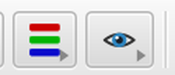
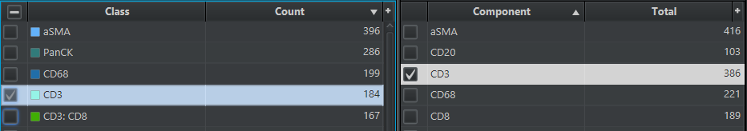
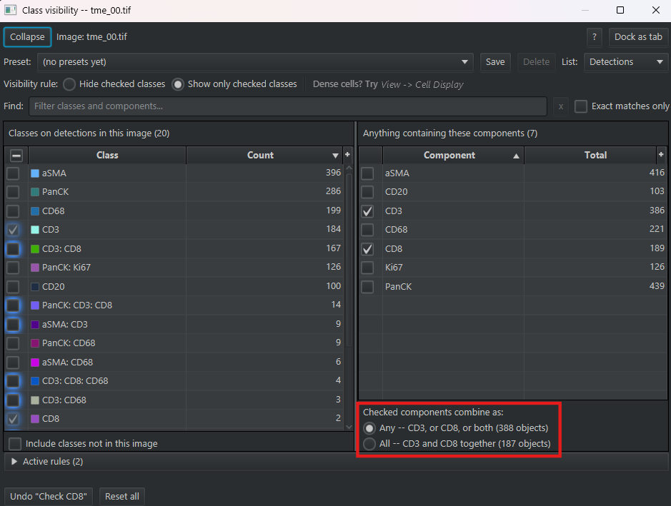
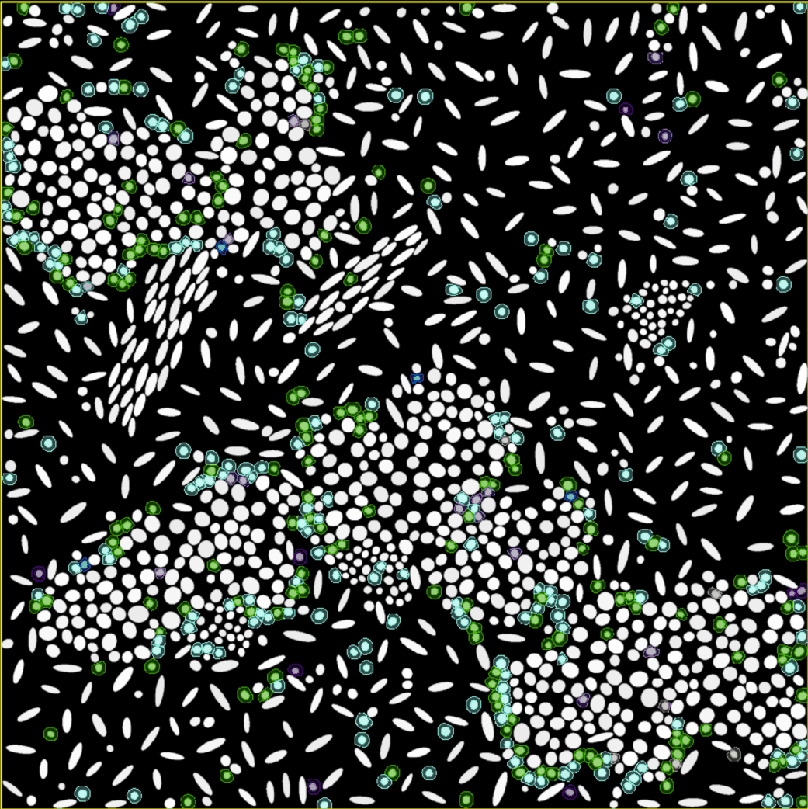
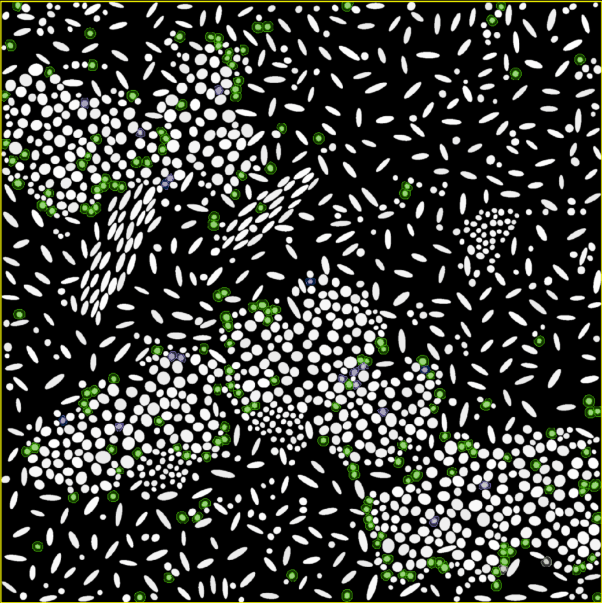

# Class Visibility

> Show or hide objects by class — or by **one marker inside a class name**, combined with
> `Any` or `All`. On a panel of combinatorial classes like `CD3: CD8: PD1`, "CD3 **and** CD8
> together" is one rule here and no rule at all in QuPath's built-in class list.

| | |
|---|---|
| **Repository** | [uw-loci/qupath-extension-class-visibility](https://github.com/uw-loci/qupath-extension-class-visibility) |
| **Extension version** | 0.3.3 |
| **License** | Apache-2.0 |
| **Requires** | QuPath 0.7.0+ |
| **Where to find it** | `Extensions > Class Visibility > Show panel` · toolbar button |
| **Catalog** | LOCI QuPath Extensions |
| **Session** | Hands-on |

> **Walkthrough video:** %%VIDEO_CLASS_VISIBILITY%%
> The walkthrough below is self-contained. You can work through it in the hands-on hour, or on your own afterwards.

---

## What it does

A panel of check boxes that shows or hides detections by their class, or by part of a class
name. Check `CD3` and every cell whose class contains CD3 appears, whether that class is `CD3`,
`CD3: CD8` or `PanCK: CD3: CD8`. Check two parts and choose whether you want cells with either
one or with both. Combinations like these are hard to build from QuPath's built-in class list,
which only checks whole classes one at a time. The panel earns its place when no plain
single-marker class exists in your image, which is usual on a real panel, and when you want the
cells carrying two markers at once.

## When the built-in class list is the better tool

When you have a small number of classes (five to ten), use QuPath's built-in class list on the
**Annotations** tab. It does things the extension's panel does not: a color picker on every row,
a `Show by default` / `Hide by default` dropdown, and a filter field that accepts regular
expressions.

<b>How class matching works</b> — in both tools

QuPath's class matching is not exact by default, and the built-in class list and the extension's
panel follow the same rule. Checking the class `CD3: CD8` in either one shows every class that
contains both `CD3` and `CD8`, such as `PanCK: CD3: CD8`, not only the cells whose class is
exactly `CD3: CD8`. So if your image has a plain `CD3` class, checking it in the built-in list
already shows every class containing CD3, which is what checking the `CD3` component in the
extension does.

<b>Install</b> — from the LOCI catalog, then restart QuPath

Install from the **LOCI QuPath Extensions** catalog, then restart QuPath. Full steps, including
the catalog URL, are in the [setup guide](setup.md).

---

## Try it yourself

**The cells in this project ship unclassified.** The six type names you may have met in other
walkthroughs — `tumor`, `fibroblast`, `cd8_t`, `helper_t`, `b_cell`, `macrophage` — belong to the
ground-truth *point annotations*, not to the cells. So if you open the panel right now you get a
single `Unclassified` row and an empty components list, which looks like a broken extension.

Either way there is nothing for a component list to do: six names that never overlap is a job
for the built-in class list. The walkthrough therefore starts by **changing the shape of the
data** — one script labels every cell by the markers it is actually positive for.

Every number below is from **`tme_00.tif`** and was produced by the run this guide describes.
On another image they differ, and step 8 is about why.

### 1. Get the data

**Download:** `multiplex-synthetic-data-demo-project-v1.2.zip` —
**[direct download](https://github.com/uw-loci/multiplex-synthetic-data/releases/download/v1.2/multiplex-synthetic-data-demo-project-v1.2.zip)**
(20 MB). The same project used by Classify Object Subset and Class Distribution, so if you
already have it, you are done here.

**You will also need:** QuPath **0.7.0 or later**, and this extension installed from the LOCI
catalog (see the **Install** box above, or the [setup guide](setup.md)).

### 2. Load it into QuPath

1. **Drag `project.qpproj` onto an open QuPath window** — or the unzipped folder itself, either
   works. (Menu route: `File > Project > Open project...`.)
2. QuPath pops up an **Update URIs** dialog with the images listed in red. This is expected.
   The project ships with *relative* image paths so the zip is portable, and QuPath cannot
   resolve those until you show it the folder once. Click **Search...** (bottom-right), choose
   the folder you unzipped, then **Apply changes**.
3. Double-click **`tme_00.tif`** to open it.

> **Use `tme_00`, not whichever image opens first.** The eight images are different, and the
> numbers in this guide will not match on the other images.

### 3. Re-label the cells by marker

1. Open the Script Editor: `Automate > Script editor`.
2. Open this script in a browser tab (it opens as plain text, not a download):
   [`composite_marker_classes.groovy`](https://raw.githubusercontent.com/MichaelSNelson/BINA-I2K-2026-QuPath-Extensions/main/scripts/composite_marker_classes.groovy)
3. **Select all of that page and copy it** — you want the file's contents, several dozen lines
   of Groovy, not the link itself.
4. Paste into the Script Editor and press **Run** (`Run > Run`, or **Ctrl+R** / **Cmd+R** on
   macOS).

For every cell, the script decides whether it is positive or negative for each of seven markers.
Any cell can contain any combination of markers, or none at all. Each cell is classified based on
the markers for which it is positive. Cells positive for no markers are called `Unclassified`.

<b>The markers, and how the names are built</b>

The markers are: `aSMA`, `CD20`, `CD3`, `CD68`, `CD8`, `Ki67`, `PanCK`. A cell positive for CD3
and CD8 would be classified as `CD3: CD8`; a cell positive for only CD3 would be classified as
`CD3`.

<b>This overwrites cell classifications</b> — and how to get the old ones back

If you have already run a classifier on these cells — from the Classify Object Subset or Class
Distribution walkthroughs — this replaces it. It does **not** touch the ground-truth point
annotations, because those are annotations rather than detections, so nothing the other
walkthroughs need is lost.

**To get the six type classes back:** `Automate > Project scripts > apply_trained_classifier`,
then **Run**. For the deliberately imperfect version used by Classify Object Subset, run
`classify_with_marker_gate` instead. To discard the change entirely, close the image and answer
**No** when QuPath asks whether to save changes to `tme_00.tif` — but see the warning in step 8
first, because `Run for project` saves as it goes and that escape route is then gone.

<b>How the script decides "positive"</b>

Each marker gets its own threshold, computed on the open image by
[Otsu's method](https://en.wikipedia.org/wiki/Otsu%27s_method): automatic, deterministic, one
cut per marker per image. Six markers are read as the whole-cell mean (`Cell: CD3 mean` and so
on); `Ki67` is read from the nucleus (`Nucleus: Ki67 mean`), because a whole-cell mean would
dilute a nuclear marker.

> **Three things to know before you trust the result.**
>
> 1. **These are not phenotype calls.** Each marker is gated on its own, so nothing forbids
>    `CD3: CD20` — a T cell and a B cell at once. The dataset's ground truth is clean by
>    construction, one lineage marker per cell type, so **every multi-lineage combination here is
>    an artifact** of the 5 µm cell expansion picking up signal from a neighbor.
> 2. **Thresholds are computed per image**, over the cells of the open image only. Step 8 is about
>    what that costs you.
> 3. **The data are synthetic and background-free**, which is what makes a plain threshold work at
>    all. Real hi-plex data with autofluorescence is not this well behaved.

### 4. Open the panel

`Extensions > Class Visibility > Show panel`, or the Class Visibility button in QuPath's
toolbar: the blue eye. (Where it sits in the toolbar depends on the order your extensions were
installed.)

**When you first open the panel, all objects will be hidden.** By default, visibility is set to
**`Show only checked classes`**, and no classes are checked.

> **The check box at the top of the classes list is haloed in blue.** Clicking it checks
> **every** class, which puts every object back on screen. Leave it alone for now — step 5
> starts from the empty state.

**What you should see.** On `tme_00`, 1,530 cells become **20 classes**: nineteen marker
combinations plus `Unclassified`, which holds the 17 cells positive for nothing. QuPath treats
Unclassified as a class, so the panel counts it as one. The `Visibility rule` row is boxed in red
here:

Six of the nineteen combinations carry a single marker, and they hold 1,167 of the 1,513
classified cells, 77%. The other thirteen combine two or more markers, and eleven of those hold
fewer than ten cells each. That long tail of near-empty combinations is what a real hi-plex panel
looks like, and it is what a flat class list handles worst.

> **The panel opens as a floating window.** If it covers the viewer, use the **Dock as tab**
> button in the panel's own header to park it in the analysis pane. **Undock to window** puts
> it back, and the docked layout stacks the two lists instead of placing them side by side.
>
> **Short of room for the lists?** **`Collapse`**, at the left of the `Image:` row, hides the
> `Preset`, `Visibility rule`, `List` and `Find` rows. Your rules keep working while they are
> hidden. **`Expand`** brings them back, and so does **Ctrl+F** (**Cmd+F** on macOS).

### 5. One component, many classes

In the components list — its header reads **Anything containing these components (7)** — check
**`CD3`**. Every object whose class contains `CD3` is now visible, and nothing else is. (If
nothing changed, see [If something looks wrong](#if-something-looks-wrong).)

**Now look at the classes list.** The `CD3` row shows a greyed-out tick: the component rule set
it, and hovering it says to change it in the components list. The other eight classes containing
`CD3` (`CD3: CD8`, `PanCK: CD3: CD8`, `aSMA: CD3` and five more, some below the fold) have a
**blue ring** around their check box. A ring means
the component rule reaches that class. Uncheck `CD3` and the rings disappear; a tick you put there
yourself would stay.

Now compare two numbers. In the classes list, the `CD3` row's **`Count`** reads 184: cells whose
class is exactly `CD3`. In the components list, the `CD3` row's **`Total`** reads 386: cells
carrying `CD3` anywhere in their class.

Checking the `CD3` *class* row would act on all 386, not 184, because QuPath matches supersets by
default (hover the 184 and the tooltip says so). So on this dataset, checking that one class row
does the same job as checking the component.

> **That is worth seeing rather than glossing.** On a *real* panel there is usually no plain
> `CD3` class to check, and then the component row is the only way to say it. Here there is one,
> so the component list saves you nothing yet. The next step is where it stops being optional.

### 6. `Any` vs `All` — the part with no equivalent

Check a second component, **`CD8`**. Two options below the list now read, each with the number
of cells it would show:

- `Any -- CD3, or CD8, or both (388 objects)` — **10 classes**
- `All -- CD3 and CD8 together (187 objects)` — **4 classes** (`CD3: CD8`, `PanCK: CD3: CD8`,
  `CD3: CD8: CD68`, `aSMA: CD3: CD8`)

You can compare the two before choosing. Neither number appears on any single row: each
component's `Total` is that component alone.

`Any` is selected by default, but the panel remembers whichever you last chose, so glance at
which option is selected before you read any counts. On `Any`, this image barely changes: you go from
386 cells to 388 — 187 of the 189 CD8-positive cells are also CD3-positive,
so CD8 sits almost entirely inside CD3.

*`Any`: every cell carrying CD3 or CD8.*

Now switch to `All`. 201 cells leave the screen, you are looking at the CD8 T cells, and **the
rings in the classes list narrow from 10 rows to 4** — under `All`, only classes carrying every
checked component are highlighted.

*`All`: only the cells carrying both. The teal CD3-only cells have gone.*

**There is no class row that does this.** QuPath evaluates its selected-class set as a logical <code>OR</code>,
so the built-in pane can express "CD3 or CD8" but never "CD3 and CD8" across separate names. The
panel builds a single composite rule to get the logical <code>AND</code> — and it survives onto the next image,
where the class names may be different.

### 7. `Spread`, and what it is really for

Switch on the **`Spread`** column. In the component list, on the right side of the panel under
**Anything containing these components**, click the small **+** button at the right end of the
**column-header row** (the row reading `Component` and `Total`, not the caption above it), then
tick `Spread`.

> That menu's first entry is blank and does nothing. It is the check-box column, which has no
> name to show and is not allowed to hide. Ignore it.

On `tme_00` the column should read:

| Component | Spread |
|---|---|
| CD3 | `9/20` |
| PanCK | `7/20` |
| aSMA | `6/20` |
| CD8 | `5/20` |
| CD68 | `5/20` |
| CD20 | `3/20` |
| Ki67 | `1/20` |

No component ever reaches
20: `Unclassified` is one of the twenty and can never contain a component.

**`CD3` is the widest-spreading component here, and `Ki67` the narrowest.** Ki67 is the only
marker read in the nucleus, so a neighboring cell's cytoplasm cannot leak into it, and it lands in
exactly one class (`PanCK: Ki67`). The six read as whole-cell means all pick up some signal from
whatever they are touching.

The panel emphasizes a `Spread` figure, by showing it in bold, only when a component covers at
least 80% of the classes, and only once there are five or more of them. The widest-spreading
component, CD3, tops out at 9 of 20, which is 45%. A real hi-plex panel that appends
`positive` or `Cell` to every class name produces a component sitting in 19 of 20 classes — that
one bolds, and the status strip names it. This dataset has no such component, because the script
builds names from marker names alone.

**Test that, rather than taking it on trust.** Change `COMPARTMENT` in the script to
`["Ki67": "Nucleus"].withDefault { "Cytoplasm" }` and re-run. Cytoplasm excludes the nuclear
hole and is documented as the cleaner of the two, and there should be fewer multi-marker classes.

### 8. Why a preset does not travel between images

> **`Run for project` saves each image as it goes.** After this step the new classes are written
> to all eight images, and closing without saving will not undo them. To put the project back, run
> `Automate > Project scripts > apply_trained_classifier` with `Run for project` as well. If you
> would rather not touch the other seven images, read the table below instead of running it.

Run the script over the whole project (`Run > Run for project`) and compare the PanCK threshold:

| Image | PanCK threshold | Classes |
|---|---|---|
| tme_02 | 27.41 | 19 |
| tme_05 | 28.40 | 19 |
| **tme_00** | **34.20** | **19** |
| tme_04 | 42.18 | 19 |
| tme_07 | 32.68 | 12 |

Those differences are not noise. The dataset deliberately carries per-image intensity offsets of
roughly ×0.80 on `tme_02`, ×0.85 on `tme_05` and ×1.20 on `tme_04` — and a per-image Otsu cut
recovers almost exactly those factors. A class name here means "above **this image's** Otsu
cut", so **the same name does not mean the same thing on two images.**

`tme_07` is the extreme case: it is the immune-poor variant with no B cells at all, so `CD20` is
positive in **0** cells and its `Spread` reads `0`. A component can exist in the list and select
nothing.

### 9. Save a preset

Build a filter worth keeping — `CD3` and `CD8` on `All` — then use **`Preset`** in the panel
header and **Save** it under a name. Presets are stored in the project, so the filter is there
next week and for whoever else opens it.

### 10. Get your view back

| You want | Do this |
|---|---|
| Every listed class visible again | The check box in the **classes list's header** |
| The view you had *before* you opened the panel | **Close the panel.** That state is recorded automatically |
| QuPath's own defaults — no rules, `Hide checked classes`, `Exact matches only` off | **`Reset all`**, on the status strip |

`Extensions > Class Visibility > Restore the state from when the panel opened` does the middle
one from the menu, whether or not the panel is still open. It is greyed out and reads *(nothing
recorded yet)* until the panel has changed something. The menu's own version of the last row is
spelled **`Reset all visibility`**.

## If something looks wrong

| What you see | Why | What to do |
|---|---|---|
| `No cells in this image -- open an image from the synth multiplex project first.` | No image open, or one with no detections | Double-click `tme_00.tif` in the project list, then Run again |
| You check a component and nothing happens | `Exact matches only` is on. It is a QuPath-wide, persistent setting, so it can arrive on from an earlier session | A warning under the `Find` row says so and offers a **`Turn off`** button beside it. It stays visible even when the panel's top rows are collapsed |
| The classes list shows `tumor`, `fibroblast`, `cd8_t`… | The **`List:`** selector is on `Annotations`, so you are looking at the ground-truth points | Set `List:` back to `Detections` |
| `Active rules` shows a number you did not expect | The classes-list header check box adds every listed class as a rule | **Clear all rules** in the `Active rules` expander |
| Everything is hidden and you cannot get back | `Show only checked classes` with the wrong rules | **`Reset all`** on the status strip, or `Extensions > Class Visibility > Reset all visibility` |

## What to notice

- The component list and the class list overlap more than they look like they do, because
  QuPath matches supersets by default. `All` is the operation that has no equivalent.
- Naming schemes that append `positive` or `Cell` to every class name produce components that
  match everything, and they look exactly like real markers until you count — which is what
  `Spread` counts.
- This same script gives **[Class Distribution](10-class-distribution.md)** a second, richer
  view: nineteen combinatorial classes instead of six flat ones, on data you already have.

---

**Full documentation:** the
[repository README](https://github.com/uw-loci/qupath-extension-class-visibility#readme), the
[user guide](https://github.com/uw-loci/qupath-extension-class-visibility/blob/master/docs/user-guide.md),
and [migrating from the script](https://github.com/uw-loci/qupath-extension-class-visibility/blob/master/docs/migration-from-the-script.md).
