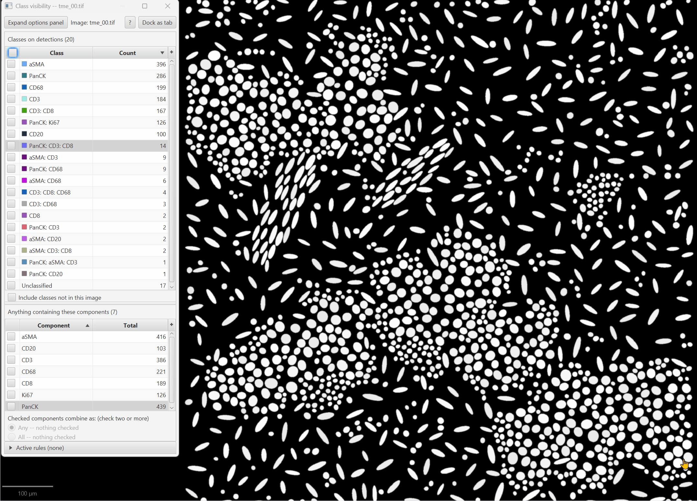
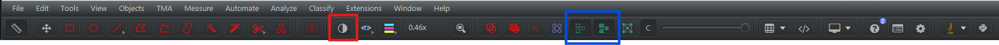
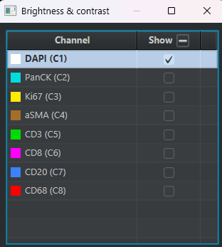
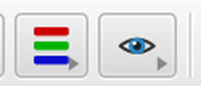
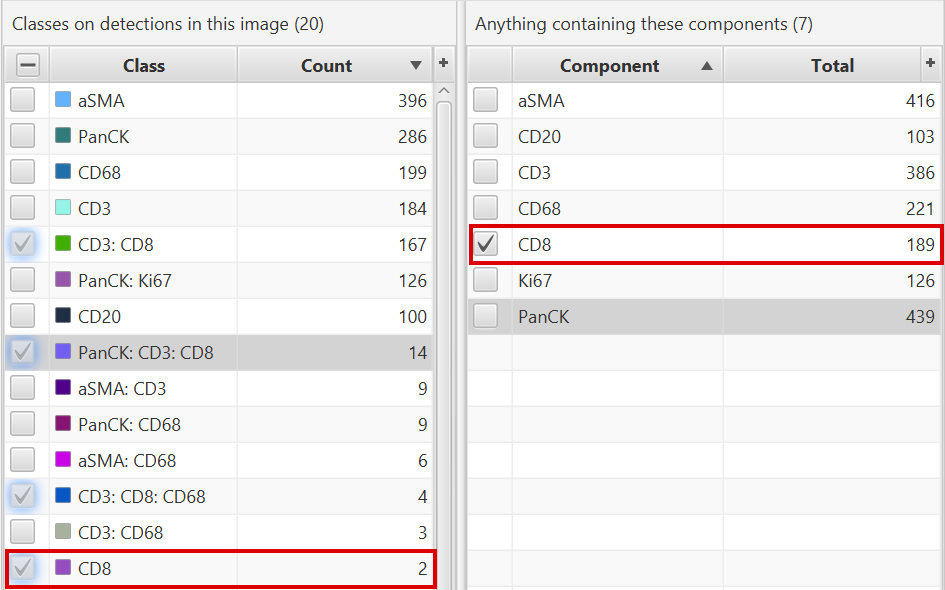
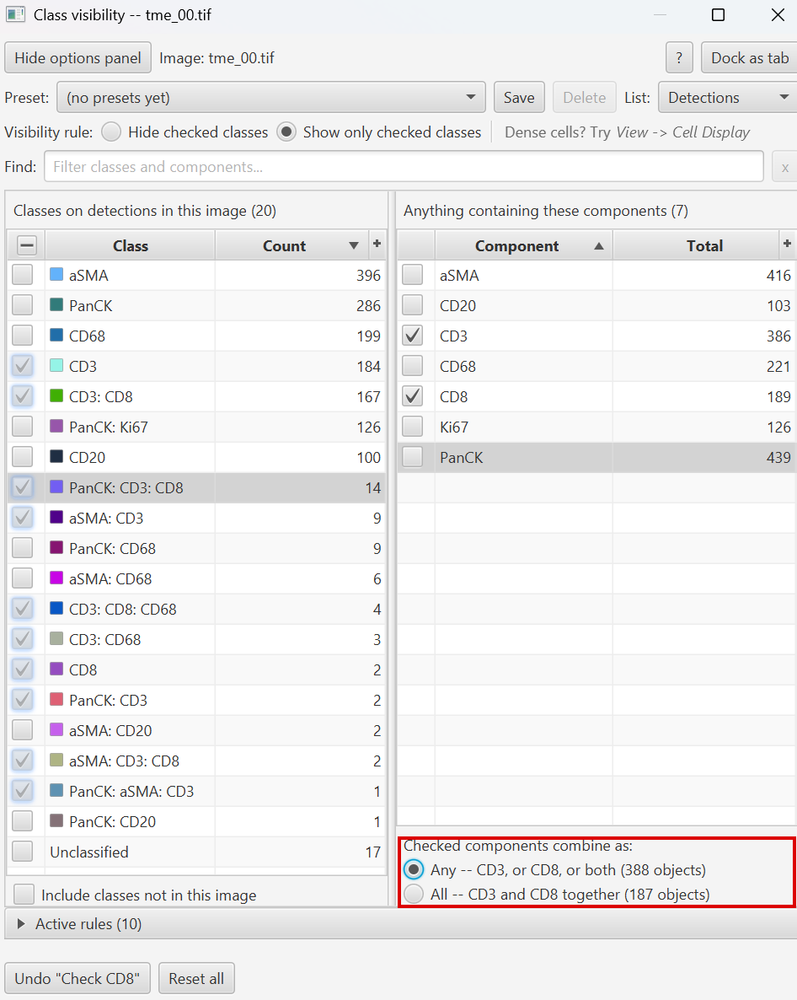
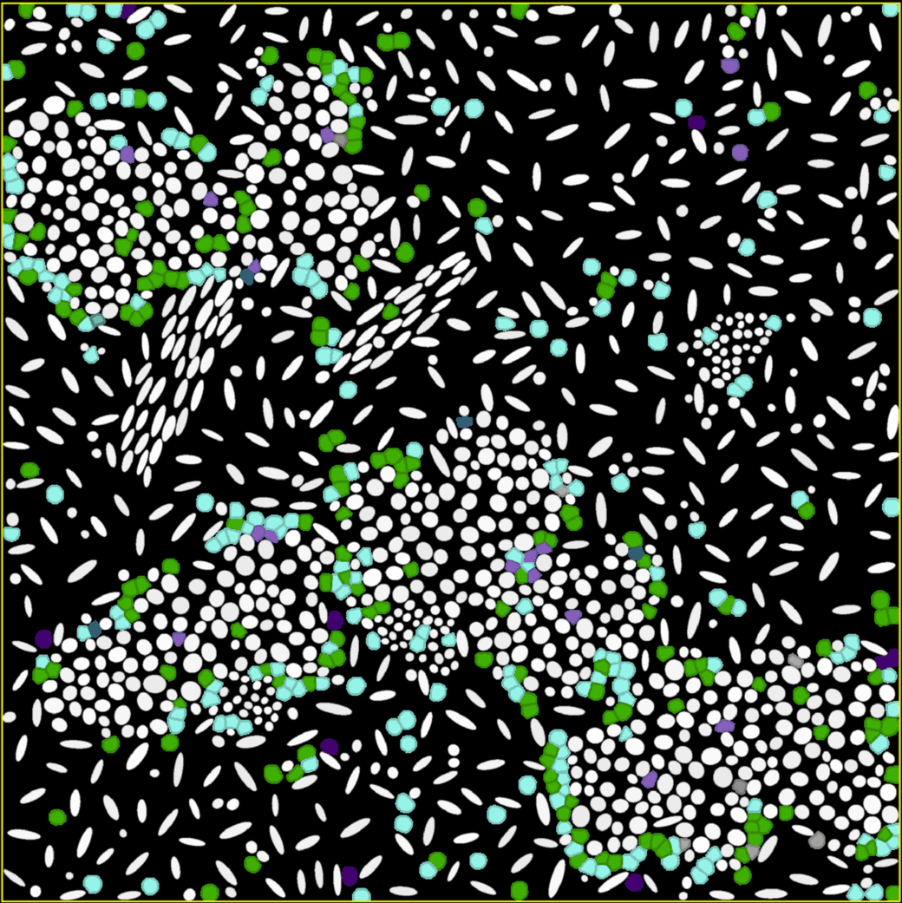
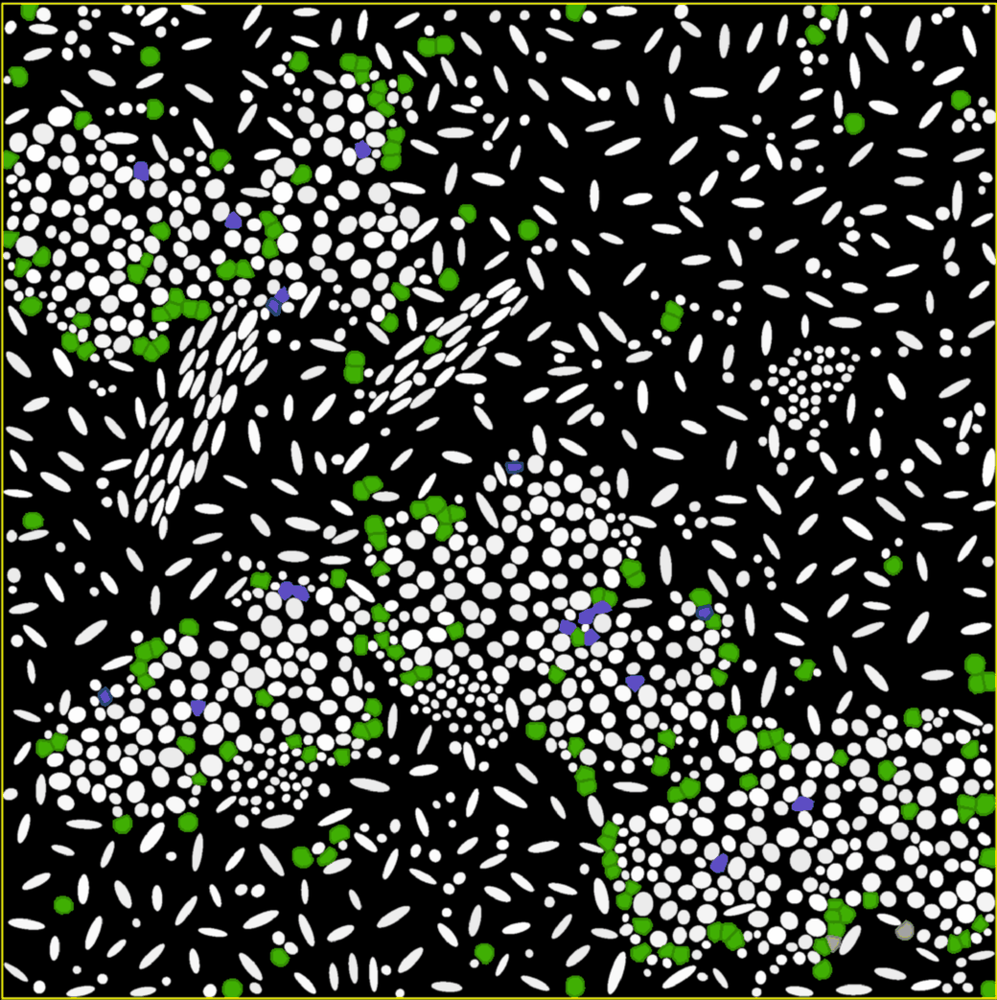
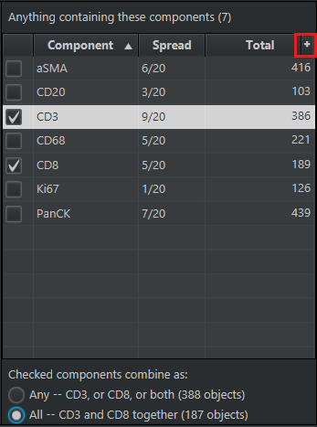

# Class Visibility

> Show or hide objects by class — or by **one marker inside a class name**, combined with
> `Any` or `All`. On a panel of combinatorial classes like `CD3: CD8: PD1`, "CD3 **and** CD8
> together" is one rule here and no rule at all in QuPath's built-in class list.

| | |
|---|---|
| **Repository** | [uw-loci/qupath-extension-class-visibility](https://github.com/uw-loci/qupath-extension-class-visibility) |
| **Extension version** | 0.4.1 |
| **License** | Apache-2.0 |
| **Requires** | QuPath 0.7.0+ |
| **Where to find it** | `Extensions > Class Visibility > Show panel` · toolbar button |
| **Catalog** | LOCI QuPath Extensions |
| **Session** | Hands-on |

> **Walkthrough video:** %Video not ready yet%
> The walkthrough below is self-contained. You can work through it in the hands-on hour, or on your own afterwards.

> **New to QuPath?** Words like *project*, *annotation*, *detection*, *class* and
> *measurement* are explained in the [glossary](glossary.md). For QuPath itself, the
> [official documentation](https://qupath.readthedocs.io/en/stable/) is the place to go.

**Steps:** [1. Get the data](#1-get-the-data) · [2. Load it into QuPath](#2-load-it-into-qupath) · [3. Re-label the cells by marker](#3-re-label-the-cells-by-marker) · [4. Simplify the view](#4-simplify-the-view) · [5. Open the panel](#5-open-the-panel) · [6. One component, many classes](#6-one-component-many-classes) · [7. Any vs All](#7-any-vs-all--the-part-with-no-equivalent) · [8. Spread, and what it is really for](#8-spread-and-what-it-is-really-for) · [9. Save a preset, and take it to another image](#9-save-a-preset-and-take-it-to-another-image) · [10. Get your view back](#10-get-your-view-back)
{: .toc}

---

## What it does

A panel of check boxes that shows or hides detections by their class, or by part of a class
name. Check the `CD3` **class** and only cells classed exactly `CD3` appear. Check the `CD3`
**component** and every cell whose class contains CD3 appears, whether that class is `CD3`,
`CD3: CD8` or `PanCK: CD3: CD8`. Check two components and choose whether
you want cells with either one or with both. Combinations like these are hard to build from
QuPath's built-in class list, which only checks whole classes one at a time.

This interface is most useful with large numbers of classes, where QuPath's standard interface
becomes clunky. If you have never been frustrated trying to show specific objects from the
Annotations panel, you can skip this one.

<b>Install</b> — from the LOCI catalog, then restart QuPath

Install from the **LOCI QuPath Extensions** catalog, then restart QuPath. Full steps, including
the catalog URL, are in the [setup guide](setup.md).

---

## Hands-on exercise

### 1. Get the data

**Download:** `multiplex-synthetic-data-demo-project-v1.2.zip` —
**[direct download](https://github.com/uw-loci/multiplex-synthetic-data/releases/download/v1.2/multiplex-synthetic-data-demo-project-v1.2.zip)**
(20 MB). The same project used by Classify Object Subset and Class Distribution, so if you
already have it, you are done here.

**You will also need:** QuPath **0.7.0 or later**, and this extension installed from the LOCI
catalog (see the **Install** box above, or the [setup guide](setup.md)).

### 2. Load it into QuPath

1. **Drag `project.qpproj` onto an open QuPath window** — or the unzipped folder itself, either
   works. (Menu route: `File > Project > Open project...`.)
2. QuPath pops up an **Update URIs** dialog with the images listed in red. This is expected.
   The project ships with *relative* image paths so the zip is portable, and QuPath cannot
   resolve those until you show it the folder once. Click **Search...** (bottom-right), choose
   the folder you unzipped, then **Apply changes**.
3. Double-click **`tme_00.tif`** to open it.

> **Use `tme_00`, not whichever image opens first.** The eight images are different, and the
> numbers in this guide will not match on the other images.

### 3. Re-label the cells by marker

1. Open the Script Editor: `Automate > Script editor`.
2. Open this script in a browser tab (it opens as plain text, not a download):
   [`composite_marker_classes.groovy`](https://raw.githubusercontent.com/MichaelSNelson/BINA-I2K-2026-QuPath-Extensions/main/scripts/composite_marker_classes.groovy)
3. **Select all of that page and copy it** — you want the file's contents, several dozen lines
   of Groovy, not the link itself.
4. Paste into the Script Editor and press **Run** (`Run > Run`, or **Ctrl+R** / **Cmd+R** on
   macOS).

> For every cell, the script decides whether it is positive or negative for each of seven
> markers. Any cell can contain any combination of markers, or none at all. Each cell is
> classified based on the markers for which it is positive. Cells positive for no markers are
> called `Unclassified`.

<b>The markers, and how the names are built</b>

The markers are: `aSMA`, `CD20`, `CD3`, `CD68`, `CD8`, `Ki67`, `PanCK` (in this synthetic
dataset the aSMA distribution is not biologically meaningful). A cell positive for CD3
and CD8 would be classified as `CD3: CD8`; a cell positive for only CD3 would be classified as
`CD3`.

<b>The script overwrites cell classifications</b> — and how to get the old ones back

If you have already run a classifier on these cells — from the Classify Object Subset or Class
Distribution walkthroughs — the script replaces those classes. The script does **not** touch the ground-truth point
annotations, because those are annotations rather than detections, so nothing the other
walkthroughs need is lost.

**To get the six type classes back:** `Automate > Project scripts > apply_trained_classifier`,
then **Run**. For the deliberately imperfect version used by Classify Object Subset, run
`classify_with_marker_gate` instead. To discard the change entirely, close the image and answer
**No** when QuPath asks whether to save changes to `tme_00.tif`.

<b>How the script decides "positive"</b>

Each marker gets its own threshold, computed on the open image by
[Otsu's method](https://en.wikipedia.org/wiki/Otsu%27s_method): automatic, deterministic, one
cut per marker per image. Six markers are read as the whole-cell mean (`Cell: CD3 mean` and so
on); `Ki67` is read from the nucleus (`Nucleus: Ki67 mean`), because a whole-cell mean would
dilute a nuclear marker.

> **Three things to know before you trust the result.**
>
> 1. **The combined classes are not cell-type classifications.** Each marker is gated on its own, so nothing forbids
>    `CD3: CD20` — a T cell and a B cell at once. The dataset's ground truth is clean by
>    construction, one lineage marker per cell type, so **every multi-lineage combination here is
>    an artifact** of the 5 µm cell expansion picking up signal from a neighbor.
> 2. **Thresholds are computed per image**, over the cells of the open image only, so the same
>    class name can mean a slightly different cut on another image.
> 3. **The data are synthetic and background-free**, which is what makes a plain threshold work at
>    all. Real hi-plex data with autofluorescence is not this well behaved.

### 4. Simplify the view

The cells are easier to read as flat shapes in one color, so before opening the panel, show
only the nuclei and fill the cells in.

1. Open the **Brightness & contrast** window: the toolbar button boxed in red below, or
   **Shift+C**. In the channel list, leave only **DAPI** checked.
2. In the toolbar group boxed in blue, make sure **Show detections** (the left button,
   or **D**) is on, and turn on **Fill detections** (the right button, or **F**).

Every cell is now a solid white shape on black, and a class rule shows as a change of color.

### 5. Open the panel

`Extensions > Class Visibility > Show panel`, or the Class Visibility button in QuPath's
toolbar: the blue eye. (Where it sits in the toolbar depends on the order your extensions were
installed.)

> **When you first open the panel, all objects will be hidden.** By default, visibility is set
> to **`Show only checked classes`**, and no classes are checked.

> **The check box at the top of the classes list is haloed in blue.** Clicking it checks
> **every** class, which puts every object back on screen. Leave it alone for now — step 6
> starts from the empty state.

**What you should see.** On `tme_00`, 1,530 cells become **20 classes**: nineteen marker
combinations plus `Unclassified`, which holds the 17 cells positive for nothing. QuPath treats
Unclassified as a class, so the panel counts it as one. The `Visibility rule` row is boxed in red
here:

Six of the nineteen combinations carry a single marker, and they hold 1,167 of the 1,513
classified cells, 77%. The other thirteen combine two or more markers, and eleven of those hold
fewer than ten cells each. That long tail of near-empty combinations is what a real hi-plex panel
looks like, and it is what a flat class list handles worst.

> **The panel opens as a floating window.** If it covers the viewer, use the **Dock as tab**
> button in the panel's own header to park it in the analysis pane. **Undock to window** puts
> it back, and the docked layout stacks the two lists instead of placing them side by side.
>
> **Short of room for the lists?** **`Hide options panel`**, at the left of the `Image:` row,
> hides the `Preset`, `Visibility rule`, `List` and `Find` rows and the status line at the
> bottom, leaving just the lists. Your rules keep working while they are hidden.
> **`Expand options panel`** brings them back, and so does **Ctrl+F** (**Cmd+F** on macOS).

### 6. One component, many classes

In the components list — its header reads **Anything containing these components (7)** — check
**`CD8`**. Every object whose class contains `CD8` is now visible, and nothing else is.

**Now look at the classes list.** The five classes containing `CD8` — `CD3: CD8`,
`PanCK: CD3: CD8`, `CD3: CD8: CD68`, `CD8` and `aSMA: CD3: CD8`, some below the fold — show a
**grayed-out tick with a blue ring** around the check box. The ring means the component rule
reaches that class, and hovering the row says to change it in the components list.
`Active rules` reads 5: the component is written as one rule per class it covers. Uncheck `CD8`
and the ticks and rings disappear; a tick you put there yourself would stay.

**And look at QuPath's own class list**, boxed at the top of the picture on the Annotations
tab. It has switched to `Hide by default`, and the eye is open on exactly the classes the
component reached. The panel writes to the same setting as QuPath's own list; it just fills it
in for you.

Now compare two numbers:

In the classes list, the `CD8` row's **`Count`** reads **2**: cells whose class is exactly
`CD8`. In the components list, the `CD8` row's **`Total`** reads **189**: cells carrying `CD8`
anywhere in their class. Almost every CD8 cell in this image is also CD3-positive, so it lives
in a class like `CD3: CD8`, not in `CD8`.

**A class row counts that class and nothing else; a component row counts every class that
contains it.** Checking the `CD8` *class* row would show 2 cells. Checking the `CD8` component
shows the 189 in its `Total`.

Try it with `PanCK`. Uncheck the `CD8` component, then check the **`PanCK` class row**: 286
cells, the tumor cells positive for PanCK alone. Uncheck it and check the **`PanCK`
component** instead: 439 cells, now including `PanCK: Ki67`, `PanCK: CD68` and the rest — seven
classes ticked and ringed.

*This picture is the panel docked in the analysis pane (**Dock as tab**) with its options hidden
(**Hide options panel**): the two lists stack, and nothing but the check boxes is left.*

Uncheck `PanCK` again before step 7.

> **To keep the two meanings apart, the panel turns on QuPath's `Exact matches only` setting**
> the first time you change something. Closing the panel puts your own setting back.

### 7. `Any` vs `All` — the part with no equivalent

Check **`CD3`** and **`CD8`** in the components list. Two options below the list now read, each
with the number of cells it would show:

- `Any -- CD3, or CD8, or both (388 objects)` — **10 classes**
- `All -- CD3 and CD8 together (187 objects)` — **4 classes** (`CD3: CD8`, `PanCK: CD3: CD8`,
  `CD3: CD8: CD68`, `aSMA: CD3: CD8`)

You can compare the two before choosing. Neither number appears on any single row: each
component's `Total` is that component alone.

`Any` is selected by default, but the panel remembers whichever you last chose, so glance at
which option is selected before you read any counts. On `Any`, 388 cells show — barely more
than the 386 that `CD3` reaches on its own, because 187 of the 189 CD8-positive cells are also
CD3-positive: CD8 sits almost entirely inside CD3.

Now switch to `All`. 201 cells leave the screen, you are looking at the CD8 T cells, and **the
ticked, ringed rows in the classes list narrow from 10 to 4** — under `All`, only classes
carrying every checked component are covered.

  <figure style="flex:1 1 300px;margin:0">
    
    <figcaption><b>Any</b>: every cell carrying CD3 or CD8.</figcaption>
  </figure>
  <figure style="flex:1 1 300px;margin:0">
    
    <figcaption><b>All</b>: only the cells carrying both. The light teal CD3-only cells have gone.</figcaption>
  </figure>

**There is no class row that does this.** QuPath evaluates its selected-class set as a logical <code>OR</code>,
so the built-in pane can express "CD3 or CD8" but never "CD3 and CD8" across separate names
without you finding and ticking every class that carries both. The panel finds them for you, and
a saved preset finds them again on the next image, where the class names may be different.

### 8. `Spread`, and what it is really for

Switch on the **`Spread`** column. In the component list, on the right side of the panel under
**Anything containing these components**, click the small **+** button at the right end of the
**column-header row** (the row reading `Component` and `Total`, not the caption above it; it is
boxed in red in the picture below), then tick `Spread`.

> The first entry in the **+** menu is blank and does nothing. That entry is the check-box column, which has no
> name to show and is not allowed to hide. Ignore it.

On `tme_00` the column should read:

No component ever reaches
20: `Unclassified` is one of the twenty and can never contain a component.

**`CD3` is the widest-spreading component here, and `Ki67` the narrowest.** Ki67 is the only
marker read in the nucleus, so a neighboring cell's cytoplasm cannot leak into it, and it lands in
exactly one class (`PanCK: Ki67`). The six read as whole-cell means all pick up some signal from
whatever they are touching.

The panel emphasizes a `Spread` figure, by showing it in bold, only when a component covers at
least 80% of the classes, and only once there are five or more of them. The widest-spreading
component, CD3, tops out at 9 of 20, which is 45%. A real hi-plex panel that appends
`positive` or `Cell` to every class name produces a component sitting in 19 of 20 classes — that
one bolds, and the status strip names it. This dataset has no such component, because the script
builds names from marker names alone.

### 9. Save a preset, and take it to another image

Build a filter worth keeping — `CD3` and `CD8` on `All` — then use **`Preset`** in the panel
header and **Save** it under a name. A preset stores which components and classes are checked,
the `Any` / `All` choice, and the show/hide setting, in the project. So it is there next week, for
whoever else opens the project, and on every image in it.

To see that, open **`tme_02.tif`** and run the script on it the same way as in step 3 (plain
**Run**; the script works on the open image only). Then pick your preset from the **`Preset`**
dropdown: the same rule is rebuilt on the new image, with no clicking through the lists.

### 10. Get your view back

| You want | What to do |
|---|---|
| Every listed class visible again | The check box in the **classes list's header** |
| The view you had *before* you opened the panel | **Close the panel.** That state is recorded automatically |
| QuPath's own defaults — no rules, `Hide checked classes`, QuPath's `Exact matches only` off | **`Reset all`**, on the status strip |

`Extensions > Class Visibility > Restore the state from when the panel opened` does the middle
one from the menu, whether or not the panel is still open. It is grayed out and reads *(nothing
recorded yet)* until the panel has changed something. The menu's own version of the last row is
spelled **`Extensions > Class Visibility > Reset all visibility`**.

### If something looks wrong

| What you see | Why | What to do |
|---|---|---|
| `No cells in this image -- open an image from the synth multiplex project first.` | No image open, or one with no detections | Double-click `tme_00.tif` in the project list, then Run again |
| You check `PanCK` in the classes list and some PanCK cells stay hidden | A class row is that exact class only, so `PanCK: Ki67` and the other combinations are not included | Check `PanCK` in the **components** list instead |
| The classes list shows `tumor`, `fibroblast`, `cd8_t`… | The **`List:`** selector is on `Annotations`, so you are looking at the ground-truth points | Set `List:` back to `Detections` |
| `Active rules` shows a number you did not expect | The classes-list header check box adds every listed class as a rule | **Clear all rules** in the `Active rules` expander |
| Everything is hidden and you cannot get back | `Show only checked classes` with the wrong rules | **`Reset all`** on the status strip, or `Extensions > Class Visibility > Reset all visibility` |

### What to notice

- The two lists answer different questions: a class row is exactly that class, a component is
  everything containing it. `All` is the operation that has no equivalent in QuPath's own list.
- Naming schemes that append `positive` or `Cell` to every class name produce components that
  match everything, and they look exactly like real markers until you count — which is what
  `Spread` counts.
- This same script gives **[Class Distribution](10-class-distribution.md)** a second, richer
  view: nineteen combinatorial classes instead of six flat ones, on data you already have.

---

**Full documentation:** the
[repository README](https://github.com/uw-loci/qupath-extension-class-visibility#readme), the
[user guide](https://github.com/uw-loci/qupath-extension-class-visibility/blob/master/docs/user-guide.md),
and [migrating from the script](https://github.com/uw-loci/qupath-extension-class-visibility/blob/master/docs/migration-from-the-script.md).
